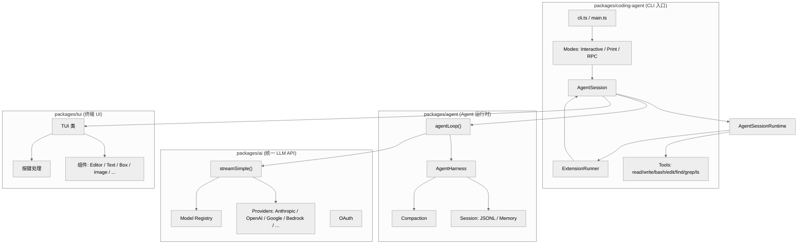

# 第一章：全局概览

## 一句话概括

Pi 是一个极简终端 coding agent 框架，通过 TypeScript 扩展、Skills、Prompt Templates 和 Themes 实现高度可定制化，默认提供 read、bash、edit、write 四个工具。

## 架构图



## 核心概念和数据结构

### 1. 包依赖关系

```
packages/coding-agent
    ├── packages/agent
    │       └── (无外部 AI 依赖，纯运行时)
    ├── packages/ai
    │       └── providers/ (Anthropic, OpenAI, Google, ...)
    └── packages/tui
            └── (无外部依赖，纯 UI)
```

### 2. AgentMessage vs Message

Pi 在内部使用 `AgentMessage` 类型，在 LLM 调用边界转换为 `Message` 类型：

| 类型 | 用途 | 位置 |
|---|---|---|
| `AgentMessage` | 内部消息格式，包含 `role`、`content`、`type` 等 | packages/agent/src/types.ts |
| `Message` | LLM API 兼容格式（由 `convertToLlm` 转换） | packages/ai/src/types.ts |

转换发生在 `agentLoop` 调用 `config.convertToLlm(messages)` 时（[agent-loop.ts:289](file:///workspace/packages/agent/src/agent-loop.ts#L289)）。

### 3. 关键类型定义

**AgentContext**（[agent/src/types.ts:366-423](file:///workspace/packages/agent/src/types.ts#L366-L423)）:
```typescript
export interface AgentContext {
    messages: AgentMessage[];
    systemPrompt?: string;
    tools?: AgentTool[];
    // ... 其他字段
}
```

**AgentTool**（[agent/src/types.ts:50-120](file:///workspace/packages/agent/src/types.ts#L50-L120)）:
```typescript
export interface AgentTool<T = unknown> {
    name: string;
    description?: string;
    inputSchema: TSchema;
    execute: (
        id: string,
        args: T,
        signal: AbortSignal | undefined,
        onUpdate: AgentToolUpdateCallback | undefined
    ) => Promise<AgentToolResult>;
}
```

**Model**（[ai/src/types.ts:100-200](file:///workspace/packages/ai/src/types.ts#L100-L200)）:
```typescript
export interface Model<P = any> {
    provider: Provider;
    modelId: string;
    displayName?: string;
    maxTokens?: number;
    supportsImages?: boolean;
    supportsCacheControl?: boolean;
    // ... 提供商特定配置
}
```

## 系统模块划分

### 1. CLI 入口（packages/coding-agent）

**职责**：解析命令行参数、初始化运行时、选择运行模式

**关键文件**：
- [cli.ts](file:///workspace/packages/coding-agent/src/cli.ts) - 入口点
- [main.ts](file:///workspace/packages/coding-agent/src/main.ts) - 主逻辑（837 行）
- [cli/args.ts](file:///workspace/packages/coding-agent/src/cli/args.ts) - 参数解析

**运行模式**：
- `interactive` - 交互式 TUI 模式
- `print` - 非交互式输出模式
- `json` - JSON 行输出模式
- `rpc` - RPC 模式（stdin/stdout JSONL）

### 2. Agent 运行时（packages/agent）

**职责**：管理 agent 循环、工具调用、会话状态

**关键文件**：
- [agent-loop.ts](file:///workspace/packages/agent/src/agent-loop.ts) - 核心循环逻辑
- [agent.ts](file:///workspace/packages/agent/src/agent.ts) - Agent 类
- [harness/agent-harness.ts](file:///workspace/packages/agent/src/harness/agent-harness.ts) - 测试用 harness

**核心流程**：
```
用户输入 → agentLoop() → streamAssistantResponse()
                              ↓
                        LLM 流式响应
                              ↓
                        工具调用处理
                              ↓
                        结果返回 → 下一轮或结束
```

### 3. 统一 LLM API（packages/ai）

**职责**：封装多 provider 差异，提供统一流式 API

**关键文件**：
- [base.ts](file:///workspace/packages/ai/src/base.ts) - 基础 API
- [stream.ts](file:///workspace/packages/ai/src/stream.ts) - 流式处理
- [providers/](file:///workspace/packages/ai/src/providers/) - 各 provider 实现
- [models.generated.ts](file:///workspace/packages/ai/src/models.generated.ts) - 模型元数据（17213 行）

**支持的 Providers**：
- Anthropic、Google、OpenAI、Azure OpenAI
- Amazon Bedrock、Google Vertex
- Mistral、DeepSeek、xAI、Groq、Cerebras
- OpenRouter、Vercel AI Gateway
- 以及更多...

### 4. 终端 UI（packages/tui）

**职责**：渲染 TUI、处理按键、管理组件

**关键文件**：
- [tui.ts](file:///workspace/packages/tui/src/tui.ts) - 核心 TUI 类（约 400 行）
- [components/editor.ts](file:///workspace/packages/tui/src/components/editor.ts) - 编辑器组件（约 300 行）
- [components/](file:///workspace/packages/tui/src/components/) - 各种 UI 组件

## 核心循环

### 交互模式主循环

```
用户输入 → submit() → session.prompt()
                              ↓
                        emit("agent_start")
                              ↓
                        emit("turn_start")
                              ↓
                        streamAssistantResponse() → LLM
                              ↓
                        工具调用处理
                              ↓
                        emit("turn_end")
                              ↓
                        检查停止条件
                              ↓
                        emit("agent_end") / 下一轮
```

### 工具调用流程

```
LLM 返回 ToolCall
        ↓
prepareToolCall() → 验证参数 → beforeToolCall hook
        ↓
executePreparedToolCall() → 执行工具
        ↓
afterToolCall hook → 返回结果
        ↓
创建 ToolResultMessage → 下一轮
```

## 扩展机制

Pi 的扩展系统是其核心设计亮点，允许用户通过 TypeScript 模块扩展功能：

**可扩展点**：
- 工具注册（`registerTool`）
- 命令注册（`registerCommand`）
- 快捷键注册（`registerShortcut`）
- 事件订阅（`on("tool_call", ...)`）
- UI 组件（自定义编辑器、覆盖层）
- 消息渲染器

**扩展文件位置**：
- `~/.pi/agent/extensions/`
- `.pi/extensions/`（项目级）
- npm 包
- git 仓库

## 关键文件表

| 文件 | 行数 | 职责 |
|------|------|------|
| [packages/ai/src/models.generated.ts](file:///workspace/packages/ai/src/models.generated.ts) | 17213 | 模型元数据自动生成 |
| [packages/coding-agent/src/modes/interactive/interactive-mode.ts](file:///workspace/packages/coding-agent/src/modes/interactive/interactive-mode.ts) | 5731 | 交互模式主类 |
| [packages/tui/test/editor.test.ts](file:///workspace/packages/tui/test/editor.test.ts) | 4051 | 编辑器测试 |
| [packages/coding-agent/src/core/agent-session.ts](file:///workspace/packages/coding-agent/src/core/agent-session.ts) | 3148 | 会话核心类 |
| [packages/agent/src/agent-loop.ts](file:///workspace/packages/agent/src/agent-loop.ts) | 748 | Agent 循环逻辑 |
| [packages/agent/src/agent.ts](file:///workspace/packages/agent/src/agent.ts) | 557 | Agent 类定义 |
| [packages/ai/src/providers/anthropic.ts](file:///workspace/packages/ai/src/providers/anthropic.ts) | 1251 | Anthropic provider |
| [packages/ai/src/providers/openai-responses.ts](file:///workspace/packages/ai/src/providers/openai-responses.ts) | ~1500 | OpenAI Responses provider |
| [packages/coding-agent/src/core/extensions/types.ts](file:///workspace/packages/coding-agent/src/core/extensions/types.ts) | 1606 | 扩展 API 类型 |
| [packages/coding-agent/src/core/session-manager.ts](file:///workspace/packages/coding-agent/src/core/session-manager.ts) | 1575 | 会话管理 |
