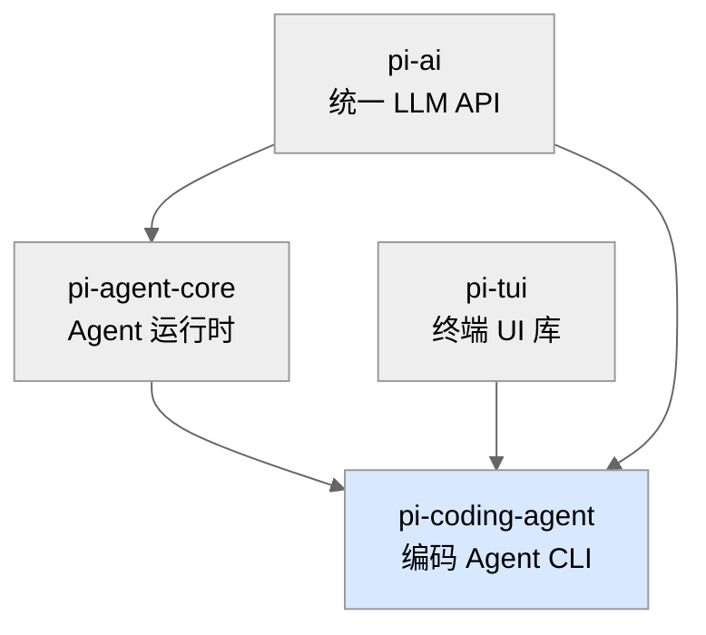
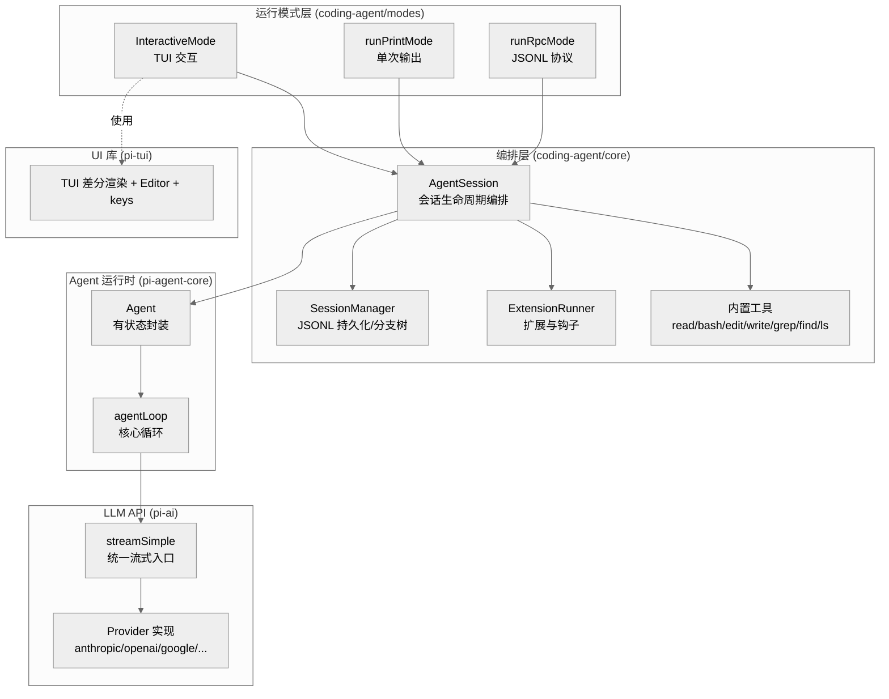
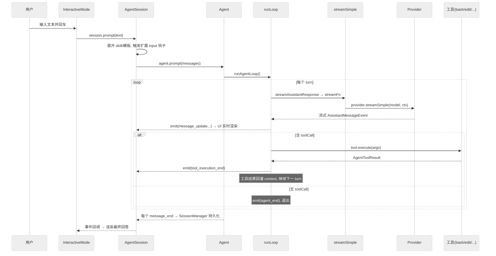

# 01 · 全局概览：pi 是什么

> 一句话：pi 是一个**可自我扩展的命令行编码 Agent**，由四个分层的 npm 包组成——底层是统一多厂商 LLM API，往上是与厂商无关的 Agent 运行时，再往上是带工具、会话、扩展的编码 Agent，以及一个独立的终端 UI 库。

本章建立全局心智模型：系统由哪些部分组成、它们如何连接、一条命令从进入到完成的主干路径是什么。后续每一章再深入某个子系统。

---

## 1. 仓库规模与形态

这是一个 npm **monorepo**（`package.json:5-12` 定义 workspaces），根目录 `package.json` 名为 `pi-monorepo`、`private: true`、`type: module`（纯 ESM）。源码全部是 TypeScript，并且约束为 **Node strip-only 可擦除语法**（不允许 `enum`/`namespace`/参数属性等需要 JS emit 的语法，见 `AGENTS.md`）。

| 包 | 目录 | 源文件数(.ts) | 角色 |
|----|------|--------------|------|
| `@earendil-works/pi-ai` | `packages/ai` | 55 | 统一多厂商 LLM API（流式、模型注册表、OAuth、图像） |
| `@earendil-works/pi-agent-core` | `packages/agent` | 26 | 与厂商无关的 Agent 运行时（agent loop、工具调用、状态） |
| `@earendil-works/pi-coding-agent` | `packages/coding-agent` | 158 | 交互式编码 Agent CLI（模式、工具、扩展、会话） |
| `@earendil-works/pi-tui` | `packages/tui` | 28 | 终端 UI 库（差分渲染、编辑器、按键） |

> 规模实测：`find packages/*/src -type f -name "*.ts" | wc -l` = **267** 个源文件。其中最大的单文件是生成的 `packages/ai/src/models.generated.ts`（17177 行），最大的手写文件是 `packages/coding-agent/src/modes/interactive/interactive-mode.ts`（5165 行）。

### 包之间的依赖方向

`pi-tui` 与 `pi-ai` 是两个互不依赖的叶子库；`pi-agent-core` 依赖 `pi-ai`；`pi-coding-agent` 把四者粘合成最终的 CLI。构建顺序在根 `package.json:15` 中固定为 `tui → ai → agent → coding-agent`。

---

## 2. 五层架构

把系统按职责拉成五层（从底向上）：

- **L1 pi-tui**：纯渲染。把字符串数组差分写到终端，处理键盘、编辑器、组件。只被交互模式使用，与 LLM 无关。
- **L2 pi-ai**：把"调用某个厂商的 LLM 并流式返回"抽象成统一的 `streamSimple(model, context, options)`。所有厂商差异封装在 provider 里。
- **L3 pi-agent-core**：实现"Agent 循环"——发请求、收到工具调用、执行工具、把结果回灌、再发请求……直到模型停下。它**不知道**有哪些具体工具、不知道终端、不知道会话文件。
- **L4 coding-agent/core**：把 L3 的 `Agent` 装配成真正能干活的编码 Agent：注入文件/Bash 工具、系统提示、会话持久化、自动压缩、扩展系统、模型/鉴权管理。核心类是 `AgentSession`。
- **L5 coding-agent/modes**：在 `AgentSession` 之上套一层 I/O。三种模式共享同一个 `AgentSession`，只是输入输出层不同（TUI / 标准输出 / JSONL RPC）。

> 这个分层的关键洞察：**L4 与 L5 都不直接写"调用 LLM"的代码**。它们只跟 `AgentSession` / `Agent` 打交道，而 `Agent` 又只跟 `streamSimple` 打交道。每一层都对上层隐藏了下层的复杂度。

---

## 3. 主干数据流：一条 prompt 的旅程

以交互模式下用户敲一条消息为例，端到端追踪一次"请求-工具-响应"循环：

把它拆成可记忆的步骤：

1. **输入归一化**（`AgentSession.prompt`）：处理 `/扩展命令`、`/skill:` 展开、prompt 模板展开、扩展 `input` 钩子；判断是否在流式中（要排队 steer/followUp）；校验模型与鉴权。
2. **进入 Agent 循环**（`Agent.prompt` → `runAgentLoop`）：把 `AgentMessage[]` 快照成 `AgentContext`，开始 turn 循环。
3. **流式生成**（`streamAssistantResponse`）：通过 `convertToLlm` 把 `AgentMessage[]` 转成 LLM 能懂的 `Message[]`，调用 `streamFn`（即 `streamSimple` 的封装），逐事件 `emit`。
4. **工具执行**（`executeToolCalls`）：从 assistant 消息里挑出 `toolCall`，校验参数、跑 `beforeToolCall` 钩子、`execute`、`afterToolCall` 钩子，生成 `toolResult` 消息回灌。
5. **循环或停止**：有工具调用就继续下一个 turn（把结果给模型看）；没有就 `agent_end` 退出。还会检查 steering/follow-up 队列、`shouldStopAfterTurn`。
6. **持久化与渲染**：`AgentSession` 订阅了 `Agent` 的每一个事件，`message_end` 时追加写入会话 JSONL 文件，同时把事件转发给 UI 层渲染。

> 核心循环就是 `packages/agent/src/agent-loop.ts` 里的 `runLoop`（第 155-269 行）。它是整个系统的"心脏"，第 03 章会逐行剖析。

---

## 4. 关键数据结构（贯穿全栈的"通用货币"）

理解这几个类型，就理解了各层之间传递的是什么：

| 类型 | 定义位置 | 作用 |
|------|---------|------|
| `Message` (`UserMessage`/`AssistantMessage`/`ToolResultMessage`) | `packages/ai/src/types.ts:302-333` | LLM 能理解的消息。provider 的输入/输出单位 |
| `AgentMessage` | `packages/agent/src/types.ts:309` | `Message` ∪ 自定义消息类型（通过声明合并扩展）。Agent 内部流转单位 |
| `AgentTool` | `packages/agent/src/types.ts:366-389` | 工具定义：`name`/`label`/`parameters`(TypeBox schema)/`execute` |
| `AgentEvent` | `packages/agent/src/types.ts:408-423` | Agent 循环对外广播的生命周期事件 |
| `Model<TApi>` | `packages/ai/src/types.ts:591-621` | 模型元数据：`id`/`provider`/`api`/`baseUrl`/`cost`/`contextWindow`... |
| `SessionEntry` | `packages/coding-agent/src/core/session-manager.ts:140-149` | 会话文件里的一条记录（消息、压缩、分支、标签...），带 `id`/`parentId` 构成树 |

`coding-agent` 通过 TypeScript **声明合并**给 `AgentMessage` 扩展了 4 种自定义消息：`bashExecution`、`custom`、`branchSummary`、`compactionSummary`（`packages/coding-agent/src/core/messages.ts:70-77`）。这些自定义消息在送给 LLM 前由 `convertToLlm` 转成普通 user 消息（`messages.ts:148-195`）。

---

## 5. 三种运行模式

同一个 `AgentSession`，三套 I/O：

| 模式 | 入口 | 触发方式 | 用途 |
|------|------|---------|------|
| **交互** | `InteractiveMode` (`modes/interactive/interactive-mode.ts`) | 默认（TTY） | 全功能 TUI 聊天 |
| **打印** | `runPrintMode` (`modes/print-mode.ts`) | `pi -p "..."` / `--mode json` | 单次执行、脚本化 |
| **RPC** | `runRpcMode` (`modes/rpc/rpc-mode.ts`) | `--mode rpc` | 嵌入式、JSONL 协议远程控制 |

模式的分发在 `main()` 的末尾（`packages/coding-agent/src/main.ts:792-836`）：`resolveAppMode` 根据 `--mode`、`-p`、stdin/stdout 是否 TTY 决定走哪条路。第 09、10 章详述。

---

## 6. 入口：从 `pi` 命令到 `main()`

可执行入口是 `packages/coding-agent/src/main.ts` 的 `main(args, options)`（第 457 行）。它的职责被注释明确为"把 CLI 参数翻译成 `createAgentSession()` 选项，SDK 干重活"（`main.ts:1-6`）。主要步骤：

1. `parseArgs(args)` 解析命令行（`cli/args.ts:63`），得到 `Args`（约 30 个字段，`cli/args.ts:12-55`）。
2. 处理 `--help`/`--version`/`--list-models`/`config`/`package` 等"元命令"提前返回。
3. `createSessionManager` 决定用哪个会话文件（新建/继续/恢复/fork）。
4. `buildSessionOptions` + `createAgentSessionRuntime` 构造运行时（内部调用 `createAgentSession`）。
5. `resolveAppMode` 决定模式，分发到 `InteractiveMode.run()` / `runPrintMode` / `runRpcMode`。

真正的"装配车间"是 `packages/coding-agent/src/core/sdk.ts` 的 `createAgentSession()`（第 166-399 行）——它把 `AuthStorage`、`ModelRegistry`、`SettingsManager`、`SessionManager`、`ResourceLoader`、`Agent`、`AgentSession` 全部 new 出来并接好线。第 04 章逐行讲。

---

## 7. 配置与数据落盘位置

pi 的所有用户态数据在 `~/.pi/agent/`（可用环境变量 `PI_CODING_AGENT_DIR` 覆盖，`config.ts:494-521`）：

| 文件/目录 | 内容 | 取路径函数 |
|-----------|------|-----------|
| `auth.json` | 凭证（API key / OAuth token） | `getAuthPath` `config.ts:534` |
| `models.json` | 自定义模型/provider | `getModelsPath` `config.ts:529` |
| `settings.json` | 用户设置 | `getSettingsPath` `config.ts:539` |
| `sessions/` | 会话 JSONL 文件 | `getSessionsDir` `config.ts:559` |
| `themes/` `prompts/` `tools/` `bin/` | 主题/模板/工具/托管二进制(fd,rg) | `config.ts:524-555` |

项目级配置在工作目录的 `.pi/`（`CONFIG_DIR_NAME = ".pi"`，`config.ts:491`），并受"项目信任"机制门控（第 07、11 章）。

---

## 8. 本章关键文件

| 文件 | 行数 | 职责 |
|------|------|------|
| `packages/coding-agent/src/main.ts` | 753 | CLI 入口、参数→会话选项翻译、模式分发 |
| `packages/coding-agent/src/core/sdk.ts` | 366 | `createAgentSession()` 总装配 |
| `packages/coding-agent/src/config.ts` | 507 | 路径解析、安装方式探测、APP 常量 |
| `packages/agent/src/agent-loop.ts` | 670 | Agent 核心循环 |
| `packages/agent/src/types.ts` | 392 | Agent 运行时的全部契约类型 |
| `packages/ai/src/types.ts` | 581 | LLM 消息/模型/工具/流事件类型 |
| `packages/coding-agent/src/core/agent-session.ts` | 2791 | 会话编排核心类 `AgentSession` |

---

**下一步**：第 02 章深入 `pi-ai`——provider 如何把统一的 `streamSimple` 翻译成各家厂商的 HTTP/流式协议。
