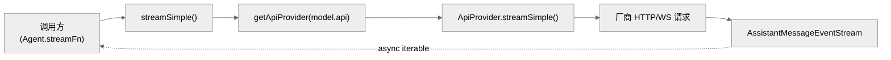
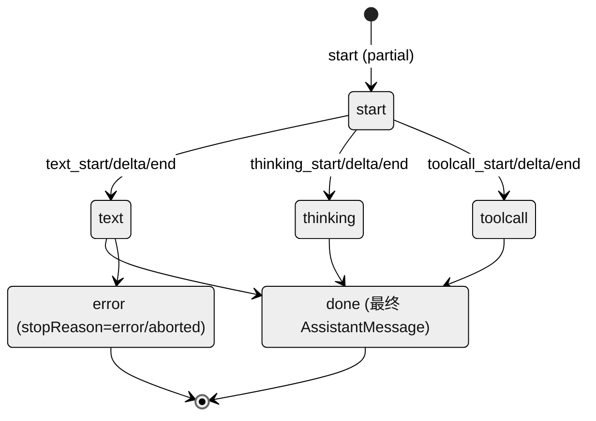

# 02 · pi-ai：统一多厂商 LLM API

> 一句话：`pi-ai` 把"调用任意厂商的 LLM 并流式返回"抽象成一个函数 `streamSimple(model, context, options)`，所有厂商差异（HTTP 格式、思考参数、缓存、鉴权、消息形状）都封装在各自的 provider 实现里。

这是整个系统的**最底层**。它不知道 Agent、不知道工具调度、不知道终端——它只负责"给定一个模型和一段对话，吐出流式回复"。

---

## 1. 核心抽象：四个函数 + 一个注册表

`pi-ai` 的公开门面在 `packages/ai/src/stream.ts`（70 行），只有四个函数：

| 函数 | 行 | 说明 |
|------|-----|------|
| `stream()` | 36-43 | 底层流式，按 `model.api` 找 provider，注入环境变量 API key |
| `complete()` | 45-52 | `stream()` 后 `await result()`，拿最终 `AssistantMessage` |
| `streamSimple()` | 54-61 | **Agent 实际用的入口**，带 `reasoning`/`thinkingBudgets` 等统一选项 |
| `completeSimple()` | 63-70 | `streamSimple()` 的非流式版 |

它们都做同一件事：`resolveApiProvider(model.api)` 找到 provider，再委托给 provider 的方法。区别在 `stream` 用 `StreamOptions`，`streamSimple` 用 `SimpleStreamOptions`（多了 `reasoning`/`thinkingBudgets`，`types.ts:221-225`）。



### ApiProvider 契约

注册表在 `packages/ai/src/api-registry.ts`（98 行）。每个 provider 实现 `ApiProvider<TApi, TOptions>` 接口（`api-registry.ts:23-27`）：

```ts
interface ApiProvider<TApi, TOptions> {
  api: TApi;                                              // 处理哪个 api 字符串
  stream(model, context, options?): AssistantMessageEventStream;
  streamSimple(model, context, options?): AssistantMessageEventStream;
}
```

- `registerApiProvider()`（`api-registry.ts:66-78`）按 `api` 字符串存一个 provider（一个 api 一个）。
- `getApiProvider(api)`（`api-registry.ts:80-82`）取出。
- 注册时用 `wrapStream`/`wrapStreamSimple`（`api-registry.ts:42-63`）包一层，**强制校验 `model.api === api`** 才调用。
- 还提供 `unregisterApiProviders(sourceId)` / `clearApiProviders()`（`api-registry.ts:88-98`），扩展注册的自定义 provider 可按 sourceId 卸载。

### 一个模型如何路由到 provider

关键字段是 `Model.api`（不是 `Model.provider`）。例如 `provider: "deepseek"` 的模型其 `api` 可能是 `"openai-completions"`，因为 DeepSeek 兼容 OpenAI 协议。`api` 决定"用哪套 HTTP 协议"，`provider` 决定"用哪个 baseUrl / 鉴权 / 计费"。

---

## 2. 内置 Provider 与 API 映射

内置 provider 在 `packages/ai/src/providers/register-builtins.ts`（256 行）**懒加载**注册（`createLazyApiProvider`；首次用到才动态 import 实现文件）。`registerBuiltInApiProviders()` 在模块加载时执行。

> 注意：`@earendil-works/pi-ai`（`index.ts`）会自动注册所有内置 provider；而 `@earendil-works/pi-ai/base`（`base.ts`）**不会**——这是 `pi-agent-core` 的 `index.ts:1-5` 特意区分的：它 import 完整入口以触发注册。

九个内置 `api` 字符串 → 实现文件：

| `api` 字符串 | 实现文件 | 行数 |
|--------------|---------|------|
| `anthropic-messages` | `anthropic.ts` | 1151 |
| `openai-completions` | `openai-completions.ts` | 1155 |
| `openai-responses` | `openai-responses.ts` | 284 |
| `openai-codex-responses` | `openai-codex-responses.ts` | 1348 |
| `azure-openai-responses` | `azure-openai-responses.ts` | 267 |
| `mistral-conversations` | `mistral.ts` | 602 |
| `google-generative-ai` | `google.ts` | 468 |
| `google-vertex` | `google-vertex.ts` | 537 |
| `bedrock-converse-stream` | `amazon-bedrock.ts`（经 `loadBedrockProviderModule()`） | 976 |

另有图像 API `openrouter-images` 由 `registerBuiltInImagesApiProviders()` 单独注册（`register-builtins.ts:267-269`）。

### 非 provider 的辅助文件

| 文件 | 行 | 作用 |
|------|-----|------|
| `openai-responses-shared.ts` | 557 | Responses API 系列的共享转换/流处理 |
| `openai-prompt-cache.ts` | 8 | prompt cache key 辅助 |
| `google-shared.ts` | 350 | Google 系列共享消息/工具映射 |
| `simple-options.ts` | 54 | `SimpleStreamOptions → StreamOptions` 公共选项映射 + 思考预算 |
| `transform-messages.ts` | 220 | 跨 provider 消息历史归一化 |
| `github-copilot-headers.ts` | 37 | Copilot 请求头辅助 |
| `cloudflare.ts` | 36 | Cloudflare baseUrl/常量（不注册 api） |
| `faux.ts` | 499 | 测试用确定性假 provider |

> `KnownProvider` 枚举（`types.ts:23-58`）列出了约 35 个已知 provider 名（anthropic、openai、google、xai、groq、deepseek、github-copilot、openrouter、mistral、moonshotai、zai、cerebras、fireworks、together……），但它们大多复用上面 9 个 `api` 中的某一个（尤其 `openai-completions`）。

---

## 3. SimpleStreamOptions → StreamOptions 的映射

`buildBaseOptions()`（`simple-options.ts:3-21`）把统一选项里的公共字段拷贝到 provider 选项：`temperature`、`maxTokens`、`signal`、`apiKey`、`transport`、`cacheRetention`、`sessionId`、`headers`、`onPayload`、`onResponse`、`timeoutMs`、`websocketConnectTimeoutMs`、`maxRetries`、`maxRetryDelayMs`、`metadata`、`env`。

思考/推理相关有两个辅助：
- `clampReasoning()`（第 24-26 行）
- `adjustMaxTokensForThinking()`（第 28-54 行）——思考模型需要为推理预留 token。

`reasoning`（思考等级 `minimal|low|medium|high|xhigh`）如何映射到各家参数，由 `Model.thinkingLevelMap`（`types.ts:602`）和每家 provider 的 `compat.thinkingFormat`（`types.ts:416-426`，支持 `openai`/`openrouter`/`deepseek`/`together`/`zai`/`qwen`/`chat-template` 等 10 种格式）共同决定。这是 `pi-ai` 处理"思考参数厂商碎片化"的核心机制。

---

## 4. 流式协议：AssistantMessageEventStream

provider 不返回 Promise，而返回一个**可异步迭代**的事件流 `AssistantMessageEventStream`（实现在 `packages/ai/src/utils/event-stream.ts`，88 行；`EventStream` 类第 4-67 行）。事件协议定义在 `types.ts:378-390`（`AssistantMessageEvent`）：



约定（`types.ts:371-377`）：先 `start`，中间任意多个增量事件，最后**要么** `done`（成功，带最终 `AssistantMessage`）**要么** `error`（失败，`AssistantMessage.stopReason` 为 `error`/`aborted` 且带 `errorMessage`）。

> 关键契约（`agent/src/types.ts:18-26` 的 `StreamFn`）：**provider 一旦开始流，就不能抛异常**。所有运行时/请求失败都必须编码进流里的 `error` 事件 + 一个 `stopReason: "error"` 的最终消息。这让 Agent 循环可以用统一方式处理失败，而不必到处 try/catch。

每个事件都带一个 `partial: AssistantMessage`——即"到目前为止累积的消息"，UI 可以直接拿它做实时渲染（见第 03 章 `streamAssistantResponse` 如何消费）。

---

## 5. 消息归一化：transform-messages.ts

不同厂商对历史消息的要求不同（思考块能否回放、tool_call id 格式、孤立的 tool_call 怎么办）。`transform-messages.ts`（220 行）在送请求前归一化：

- 不支持图像的模型，把 `ImageContent` 降级为占位文本（第 35-57 行）；
- 跨模型回放时剥离 thinking 块，同模型回放时保留（第 97-114 行）；
- 归一化 tool-call id，跨 provider 时去掉 `thoughtSignature`（第 124-141 行）；
- 给"有 tool_call 但缺 tool_result"的孤立调用插入合成 `toolResult`（第 155-217 行）——否则厂商 API 会报错。

这是"在 pi 内部用统一消息模型、对外适配各厂商怪癖"的关键一环。

---

## 6. 模型注册表

公开 API 在 `packages/ai/src/models.ts`（95 行），数据在生成文件 `models.generated.ts`（17177 行）。

- 数据结构：`export const MODELS[provider][modelId] = Model<...>`（`models.generated.ts:6+`），每个条目含 `id`/`name`/`api`/`provider`/`baseUrl`/`reasoning`/`input`/`cost`/`contextWindow`/`maxTokens`。
- 公开函数（`models.ts`）：`getModel(provider, modelId)`（20-26）、`getProviders()`（28-30）、`getModels(provider)`（32-37）、`calculateCost()`（39-49）、`getSupportedThinkingLevels()`（53-62）、`clampThinkingLevel()`（64-83）、`modelsAreEqual()`（89-95）。

> **绝不要手改 `models.generated.ts`**（`AGENTS.md` 明令）。改 `packages/ai/scripts/generate-models.ts` 后重新生成。生成器构造 `providers: Record<provider, Record<modelId, Model>>`，排序后用 `writeFileSync` 写出整个文件。

`coding-agent` 不直接用这个注册表，而是包了一层 `ModelRegistry`（叠加用户自定义模型 + 鉴权状态，见第 11 章）。

---

## 7. OAuth 鉴权

`packages/ai/src/oauth.ts` 只是 re-export `utils/oauth/index.ts`（160 行）。内置三个 OAuth provider（`index.ts:42-50`）：

| Provider | 文件 | 行 | 流程 |
|----------|------|-----|------|
| **Anthropic** | `utils/oauth/anthropic.ts` | 403 | 授权码 + PKCE，本地回调 `127.0.0.1:53692` |
| **GitHub Copilot** | `utils/oauth/github-copilot.ts` | 430 | 设备码（device code）流程 |
| **OpenAI Codex** | `utils/oauth/openai-codex.ts` | 607 | 浏览器 PKCE 或设备码，二选一 |

注册表 API：`getOAuthProvider(id)`、`registerOAuthProvider()`、`getOAuthProviders()` 等（`index.ts:55-96`）。高层辅助 `getOAuthApiKey()`（第 135-160 行）会在凭证过期时自动刷新再返回 API key——这正是 Agent 循环 `getApiKey` 回调能在长时间运行中保持令牌有效的底座。共享辅助：`device-code.ts`（轮询/退避）、`pkce.ts`（verifier/challenge）、`types.ts`（接口）、`oauth-page.ts`（成功/失败 HTML 页）。

---

## 8. 其它工具模块

| 文件 | 行 | 作用 |
|------|-----|------|
| `utils/event-stream.ts` | 88 | 异步事件流抽象（`EventStream`、`AssistantMessageEventStream`） |
| `utils/validation.ts` | 324 | 工具调用/参数校验（`validateToolArguments`，Agent 循环用） |
| `utils/json-parse.ts` | 124 | JSON 修复/容错解析（流式不完整 JSON） |
| `utils/overflow.ts` | 162 | 上下文溢出检测（`isContextOverflow`） |
| `utils/sanitize-unicode.ts` | 25 | 代理对/非法 Unicode 清洗 |
| `env-api-keys.ts` | 177 | provider → 环境变量名 映射（如 `ANTHROPIC_API_KEY`） |
| `session-resources.ts` | 24 | 会话级资源清理注册表 |
| `cli.ts` | 147 | pi-ai 自带的 OAuth 登录/列出 CLI |

---

## 9. faux provider：可测试性的基石

`packages/ai/src/providers/faux.ts`（499 行）是一个确定性假 provider，用于测试而不打真实 API：
- `registerFauxProvider()`（第 391-499 行）注册一个合成 `api` 字符串（默认 `faux`），用 `registerApiProvider` 入表，可用 `unregisterApiProviders(sourceId)` 卸载（第 495-497 行）。
- 它把脚本化的回复按 token 速率发出真实的 `start`/`text_delta`/`thinking_delta`/`toolcall_delta`/`done` 事件（第 296-389 行），并模拟用量与 prompt cache。

> `coding-agent` 的测试套件（`test/suite/`）就用 faux provider，配合 `harness.ts`，做到"不花一分钱 token、完全确定性"地测 Agent 行为（见 `AGENTS.md`）。

---

## 10. 本章关键文件

| 文件 | 行数 | 职责 |
|------|------|------|
| `packages/ai/src/stream.ts` | 70 | `stream`/`streamSimple`/`complete*` 入口 |
| `packages/ai/src/api-registry.ts` | 98 | provider 注册表与 `ApiProvider` 契约 |
| `packages/ai/src/types.ts` | 628 | 全部核心类型（Message/Model/Tool/事件/compat） |
| `packages/ai/src/providers/register-builtins.ts` | 282 | 内置 provider 懒加载注册 |
| `packages/ai/src/providers/anthropic.ts` | 1151 | Anthropic Messages provider |
| `packages/ai/src/providers/openai-completions.ts` | 1155 | OpenAI 兼容 Chat Completions provider |
| `packages/ai/src/providers/openai-codex-responses.ts` | 1348 | OpenAI Codex Responses（含 WebSocket） |
| `packages/ai/src/providers/transform-messages.ts` | 220 | 跨 provider 消息归一化 |
| `packages/ai/src/models.ts` | 95 | 模型注册表公开 API |
| `packages/ai/src/utils/oauth/index.ts` | 160 | OAuth provider 注册表与刷新 |

---

**下一步**：第 03 章深入 `pi-agent-core`——它如何在 `streamSimple` 之上跑出一个完整的"请求→工具→再请求"循环。
