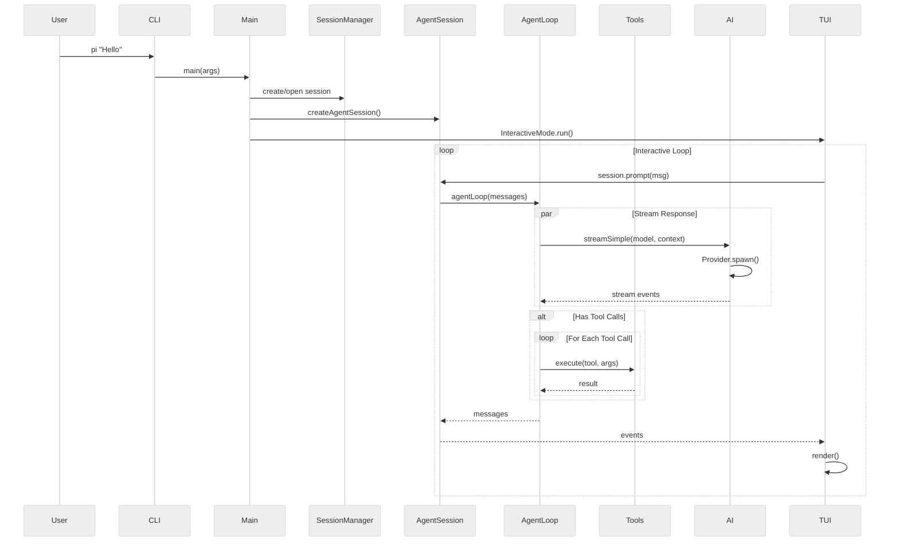

# 第二章：核心数据流

## 一句话概括

从用户输入到 LLM 响应，Pi 经历了 CLI 解析 → 会话创建 → Agent Loop → LLM API 调用 → 工具执行 → UI 更新的完整流程。

## 架构图



## 第一阶段：CLI 解析与初始化

### 入口点

[cli.ts](file:///workspace/packages/coding-agent/src/cli.ts):
```typescript
process.title = APP_NAME;
process.env.PI_CODING_AGENT = "true";
configureHttpDispatcher();  // 配置全局 HTTP 调度器
main(process.argv.slice(2));
```

[main.ts](file:///workspace/packages/coding-agent/src/main.ts) 主流程：

1. **参数解析**（[line 492](file:///workspace/packages/coding-agent/src/main.ts#L492)）
   ```typescript
   const parsed = parseArgs(args);
   ```

2. **运行迁移**（[line 538](file:///workspace/packages/coding-agent/src/main.ts#L538)）
   ```typescript
   const { migratedAuthProviders, deprecationWarnings } = runMigrations(cwd);
   ```

3. **创建 SettingsManager**（[line 541](file:///workspace/packages/coding-agent/src/main.ts#L541)）
   ```typescript
   const startupSettingsManager = SettingsManager.create(cwd, agentDir);
   ```

4. **创建 SessionManager**（[line 561](file:///workspace/packages/coding-agent/src/main.ts#L561)）
   ```typescript
   let sessionManager = await createSessionManager(parsed, cwd, sessionDir, ...);
   ```

5. **创建运行时**（[line 725](file:///workspace/packages/coding-agent/src/main.ts#L725)）
   ```typescript
   const runtime = await createAgentSessionRuntime(createRuntime, {...});
   ```

6. **运行模式分发**（[line 792-835](file:///workspace/packages/coding-agent/src/main.ts#L792-L835)）
   ```typescript
   if (appMode === "rpc") {
       await runRpcMode(runtime);
   } else if (appMode === "interactive") {
       await interactiveMode.run();
   } else {
       await runPrintMode(runtime, {...});
   }
   ```

### Session 创建流程

```
SessionManager.create(cwd) → 创建 .jsonl 文件
                           → 写入 SessionHeader
                           → 返回 SessionManager 实例
```

Session 文件格式（[session-manager.ts:30-60](file:///workspace/packages/coding-agent/src/core/session-manager.ts#L30-L60)）：

```typescript
export interface SessionHeader {
    type: "session";
    version?: number;
    id: string;
    timestamp: string;
    cwd: string;
    parentSession?: string;  // 用于 fork
}
```

## 第二阶段：AgentSession 创建

### createAgentSessionFromServices

[agent-session-services.ts](file:///workspace/packages/coding-agent/src/core/agent-session-services.ts) 创建服务：

```typescript
const services = await createAgentSessionServices({
    cwd,
    agentDir,
    authStorage,
    settingsManager,
    resourceLoaderOptions: {...},
});
```

### 服务构建

1. **ResourceLoader** - 加载 skills、prompts、themes、context files
2. **ModelRegistry** - 管理模型列表和 API key
3. **AuthStorage** - 存储认证凭据
4. **工具定义** - 创建内置工具的 ToolDefinition
5. **ExtensionRunner** - 加载和运行扩展

### AgentSession 初始化

[agent-session.ts](file:///workspace/packages/coding-agent/src/core/agent-session.ts) 构造函数：

```typescript
export class AgentSession {
    constructor(config: AgentSessionConfig) {
        // 1. 初始化 Agent
        this.agent = new Agent({
            tools: this.buildTools(),
            ...hooks,
        });

        // 2. 订阅事件
        this.subscribeToAgentEvents();

        // 3. 注册扩展
        this.extensionRunner = new ExtensionRunner(...);
    }
}
```

## 第三阶段：Agent Loop

### agentLoop 函数

[agent-loop.ts:31-54](file:///workspace/packages/agent/src/agent-loop.ts#L31-L54)：

```typescript
export function agentLoop(
    prompts: AgentMessage[],
    context: AgentContext,
    config: AgentLoopConfig,
    signal?: AbortSignal,
    streamFn?: StreamFn,
): EventStream<AgentEvent, AgentMessage[]> {
    const stream = createAgentStream();
    void runAgentLoop(prompts, context, config, stream.push, signal, streamFn)
        .then((messages) => stream.end(messages));
    return stream;
}
```

### runLoop 主循环

[agent-loop.ts:155-269](file:///workspace/packages/agent/src/agent-loop.ts#L155-L269)：

```typescript
async function runLoop(initialContext, newMessages, config, signal, emit, streamFn) {
    let currentContext = initialContext;
    let pendingMessages = [];

    // 外层循环：处理后续消息
    while (true) {
        // 内层循环：工具调用
        while (hasMoreToolCalls || pendingMessages.length > 0) {
            // 1. 处理待处理消息
            if (pendingMessages.length > 0) {
                // 注入消息到 context
            }

            // 2. 流式获取 LLM 响应
            const message = await streamAssistantResponse(currentContext, config, ...);

            // 3. 处理工具调用
            if (toolCalls.length > 0) {
                const toolResults = await executeToolCalls(...);
                hasMoreToolCalls = !toolResults.terminate;
            }

            // 4. 检查停止条件
            if (shouldStopAfterTurn({ message, toolResults, ... })) {
                return;
            }

            // 5. 获取后续消息
            pendingMessages = getSteeringMessages() || [];
        }

        // 检查 follow-up 消息
        const followUpMessages = getFollowUpMessages() || [];
        if (followUpMessages.length > 0) {
            pendingMessages = followUpMessages;
            continue;
        }
        break;
    }
}
```

### streamAssistantResponse

[agent-loop.ts:275-368](file:///workspace/packages/agent/src/agent-loop.ts#L275-L368)：

```typescript
async function streamAssistantResponse(context, config, signal, emit, streamFn) {
    // 1. 应用 context transform（如果有）
    let messages = context.messages;
    if (config.transformContext) {
        messages = await config.transformContext(messages, signal);
    }

    // 2. 转换为 LLM 格式
    const llmMessages = await config.convertToLlm(messages);

    // 3. 构建 LLM context
    const llmContext: Context = {
        systemPrompt: context.systemPrompt,
        messages: llmMessages,
        tools: context.tools,
    };

    // 4. 调用 LLM
    const response = await streamSimple(config.model, llmContext, {...});

    // 5. 处理流式事件
    for await (const event of response) {
        switch (event.type) {
            case "start":
                // 开始新消息
                emit({ type: "message_start", message });
                break;
            case "text_delta":
            case "thinking_delta":
            case "toolcall_delta":
                // 更新消息内容
                emit({ type: "message_update", ... });
                break;
            case "done":
                // 消息完成
                emit({ type: "message_end", message });
                return finalMessage;
        }
    }
}
```

## 第四阶段：工具执行

### executeToolCalls

[agent-loop.ts:373-516](file:///workspace/packages/agent/src/agent-loop.ts#L373-L516)：

```typescript
async function executeToolCalls(currentContext, assistantMessage, config, signal, emit) {
    const toolCalls = assistantMessage.content.filter(c => c.type === "toolCall");

    // 根据工具执行模式选择串行或并行
    if (config.toolExecution === "sequential" || hasSequentialToolCall) {
        return executeToolCallsSequential(...);
    }
    return executeToolCallsParallel(...);
}
```

### 工具执行准备

[agent-loop.ts:562-626](file:///workspace/packages/agent/src/agent-loop.ts#L562-L626)：

```typescript
async function prepareToolCall(currentContext, assistantMessage, toolCall, config, signal) {
    // 1. 查找工具定义
    const tool = currentContext.tools?.find(t => t.name === toolCall.name);

    // 2. 准备参数
    const preparedToolCall = prepareToolCallArguments(tool, toolCall);
    const validatedArgs = validateToolArguments(tool, preparedToolCall);

    // 3. 调用 beforeToolCall hook
    if (config.beforeToolCall) {
        const beforeResult = await config.beforeToolCall({...}, signal);
        if (beforeResult?.block) {
            return { kind: "immediate", result: errorResult };
        }
    }

    return { kind: "prepared", tool, args: validatedArgs };
}
```

### 工具执行

[agent-loop.ts:628-669](file:///workspace/packages/agent/src/agent-loop.ts#L628-L669)：

```typescript
async function executePreparedToolCall(prepared, signal, emit) {
    try {
        const result = await prepared.tool.execute(
            prepared.toolCall.id,
            prepared.args,
            signal,
            (partialResult) => {
                // 发送增量更新
                emit({ type: "tool_execution_update", partialResult });
            }
        );
        return { result, isError: false };
    } catch (error) {
        return { result: errorResult, isError: true };
    }
}
```

## 第五阶段：事件与 UI 更新

### AgentSession 事件订阅

[agent-session.ts](file:///workspace/packages/coding-agent/src/core/agent-session.ts) 中：

```typescript
private subscribeToAgentEvents() {
    this.agentLoop = agentLoop(prompts, context, config, signal, streamFn);

    this.agentLoop.on((event: AgentEvent) => {
        switch (event.type) {
            case "agent_start":
                this.emit("agent_start");
                break;
            case "message_start":
            case "message_end":
            case "message_update":
                // 持久化消息
                this.persistMessage(event.message);
                this.emit(event.type, event);
                break;
            case "tool_execution_start":
            case "tool_execution_end":
            case "tool_execution_update":
                this.emit(event.type, event);
                break;
            // ...
        }
    });
}
```

### InteractiveMode UI 更新

[modes/interactive/interactive-mode.ts](file:///workspace/packages/coding-agent/src/modes/interactive/interactive-mode.ts)：

```typescript
// 在 initialize() 中订阅事件
session.onSessionChange(() => this.requestRender());
session.onTokenUsageChange(() => this.updateFooter());

// requestRender() 触发差分渲染
private requestRender() {
    this.tui.requestRender();
}
```

## 关键文件表

| 文件 | 职责 |
|------|------|
| [packages/coding-agent/src/main.ts](file:///workspace/packages/coding-agent/src/main.ts) | CLI 主逻辑，模式分发 |
| [packages/coding-agent/src/core/agent-session.ts](file:///workspace/packages/coding-agent/src/core/agent-session.ts) | AgentSession 核心类 |
| [packages/agent/src/agent-loop.ts](file:///workspace/packages/agent/src/agent-loop.ts) | Agent 循环逻辑 |
| [packages/coding-agent/src/core/tools/index.ts](file:///workspace/packages/coding-agent/src/core/tools/index.ts) | 工具注册 |
| [packages/coding-agent/src/modes/interactive/interactive-mode.ts](file:///workspace/packages/coding-agent/src/modes/interactive/interactive-mode.ts) | 交互模式 |
