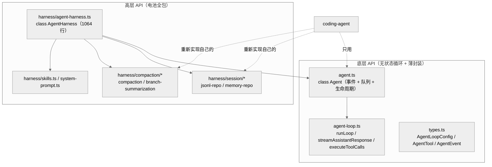
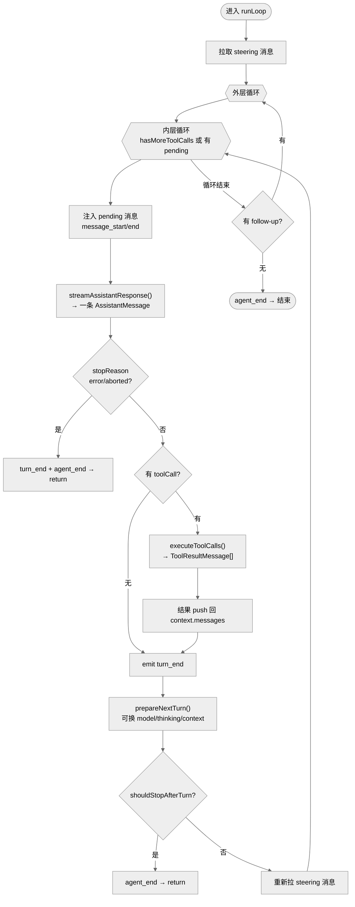
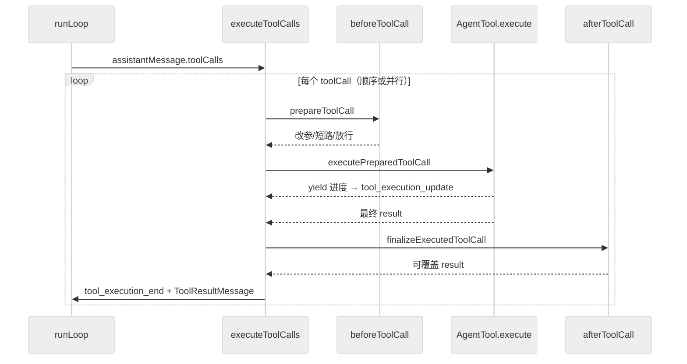
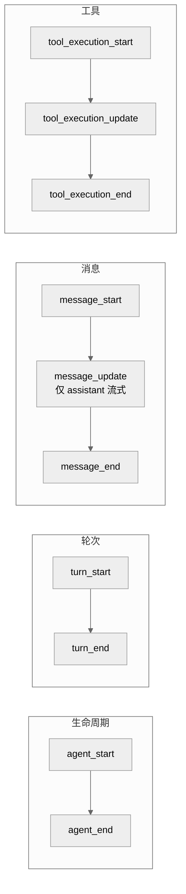

# 03 · pi-agent-core：Agent 循环与两层 API

> 一句话：`pi-agent-core` 在 `streamSimple` 之上实现了完整的"思考→调用工具→把结果喂回去→再思考"的 Agentic 循环，并把这套能力封装成两种粒度的 API：底层 `Agent` 类（coding-agent 实际用的）和高层 `AgentHarness`（自带会话/压缩/技能的"全家桶"，coding-agent 没用）。

这一章是全系统的**心脏**。读懂它，就读懂了"一个 Agent 到底是怎么自主多轮工作的"。

---

## 1. 两层 API：一个包，两种用法

`packages/agent` 的入口 `index.ts` 只有 5 行（先 `import "@earendil-works/pi-ai"` 触发 provider 注册，再 `export * from "./base.ts"`）。`base.ts`（39 行）把整个包的能力摊开 re-export，分成两层：

**关键洞察**：`coding-agent` 的 `sdk.ts` 只 `import { Agent }`，**不用 `AgentHarness`**。它在 `Agent` 之上重新实现了功能更丰富的会话持久化（`SessionManager`，3 棵分支树）、压缩（`compaction.ts`）、技能、系统提示。`AgentHarness` 是给"想要开箱即用 Agent"的第三方集成者准备的另一条路。

> 这种"一个引擎，两种封装"是有意为之：底层 `Agent` 把状态管理留给调用方，最大灵活；`AgentHarness` 把一切（会话存储、压缩、技能加载）打包，最省心。本章重点讲 `Agent` + 循环，因为那才是 pi CLI 的实际路径。

---

## 2. 无状态内核：runLoop

整个 Agentic 行为浓缩在 `agent-loop.ts`（748 行）的 `runLoop`（第 155-269 行）。它是一个**双重循环**：

- **内层循环**（第 173-260 行）：只要"还有工具要调"或"有待注入消息"，就继续。每轮：注入待处理消息 → 流式拿一条 assistant 回复 → 若有 toolCall 则执行并把结果推回上下文 → `prepareNextTurn` 钩子可换模型/思考等级/上下文 → `shouldStopAfterTurn` 钩子决定是否停。
- **外层循环**（第 169-268 行）：内层停下后，检查 `getFollowUpMessages()`（用户排队的后续消息），有就作为 pending 重入内层，否则退出。

这种设计把"模型自主多轮调工具"（内层）和"人类排队追加任务"（外层）解耦：内层是 Agent 的自主性，外层是人机协作的接口。

### steering vs follow-up

- **steering 消息**（`getSteeringMessages`，每轮开始和结束各拉一次）：用户在 Agent **思考过程中**插话，会被尽快注入到下一次模型请求前。
- **follow-up 消息**（`getFollowUpMessages`，仅在 Agent 即将停止时拉）：用户排队的下一个独立任务。

`Agent` 类把它们都接到一个 `followUpQueue`（见第 4 节）。

---

## 3. streamAssistantResponse：AgentMessage[] → Message[] → 流

`streamAssistantResponse`（第 275-368 行）是"把内部消息模型翻译成 LLM 消息、发请求、把流式事件转成 AgentEvent"的地方：

1. 用 `convertToLlm` 把 `AgentMessage[]`（含 4 种自定义类型）压成标准 `Message[]`；
2. 构造 `Context`（systemPrompt + messages + tools）；
3. 调 `getApiKey(provider)` 拿 key（OAuth 可在此刷新），注入 config；
4. 调 `streamFn(model, context, options)` 拿到 `AssistantMessageEventStream`；
5. 异步迭代事件流：每个事件 `emit({ type: "message_update", message: partial, assistantMessageEvent })`，UI 据此实时渲染；
6. 流结束后 `emit({ type: "message_end" })`，返回最终 `AssistantMessage`。

> 还记得第 02 章的契约吗？provider 流**永不抛异常**，失败编码成 `error` 事件 + `stopReason: "error"`。所以这里不需要 try/catch 包整个流——`runLoop` 第 197 行直接检查 `message.stopReason`。

`StreamFn` 类型（`types.ts:24-43`）签名 `(model, context, options) => AssistantMessageEventStream`。`Agent` 默认 `this.streamFn = options.streamFn ?? streamSimple`（`agent.ts:205`）——即默认直连 pi-ai 的 `streamSimple`，coding-agent 则注入自己的包装版（先查 ModelRegistry 拿 key/headers，见第 04 章）。

---

## 4. 工具执行：顺序 vs 并行

`executeToolCalls`（第 373-393 行）按 `config.parallelToolCalls` 分派：

- `executeToolCallsSequential`（第 395-450 行）：逐个执行，任一 `terminate` 立即停。
- `executeToolCallsParallel`（第 451-561 行）：并发执行，但**保留结果顺序**。

每个工具调用经过三段式（便于钩子介入）：

| 阶段 | 函数 | 行 | 钩子 |
|------|------|-----|------|
| 准备 | `prepareToolCall` | 562-627 | `beforeToolCall`（可改参数 / 短路返回 / 拒绝） |
| 执行 | `executePreparedToolCall` | 628-670 | 实际调 `AgentTool.execute` |
| 收尾 | `finalizeExecutedToolCall` | 671-722 | `afterToolCall`（可覆盖结果） |

执行过程发出 `tool_execution_start` / `tool_execution_update`（工具流式进度）/ `tool_execution_end` 三类事件（`types.ts:420-422`）。`AgentTool`（`types.ts:366-389`）扩展了 pi-ai 的 `Tool`，多了 `execute(args, context)`（返回 `AgentToolResult`，可 `yield` 中间进度）和可选的 `terminate` 标志（让某个工具结束整个循环，比如"完成任务"工具）。

---

## 5. AgentLoopConfig：循环的全部可调旋钮

`AgentLoopConfig`（`types.ts:135-277`）继承自 pi-ai 的 `SimpleStreamOptions`，再加上 Agent 专属字段。它就是"循环的依赖注入容器"——所有可定制行为都是它上面的回调：

| 字段 | 行 | 作用 |
|------|-----|------|
| `tools` | (继承/扩展) | 可用工具集 |
| `parallelToolCalls` | — | 顺序还是并行执行工具 |
| `shouldStopAfterTurn` | 208 | 每轮后是否停（如检测到 stop 工具） |
| `prepareNextTurn` | 215 | 每轮后换 model/thinking/context（压缩、模型切换） |
| `getSteeringMessages` | 230 | 拉取用户中途插话 |
| `getFollowUpMessages` | 243 | 拉取排队的后续任务 |
| `beforeToolCall` | 262 | 工具执行前拦截（权限、参数改写） |
| `afterToolCall` | 276 | 工具执行后改写结果 |

`Agent` 类把自己的方法绑到这些回调上（`agent.ts:436-447`）：`prepareNextTurn`、`getSteeringMessages: () => steeringQueue.drain()`、`getFollowUpMessages: () => followUpQueue.drain()`、`getApiKey` 等。这就是"无状态 runLoop"和"有状态 Agent"之间的桥。

---

## 6. Agent 类：状态、事件、生命周期

`agent.ts`（557 行）的 `Agent` 类（第 166 行）给无状态的 `runLoop` 包上状态和事件总线：

- **构造**（第 205-206 行）：`streamFn = options.streamFn ?? streamSimple`，存 `getApiKey`。
- **入口** `prompt()`（重载，第 325-337 行）：接受字符串 / `AgentMessage` / 数组，封成消息后 `runPromptMessages`（第 386 行）。
- **续跑** `continue()`（第 338 行）→ `runContinuation`（第 402 行）：不加新消息，让 Agent 基于现有上下文继续（崩溃恢复 / 手动续跑用）。
- **生命周期** `runWithLifecycle`（第 451 行）：建 AbortController、置 `isStreaming`、跑循环、`handleRunFailure`（第 476 行）兜底，最后 settle `agent_end` 监听器。
- **事件分发** `processEvents`（第 509 行）：把 `runLoop` emit 的 `AgentEvent` 转发给注册的监听器（coding-agent 的 `AgentSession` 就在这里订阅持久化，见第 04 章）。

### AgentEvent：12 种事件

`AgentEvent`（`types.ts:408-423`）是 Agent 对外的唯一可观测面，分四组：

一个 turn = 一条 assistant 回复 + 它触发的所有工具调用/结果。`message_update` 只在 assistant 流式时发，携带原始 `AssistantMessageEvent`（让 UI 拿到 token 级增量）。

### AgentState：可读快照

`AgentState`（`types.ts:317-342`）暴露一组只读/可写属性：`systemPrompt`、`model`、`thinkingLevel`、`tools`（getter/setter，赋值复制顶层数组）、`messages`、`isStreaming`、`streamingMessage`、`pendingToolCalls`（正在执行的工具 id 集合）、`errorMessage`（最近一次失败/中止）。这让外层能随时查询"Agent 现在在干嘛"。

---

## 7. 四种自定义消息类型

`runLoop` 处理的是 `AgentMessage`（`types.ts:309`）= 标准 `Message` ∪ 四种自定义类型（通过 TS 声明合并 `CustomAgentMessages` 注入，定义在 coding-agent 的 `messages.ts:70-77`）：

| 类型 | 用途 |
|------|------|
| `bashExecution` | 终端里直接跑的 bash（非模型发起），并入对话记录 |
| `custom` | 通用占位（扩展、UI 注解） |
| `branchSummary` | 分支被压缩成摘要时的节点 |
| `compactionSummary` | 上下文压缩生成的摘要 |

`streamAssistantResponse` 里的 `convertToLlm` 负责在送给模型前，把这些自定义类型翻译/折叠成标准消息（如把 `compactionSummary` 变成一条 user/assistant 文本）。这是"内部富消息模型 ↔ 厂商朴素消息模型"的又一处适配。

---

## 8. AgentHarness：另一条路（了解即可）

`harness/agent-harness.ts`（1064 行）的 `AgentHarness`（第 174 行）是高层封装：内建 session repo（`jsonl-repo.ts` / `memory-repo.ts`）、压缩（`compaction/compaction.ts`，762 行）、分支摘要（`branch-summarization.ts`，262 行）、技能（`skills.ts`，375 行）、系统提示（`system-prompt.ts`）、运行环境抽象（`env/nodejs.ts`，550 行）。

它和 coding-agent 的关系是**平行而非依赖**：coding-agent 借鉴了同样的概念（JSONL 会话、压缩、分支摘要），但实现在自己的 `core/` 下，功能更贴合交互式 CLI 的需求（分支树导航、标签、撤销）。`base.ts` 把 harness 的子模块也都 re-export 了（`compact`、`DEFAULT_COMPACTION_SETTINGS`、`generateBranchSummary` 等），所以第三方可单独取用。

> 为什么 coding-agent 不直接用 AgentHarness？因为交互式 CLI 需要的会话模型（可分支、可标签、可撤销、可压缩并保留树形历史）比 harness 默认提供的更复杂。复用底层 `Agent` + 自建 `SessionManager` 给了它完全的控制权。

---

## 9. 本章关键文件

| 文件 | 行数 | 职责 |
|------|------|------|
| `packages/agent/src/agent-loop.ts` | 748 | 无状态 Agentic 循环（runLoop / 流式 / 工具执行） |
| `packages/agent/src/agent.ts` | 557 | `Agent` 类：状态 + 事件 + 队列 + 生命周期 |
| `packages/agent/src/types.ts` | 423 | AgentLoopConfig / AgentTool / AgentEvent / AgentState |
| `packages/agent/src/base.ts` | 39 | 两层 API 的总 re-export 门面 |
| `packages/agent/src/index.ts` | 5 | 入口（触发 provider 注册 + re-export base） |
| `packages/agent/src/proxy.ts` | 367 | Agent 跨进程/跨边界代理 |
| `packages/agent/src/harness/agent-harness.ts` | 1064 | 高层 `AgentHarness`（coding-agent 未用） |
| `packages/agent/src/harness/compaction/compaction.ts` | 762 | harness 版上下文压缩 |
| `packages/agent/src/harness/types.ts` | 833 | harness 层类型 |

---

**下一步**：第 04 章看 `coding-agent` 如何用 `createAgentSession()` 把 `Agent`、ModelRegistry、SessionManager、工具、扩展全部装配成一个可交互的编码 Agent。
