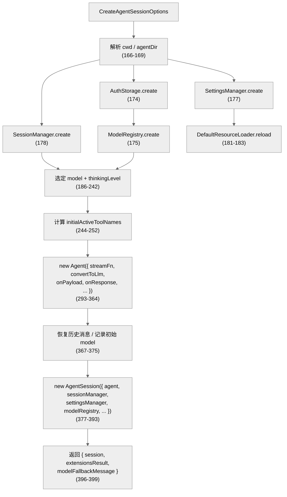
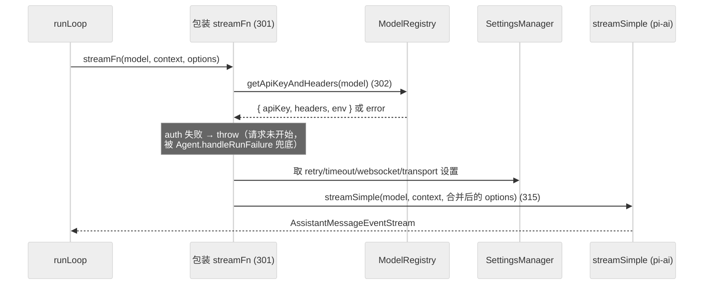
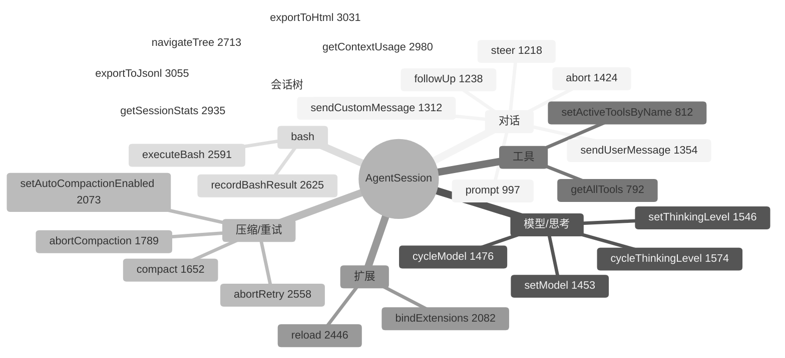
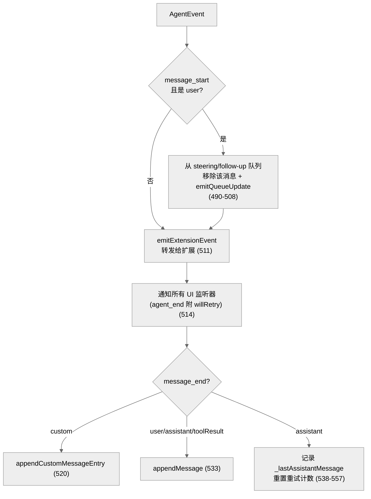
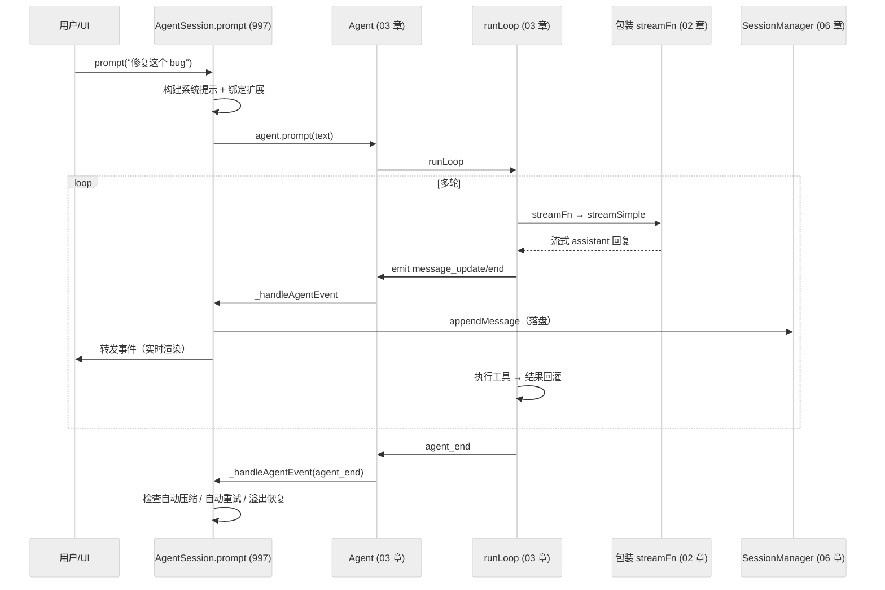

# 04 · AgentSession：编码 Agent 的总装与编排

> 一句话：`createAgentSession()` 是一条**装配流水线**——把鉴权、模型、设置、会话存储、资源加载、扩展、工具全部接到一个 `Agent` 上，再用 `AgentSession`（2791 行）这个**总编排器**包起来，对外提供 prompt / 压缩 / 分支 / 重试 / bash / 扩展绑定等一切交互能力。

第 03 章的 `Agent` 是发动机；这一章的 `AgentSession` 是整辆车——仪表盘、变速箱、油路全在这里。

---

## 1. createAgentSession：装配流水线

入口在 `packages/coding-agent/src/core/sdk.ts`，`createAgentSession()`（第 166-399 行）是整个系统唯一的"总装点"。它按依赖顺序把零件一个个造出来、接起来：



### 模型选择的优先级（186-242 行）

模型不是随便选的，有清晰的回退链：

1. `options.model`（显式指定）；
2. 否则若有历史会话且其记录了模型 → `modelRegistry.find(...)` + `hasConfiguredAuth` 校验（193-201）；
3. 仍无 → `findInitialModel(...)`（207-221）：查 settings 默认 provider/model，再查各 provider 默认；
4. 全失败 → `modelFallbackMessage = formatNoModelsAvailableMessage()`。

thinkingLevel 同样有回退链（225-242）：显式 → 历史会话 → settings 默认 `DEFAULT_THINKING_LEVEL`，最后 `clampThinkingLevel(model, ...)` 夹到模型能力范围内。

### 工具激活（244-252 行）

```
默认激活 = ["read", "bash", "edit", "write"]    // defaultActiveToolNames (244)
```

`options.tools` 显式指定则用它；`options.noTools` 则空集；再用 `excludeTools` 过滤。注意"激活"≠"可用"——共有 7 个内置工具，默认只激活 4 个写入/读取类，其余（grep/find/ls）可在会话中动态开启（见第 05 章）。

---

## 2. streamFn 包装：把鉴权/重试/扩展接进每次请求

`Agent` 默认的 `streamFn` 是直连 `streamSimple`，但 coding-agent 在 `sdk.ts:301-331` **重写**了它，这是把"业务策略"注入底层循环的关键缝合点：



这个包装里塞进了：
- **鉴权**：`modelRegistry.getApiKeyAndHeaders`（302）拿 key + 自定义 headers + env；
- **超时**：`httpIdleTimeoutMs === 0` 时用 `2147483647`（max int32）当"永不超时"，因为 SDK 把 0 当成 0ms 立即超时（309-312）；
- **重试**：从 `getProviderRetrySettings()` 取 `maxRetries` / `maxRetryDelayMs`；
- **归因头**：`mergeProviderAttributionHeaders(...)`（323-329）。

此外还接了三个扩展钩子（332-356）：`onPayload → before_provider_request`、`onResponse → after_provider_response`、`transformContext → context` 事件。它们都通过 `extensionRunnerRef.current`（一个延迟填充的引用）调到扩展系统——因为 `ExtensionRunner` 要等 `AgentSession` 构造后才 `bindExtensions`，所以这里用 ref 间接持有（见第 07 章）。

> `convertToLlm` 也被包装成 `convertToLlmWithBlockImages`（254-289）：当 `settingsManager.getBlockImages()` 为真时，动态把所有 `ImageContent` 替换成 "Image reading is disabled." 文本占位——纵深防御，防止图片在被禁用时仍流向模型。

---

## 3. AgentSession：2791 行里装了什么

`AgentSession`（`agent-session.ts:265`）是全系统**最大的协调类**。构造函数（334）做两件根本的事：保存所有依赖，然后 `this._unsubscribeAgent = this.agent.subscribe(this._handleAgentEvent)`（352）——**订阅 Agent 的事件流**，这是持久化和 UI 更新的总开关。

它的私有状态字段（270-332）暴露了它要协调多少事情：

| 状态组 | 字段 | 管什么 |
|--------|------|--------|
| 队列 | `_steeringMessages` / `_followUpMessages` / `_pendingNextTurnMessages` | 用户插话/排队/下一轮注入 |
| 压缩 | `_compactionAbortController` / `_autoCompactionAbortController` / `_overflowRecoveryAttempted` | 手动/自动压缩 + 溢出恢复 |
| 分支 | `_branchSummaryAbortController` | 分支摘要生成 |
| 重试 | `_retryAbortController` / `_retryAttempt` | 自动重试 |
| bash | `_bashAbortController` / `_pendingBashMessages` | 终端直跑 bash |
| 扩展 | `_extensionRunner` / `_extensionRunnerRef` / 一堆 `_extension*` | 扩展运行时 + UI 上下文 |
| 工具 | `_toolRegistry` / `_toolDefinitions` / `_toolPromptSnippets` / `_toolPromptGuidelines` | 工具表 + 各工具注入的提示片段 |
| 提示 | `_baseSystemPrompt` / `_baseSystemPromptOptions` | 系统提示基底 |

公开 API 极其丰富（70+ 方法/getter），按职责分组：



---

## 4. 事件处理与持久化：_handleAgentEvent

`_handleAgentEvent`（487-558）是 Agent 事件的中央处理器，每个 `AgentEvent` 都流经这里，做四件事：



要点：
- **入队即出队**：用户消息一旦真正进入 Agent（`message_start`），就从待处理队列里删掉，UI 立刻看到队列变短（490-508）。
- **扩展优先**：先发给扩展（511），再发给 UI 监听器（514）——扩展可以观察甚至影响后续。
- **追加式持久化**（516-557）：只有 `message_end` 才落盘。按 role 分流：`custom` → `appendCustomMessageEntry`；常规三种 role → `appendMessage`；`bashExecution`/`compactionSummary`/`branchSummary` 在别处持久化。
- **自动压缩/重试的触发点**：`assistant` 消息成功（`stopReason !== "error"`）则重置重试计数并记录 `_lastAssistantMessage`，供 `agent_end` 时判断是否要自动压缩。

> 设计哲学：`AgentSession` 不改 `Agent` 的循环逻辑，只**旁路监听**事件流来做持久化与 UI 同步。Agent 不知道会话文件、不知道终端的存在——这种单向依赖（AgentSession → Agent，反之没有）让底层循环保持纯粹、可测试。

---

## 5. prompt：一次用户输入的完整旅程

`prompt(text, options)`（997-1217，约 220 行）是最核心的对话入口。简化流程：

1. 准备：装系统提示（结合工具片段、技能、扩展）、确保扩展已绑定；
2. 调 `agent.prompt(text)` 启动第 03 章的 `runLoop`；
3. 循环内 emit 的事件经 `_handleAgentEvent` → 持久化 + UI；
4. 循环结束（`agent_end`）后：检查是否需要自动压缩、是否需要自动重试（如遇可重试错误）、是否有溢出需恢复。

这条链把前三章串起来了：



---

## 6. 运行模式与服务

`createAgentSession()` 返回的 `{ session, extensionsResult, modelFallbackMessage }` 被三种运行模式共用（详见第 09/10 章）：

- **交互模式**（`interactive-mode.ts`）：把 `AgentSession` 接到 TUI，订阅事件渲染。
- **打印模式**（`print-mode.ts`）：一次性 prompt，流式打印到 stdout。
- **RPC 模式**（`rpc-mode.ts`）：JSONL 协议包装，供程序化调用。

`AgentSession` 对这三者一视同仁——它只暴露 `subscribe(listener)`（691）和一组命令方法，UI 形态完全解耦。

---

## 7. 本章关键文件

| 文件 | 行数 | 职责 |
|------|------|------|
| `packages/coding-agent/src/core/sdk.ts` | 399 | `createAgentSession()` 总装 + streamFn 包装 |
| `packages/coding-agent/src/core/agent-session.ts` | 2791 | `AgentSession` 总编排器（对话/压缩/分支/重试/bash/扩展） |
| `packages/coding-agent/src/core/session-manager.ts` | 1402 | 会话持久化与分支树（第 06 章详解） |
| `packages/coding-agent/src/core/settings-manager.ts` | — | 设置读取（第 11 章详解） |
| `packages/coding-agent/src/core/model-registry.ts` | — | 模型 + 鉴权状态（第 11 章详解） |
| `packages/coding-agent/src/core/resource-loader.ts` | — | 扩展/技能/命令加载（第 07/12 章详解） |

---

**下一步**：第 05 章拆开工具系统——7 个内置工具如何定义、注册、执行，以及扩展工具如何被包成 `AgentTool`。
