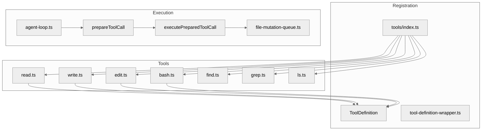

# 第四章：工具系统

## 一句话概括

Pi 的工具系统包含 7 个内置工具（read、write、edit、bash、find、grep、ls），通过 `ToolDefinition` 抽象层注册到 Agent，支持扩展自定义工具。

## 架构图



## 工具定义

### ToolDefinition 结构

[tools/index.ts](file:///workspace/packages/coding-agent/src/core/tools/index.ts)：

```typescript
export interface ToolDefinition {
    name: string;
    description?: string;
    inputSchema: Type | TSchema;
    execute: (
        id: string,
        args: Record<string, unknown>,
        signal: AbortSignal | undefined,
        onUpdate: ((partialResult: unknown) => void) | undefined,
        operations: BashOperations | undefined,
    ) => Promise<ToolResult>;
}

export interface ToolResult {
    content: Content[];
    details?: Record<string, unknown>;
    truncate?: boolean;
    terminate?: boolean;
}
```

### 工具注册表

[tools/index.ts](file:///workspace/packages/coding-agent/src/core/tools/index.ts#L96-L115)：

```typescript
export function createAllToolDefinitions(context: ToolContext): ToolDefinition[] {
    return [
        createReadTool(context),
        createWriteTool(context),
        createEditTool(context),
        createBashTool(context),
        createFindTool(context),
        createGrepTool(context),
        createLsTool(context),
        // 可选的只读工具
        ...(context.readOnlyTools ?? []),
    ];
}
```

## 内置工具详解

### 1. read 工具

[tools/read.ts](file:///workspace/packages/coding-agent/src/core/tools/read.ts)：

**功能**：读取文件或目录内容

**输入 Schema**：
```typescript
const ReadToolInput = Type.Object({
    path: Type.String(),
    offset: Type.Optional(Type.Number()),
    limit: Type.Optional(Type.Number()),
});
```

**核心流程**：
1. 验证路径安全性（检查 `..` 等路径遍历）
2. 检查文件类型（文件 vs 目录）
3. 如果是目录，列出目录内容
4. 如果是文件，读取内容并应用 offset/limit
5. 应用截断（如果文件过大）
6. 返回结果

**关键特性**：
- 支持 `offset` 和 `limit` 参数
- 自动检测文件编码
- 大文件自动截断
- 目录内容格式化输出

### 2. write 工具

[tools/write.ts](file:///workspace/packages/coding-agent/src/core/tools/write.ts)：

**功能**：写入内容到文件

**输入 Schema**：
```typescript
const WriteToolInput = Type.Object({
    path: Type.String(),
    content: Type.String(),
    append: Type.Optional(Type.Boolean()),
});
```

**核心流程**：
1. 解析目标路径
2. 如果 `append` 为 true，追加模式打开
3. 否则，检查文件是否存在（若存在则报错，防止意外覆盖）
4. 确保父目录存在
5. 写入内容
6. 返回成功/失败

**关键特性**：
- 默认不允许覆盖已有文件（安全措施）
- `append` 模式支持追加写入
- 自动创建父目录
- 写入前验证内容

### 3. edit 工具

[tools/edit.ts](file:///workspace/packages/coding-agent/src/core/tools/edit.ts)：

**功能**：对文件进行差异化编辑

**输入 Schema**：
```typescript
const EditToolInput = Type.Object({
    path: Type.String(),
    oldstring: Type.String(),
    newstring: Type.String(),
    diff: Type.Optional(Type.Boolean()),
});
```

**核心流程**：
1. 读取原文件内容
2. 验证 `oldstring` 是否存在于文件中
3. 使用 `diff` 库计算变更
4. 应用变更到文件
5. 返回修改结果

**关键特性**：
- 支持 `diff` 格式输出变更
- 精确匹配 `oldstring`
- 保留文件其他内容
- 错误处理（字符串不匹配）

### 4. bash 工具

[tools/bash.ts](file:///workspace/packages/coding-agent/src/core/tools/bash.ts)：

**功能**：执行 shell 命令

**输入 Schema**：
```typescript
const BashToolInput = Type.Object({
    command: Type.String(),
    workingDirectory: Type.Optional(Type.String()),
    maxDuration: Type.Optional(Type.Number()),
    "environment Variables": Type.Optional(Type.Record(Type.String(), Type.String())),
});
```

**核心流程**：
1. 解析命令和工作目录
2. 设置环境变量
3. 使用 Node.js `child_process` 执行
4. 捕获 stdout 和 stderr
5. 处理超时
6. 返回结果

**关键特性**：
- 支持 `workingDirectory` 设置
- 支持自定义环境变量
- 支持超时控制
- 支持流式输出更新
- 输出截断（防止过大输出）

### 5. find 工具

[tools/find.ts](file:///workspace/packages/coding-agent/src/core/tools/find.ts)：

**功能**：在文件系统中搜索文件

**输入 Schema**：
```typescript
const FindToolInput = Type.Object({
    path: Type.String(),
    pattern: Type.Optional(Type.String()),
    caseSensitive: Type.Optional(Type.Boolean()),
    includeHidden: Type.Optional(Type.Boolean()),
    excludePatterns: Type.Optional(Type.Array(Type.String())),
    fileType: Type.Optional(Type.Union([
        Type.Literal("file"),
        Type.Literal("directory"),
        Type.Literal("all"),
    ])),
});
```

**核心流程**：
1. 验证根路径
2. 获取排除模式
3. 递归遍历目录
4. 应用过滤条件
5. 返回匹配文件列表

### 6. grep 工具

[tools/grep.ts](file:///workspace/packages/coding-agent/src/core/tools/grep.ts)：

**功能**：在文件中搜索文本模式

**输入 Schema**：
```typescript
const GrepToolInput = Type.Object({
    pattern: Type.String(),
    path: Type.String(),
    caseSensitive: Type.Optional(Type.Boolean()),
    regex: Type.Optional(Type.Boolean()),
    context: Type.Optional(Type.Number()),
    include: Type.Optional(Type.Array(Type.String())),
    exclude: Type.Optional(Type.Array(Type.String())),
    maxResults: Type.Optional(Type.Number()),
});
```

### 7. ls 工具

[tools/ls.ts](file:///workspace/packages/coding-agent/src/core/tools/ls.ts)：

**功能**：列出目录内容

**输入 Schema**：
```typescript
const LsToolInput = Type.Object({
    path: Type.String(),
    all: Type.Optional(Type.Boolean()),
    long: Type.Optional(Type.Boolean()),
    sortBy: Type.Optional(Type.Union([
        Type.Literal("name"),
        Type.Literal("size"),
        Type.Literal("modified"),
    ])),
});
```

## 文件变更队列

### FileMutationQueue

[tools/file-mutation-queue.ts](file:///workspace/packages/coding-agent/src/core/tools/file-mutation-queue.ts)：

**用途**：协调同一文件上的多个并发修改操作

**核心机制**：
```typescript
export class FileMutationQueue {
    private queues = new Map<string, Promise<void>>();

    async enqueue(path: string, operation: () => Promise<void>): Promise<void> {
        const existingQueue = this.queues.get(path);
        const newQueue = (async () => {
            if (existingQueue) {
                await existingQueue;
            }
            await operation();
        })();
        this.queues.set(path, newQueue);
        return newQueue;
    }
}
```

**使用场景**：
- 当多个工具调用同时修改同一文件时
- 防止竞态条件
- 确保写入顺序

## 工具包装

### createToolDefinitionFromAgentTool

[tools/tool-definition-wrapper.ts](file:///workspace/packages/coding-agent/src/core/tools/tool-definition-wrapper.ts)：

```typescript
export function createToolDefinitionFromAgentTool(
    tool: AgentTool,
    context: ToolContext,
): ToolDefinition {
    return {
        name: tool.name,
        description: tool.description,
        inputSchema: tool.inputSchema,
        async execute(id, args, signal, onUpdate, operations) {
            // 调用原始 AgentTool.execute
            const result = await tool.execute(id, args as never, signal, onUpdate as never);

            // 包装结果
            return {
                content: result.content,
                details: result.details,
                terminate: result.terminate,
            };
        },
    };
}
```

## 输出截断

### truncate.ts

[tools/truncate.ts](file:///workspace/packages/coding-agent/src/core/tools/truncate.ts)：

**截断策略**：
1. **行数截断**：超过 `maxLines` 行时截断
2. **字节截断**：超过 `maxBytes` 字节时截断
3. **保留头部**：可选保留前 N 行
4. **保留尾部**：可选保留后 N 行

**配置项**：
```typescript
interface TruncateOptions {
    maxLines?: number;
    maxBytes?: number;
    suffix?: string;
    prefix?: string;
}
```

## 关键文件表

| 文件 | 行数 | 职责 |
|------|------|------|
| [packages/coding-agent/src/core/tools/index.ts](file:///workspace/packages/coding-agent/src/core/tools/index.ts) | ~150 | 工具注册表 |
| [packages/coding-agent/src/core/tools/bash.ts](file:///workspace/packages/coding-agent/src/core/tools/bash.ts) | ~4000 | bash 工具 |
| [packages/coding-agent/src/core/tools/read.ts](file:///workspace/packages/coding-agent/src/core/tools/read.ts) | ~1000 | read 工具 |
| [packages/coding-agent/src/core/tools/write.ts](file:///workspace/packages/coding-agent/src/core/tools/write.ts) | ~700 | write 工具 |
| [packages/coding-agent/src/core/tools/edit.ts](file:///workspace/packages/coding-agent/src/core/tools/edit.ts) | ~1200 | edit 工具 |
| [packages/coding-agent/src/core/tools/find.ts](file:///workspace/packages/coding-agent/src/core/tools/find.ts) | ~1500 | find 工具 |
| [packages/coding-agent/src/core/tools/grep.ts](file:///workspace/packages/coding-agent/src/core/tools/grep.ts) | ~1500 | grep 工具 |
| [packages/coding-agent/src/core/tools/ls.ts](file:///workspace/packages/coding-agent/src/core/tools/ls.ts) | ~1000 | ls 工具 |
| [packages/coding-agent/src/core/tools/file-mutation-queue.ts](file:///workspace/packages/coding-agent/src/core/tools/file-mutation-queue.ts) | ~150 | 文件变更队列 |
| [packages/coding-agent/src/core/tools/truncate.ts](file:///workspace/packages/coding-agent/src/core/tools/truncate.ts) | ~300 | 输出截断 |
