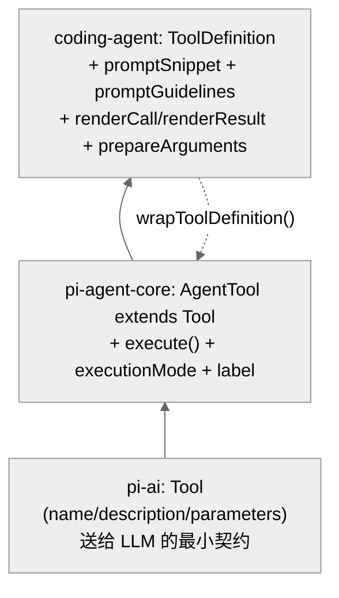
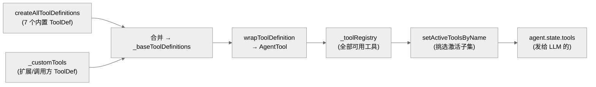

# 05 · 工具系统：7 个内置工具与 ToolDefinition 抽象

> 一句话：pi 用 `ToolDefinition`（一个比 LLM 原始工具更丰富的结构）统一描述工具——它不仅有名字/描述/参数 schema/执行函数，还带"系统提示片段""渲染器""执行模式"等 UI/编排元数据；7 个内置工具都是工厂函数产出的 `ToolDefinition`，运行时再 `wrapToolDefinition` 成底层 `AgentTool`。

工具是 Agent 与真实世界交互的唯一手段。读懂工具系统，就读懂了"模型能做什么、不能做什么、怎么被约束"。

---

## 1. 三层工具抽象

pi 的工具有三层类型，从底到高：



| 层 | 定义处 | 多了什么 |
|----|--------|---------|
| `Tool` | `pi-ai/types.ts:358` | LLM 看到的：name、description、parameters(JSON schema) |
| `AgentTool` | `agent/types.ts:366-389` | 运行时执行：`execute(toolCallId, params, signal, onUpdate)`、`executionMode`、`label` |
| `ToolDefinition` | `coding-agent/.../extensions/types.ts:435-484` | UI + 提示编排：`promptSnippet`、`promptGuidelines`、`renderCall`、`renderResult`、`prepareArguments`、`renderShell` |

**为什么要三层？** 因为同一个"工具"在不同语境扮演不同角色：对 LLM 它是一段 schema；对循环它是一个可中止的异步函数；对终端 UI 它需要知道怎么画进度和结果、给系统提示贡献什么说明。`ToolDefinition`（定义在扩展类型里，因为扩展也能贡献工具）是 pi 内部的"完全体"，`AgentTool` 是喂给底层循环的"精简体"。

### ToolDefinition 的完整字段

`ToolDefinition<TParams, TDetails, TState>`（`extensions/types.ts:435-484`）：

| 字段 | 行 | 作用 |
|------|-----|------|
| `name` / `label` / `description` | 437-441 | LLM 调用名 / UI 标签 / LLM 看的描述 |
| `promptSnippet` | 442 | 系统提示"Available tools"段里的一行说明（不填则该工具不出现在该段） |
| `promptGuidelines` | 444 | 工具激活时追加到系统提示 Guidelines 段的要点 |
| `parameters` | 446 | TypeBox schema |
| `renderShell` | 448 | UI 用标准外壳还是工具自渲染 |
| `prepareArguments` | 451 | schema 校验前的参数兼容垫片 |
| `executionMode` | 460 | `"sequential"` 或 `"parallel"`（覆盖默认） |
| `execute` | 463-469 | 执行（带 `toolCallId`/`params`/`signal`/`onUpdate`/`ctx`） |
| `renderCall` / `renderResult` | 471-481 | 终端自定义渲染 |

`defineTool()`（`extensions/types.ts:493`）是给扩展作者的辅助，保留参数类型推断。

---

## 2. 七个内置工具

`allToolNames`（`core/tools/index.ts:84`）写死了 7 个：

```
read · bash · edit · write · grep · find · ls
```

`ToolName` 联合类型（`index.ts:83`）与之对应。各工具一个文件、一个工厂：

| 工具 | 文件 | 行数 | 职责 | 关键约束 |
|------|------|------|------|---------|
| `read` | `read.ts` | 362 | 读文件（含图像，自动缩放） | 截断到 2000 行 / 50KB（`truncate.ts:11-12`） |
| `bash` | `bash.ts` | 453 | 执行 shell 命令 | 可选超时（秒，无默认超时，`bash.ts:26`） |
| `edit` | `edit.ts` | 437 | 精确字符串替换 | 配合 `edit-diff.ts`(560 行) 做 diff |
| `write` | `write.ts` | 267 | 写整个文件 | 经文件互斥队列 |
| `grep` | `grep.ts` | 385 | 内容搜索（ripgrep 风格） | 每行最长 500 字符（`truncate.ts:13`） |
| `find` | `find.ts` | 367 | 文件名/路径匹配 | — |
| `ls` | `ls.ts` | 225 | 列目录 | — |

> **激活 ≠ 存在**：7 个工具全都"存在"，但默认只**激活** 4 个：`["read","bash","edit","write"]`（`sdk.ts:244`）。grep/find/ls 默认关闭，可在会话中用 `setActiveToolsByName` 开启（第 3 节）。设计意图：模型常用 `bash` 内的 `rg`/`find`/`ls` 就够了，独立工具是可选增强，减少工具列表噪声。

### 工厂模式与分发

`core/tools/index.ts`（196 行）提供两类工厂：

- 单个：`createToolDefinition(name, cwd, options)`（96-115，一个 switch 分发到 7 个 `create*ToolDefinition`）和 `createTool(...)`（117）。
- 成组：`createCodingToolDefinitions`（138，read/bash/edit/write）、`createReadOnlyToolDefinitions`（147）、`createAllToolDefinitions`（156，返回 `Record<ToolName, ToolDef>`），以及对应的 `*Tools` 版本（168-196，直接产 `AgentTool`）。

每个 `create*ToolDefinition(cwd, options)` 都返回带 `promptSnippet`/`promptGuidelines` 的完整定义。例如 read（`read.ts:203-216`）：

```ts
return {
  name: "read", label: "read",
  description: `Read the contents of a file...`,
  promptSnippet: "Read file contents",
  promptGuidelines: ["Use read to examine files instead of cat or sed."],
  parameters: readSchema,
  async execute(_toolCallId, { path, offset, limit }, signal, _onUpdate, ctx) { ... }
};
```

`promptGuidelines` 是个有意思的细节：它把"别用 cat/sed，用 read"这类引导**绑定在工具上**，工具激活时才注入系统提示。这让系统提示随激活工具集动态变化（见第 12 章）。

---

## 3. AgentSession 如何管理工具表

`AgentSession` 维护四张表（`agent-session.ts:325-328`）：`_toolRegistry`（name→AgentTool）、`_toolDefinitions`、`_toolPromptSnippets`、`_toolPromptGuidelines`。

构建过程（`reload()` 附近，`agent-session.ts:2400-2412`）：

1. 基础工具定义来自 `createAllToolDefinitions(cwd, ...)`（2407）或 `_baseToolsOverride`（测试/嵌入场景，2400-2406）；
2. 把它们和 `_customTools`（扩展/调用方提供的 `ToolDefinition[]`）合并进 `_baseToolDefinitions`（2412）；
3. 每个定义 `wrapToolDefinition(...)` 成 `AgentTool` 入 `_toolRegistry`（2300-2365）；
4. `setActiveToolsByName([...])`（2389 / 812）从注册表里挑出"激活"的子集，赋给 `agent.state.tools`——**只有激活的工具才出现在发给 LLM 的工具列表里**。



`wrapToolDefinition`（`tool-definition-wrapper.ts:5-20`）做的转换很薄：拷 name/label/description/parameters/prepareArguments/executionMode，把 `execute` 重新绑定并注入 `ctxFactory()` 产出的 `ExtensionContext`（让工具能访问 model、cwd、扩展能力等）。反向的 `createToolDefinitionFromAgentTool`（34-44）则把裸 `AgentTool` 合成最小 `ToolDefinition`，保证内部注册表始终"定义优先"。

---

## 4. 执行流：从 toolCall 到 ToolResultMessage

回顾第 03 章：`runLoop` 拿到带 `toolCall` 的 assistant 消息后调 `executeToolCalls`，对每个调用走"准备→执行→收尾"。`AgentTool.execute` 的签名（`agent/types.ts:376-383`）：

```
execute(toolCallId, params, signal?, onUpdate?): Promise<AgentToolResult<TDetails>>
```

- **`signal`**：每个工具都拿到 `AbortSignal`，用户中止时立即停。read 工具（`read.ts:216-260`）就监听 `signal` 的 `abort` 事件并 reject。
- **`onUpdate`**（`AgentToolUpdateCallback`，`agent/types.ts:363`）：工具可推送中间进度，转成 `tool_execution_update` 事件让 UI 实时显示（如 bash 的流式输出）。
- **返回 `AgentToolResult<TDetails>`**：含 `content`（喂回模型的文本/图像）和 `details`（结构化数据，给 UI 渲染器用，不进模型上下文）。

### 执行模式：sequential vs parallel

`executionMode`（`ToolExecutionMode = "sequential" | "parallel"`，`agent/types.ts:36`）控制一个工具能否与同批其它工具并发。默认由 `config.parallelToolCalls` 决定，单个工具可覆盖。例如写文件类工具往往标 `sequential` 以避免竞态。

### 文件互斥队列

`write`/`edit` 通过 `withFileMutationQueue(filePath, fn)`（`file-mutation-queue.ts:32`）串行化对**同一文件**的修改：它用一个 `Map<规范化路径, Promise链>`（第 4 行）把对同一文件的操作排成队列，即使并行执行的工具碰到同一文件也不会互相踩。`getMutationQueueKey`（第 16 行）做路径规范化（真实路径），确保软链/相对路径指向同一文件时用同一把锁。

---

## 5. 截断与输出治理

工具输出可能很大，`truncate.ts`（276 行）定义全局上限：

| 常量 | 值 | 行 | 含义 |
|------|-----|-----|------|
| `DEFAULT_MAX_LINES` | 2000 | 11 | 读/grep 最大行数 |
| `DEFAULT_MAX_BYTES` | 50KB | 12 | 读/grep 最大字节 |
| `GREP_MAX_LINE_LENGTH` | 500 | 13 | grep 单行匹配最大字符 |

`read` 命中任一上限即截断并提示用 offset/limit 续读（`read.ts:212` 的 description 明确告诉模型这一约定）。`output-accumulator.ts`（222 行）则负责把流式工具输出累积、按上限裁剪。这些数字是"上下文经济学"的体现——既要给模型足够信息，又不能让单个工具结果撑爆上下文窗口。

---

## 6. 扩展工具：同一抽象，外部来源

扩展贡献的工具走的是**完全相同**的 `ToolDefinition` 抽象（这也是为什么 `ToolDefinition` 定义在 `extensions/types.ts` 里）。扩展注册的工具进入 `_customTools`，和内置工具一样被合并、wrap、激活。区别仅在来源与 `ctx`：扩展工具的 `execute` 能拿到扩展的 `ExtensionContext`。第 07 章详述扩展如何注册工具。

> 一致性红利：因为内置工具和扩展工具共享 `ToolDefinition`，渲染器、系统提示注入、激活管理、文件互斥等机制对两者**一视同仁**。新增一个扩展工具不需要碰循环或 UI 代码。

---

## 7. 本章关键文件

| 文件 | 行数 | 职责 |
|------|------|------|
| `packages/coding-agent/src/core/tools/index.ts` | 196 | 工具名/工厂/分发（`allToolNames`、`create*Tool*`） |
| `packages/coding-agent/src/core/extensions/types.ts` | — | `ToolDefinition` 接口（435-484）、`defineTool` |
| `packages/coding-agent/src/core/tools/tool-definition-wrapper.ts` | 45 | `ToolDefinition ↔ AgentTool` 互转 |
| `packages/coding-agent/src/core/tools/read.ts` | 362 | read 工具（文本+图像+缩放） |
| `packages/coding-agent/src/core/tools/bash.ts` | 453 | bash 工具（本地 shell 执行后端） |
| `packages/coding-agent/src/core/tools/edit.ts` + `edit-diff.ts` | 437 + 560 | edit 工具 + diff 计算 |
| `packages/coding-agent/src/core/tools/truncate.ts` | 276 | 输出截断常量与逻辑 |
| `packages/coding-agent/src/core/tools/file-mutation-queue.ts` | 61 | 同文件写操作串行化 |

---

**下一步**：第 06 章看上下文压缩与会话持久化——当对话超出上下文窗口时，pi 如何压缩历史、如何把会话存成可分支的树。
