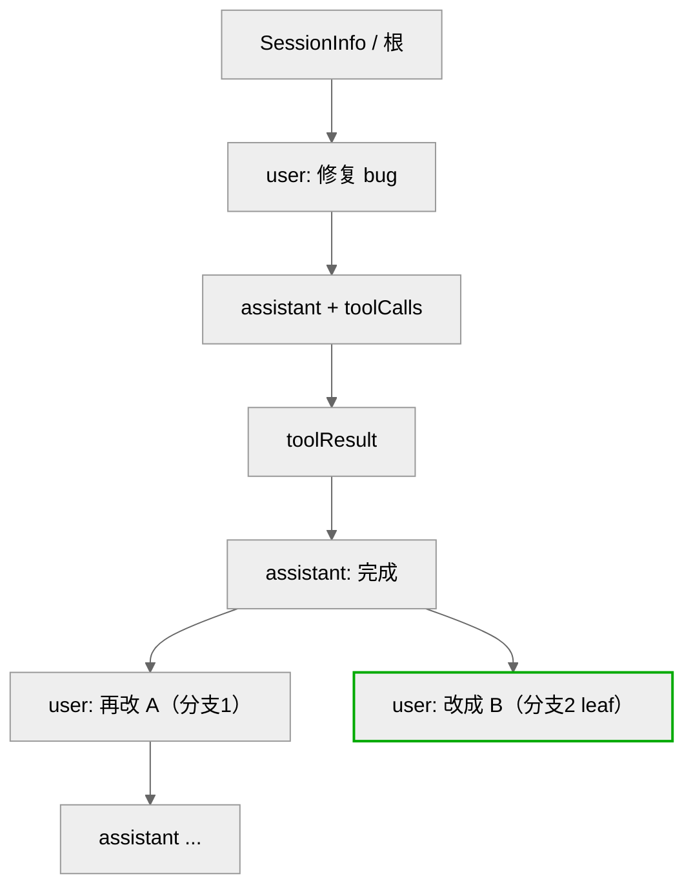
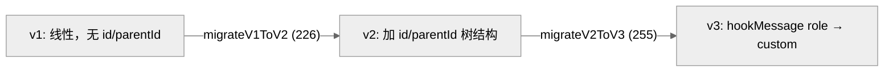
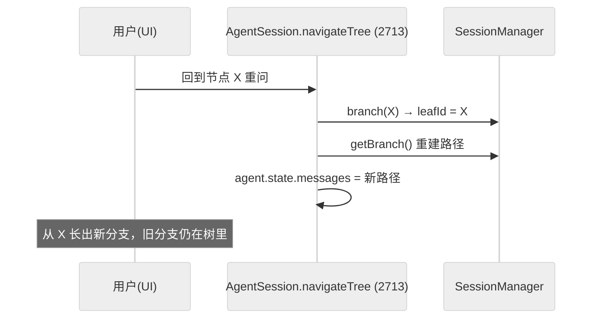
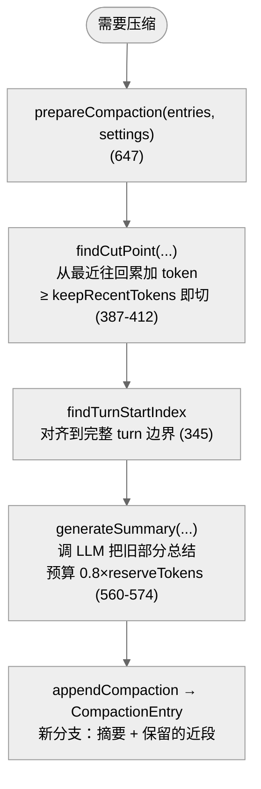

# 06 · 上下文压缩与会话持久化

> 一句话：pi 把会话存成一棵**追加式的树**（每条记录有 `id`/`parentId`，支持分支/标签/撤销），用 `buildSessionContext()` 从叶子回溯到根重建给 LLM 的消息列表；当 token 逼近上下文窗口时，`compact()` 把旧消息折叠成摘要，保留最近 ~20000 token 的原文。

这一章回答两个问题：**对话存在哪、怎么存**（持久化与分支），以及**对话太长怎么办**（压缩）。

---

## 1. 会话不是数组，是一棵树

最违反直觉、也最关键的设计：pi 的会话**不是线性消息数组**，而是 `SessionEntry` 组成的树。每个条目（`session-manager.ts:46-51`）都有：

```ts
interface SessionEntryBase {
  id: string;            // uuidv7
  parentId: string | null;  // 指向父节点 → 形成树
  timestamp: string;
}
```

"当前对话"是从某个**叶子**沿 `parentId` 回溯到根的那条路径。这让分支、撤销、压缩都变成"换叶子"或"插节点"的树操作。



`leafId`（`session-manager.ts:769`）指向当前活动叶子。`buildSessionContext()`（1167）→ 内部 `buildSessionContext(entries, byId, leafId)`（325-...）从 `leafId` 回溯到根（361 行 `current = current.parentId ? byId.get(current.parentId) : undefined`），把路径上的条目翻译成 `AgentMessage[]`。

### 九种 SessionEntry

`SessionEntry` 联合类型（`session-manager.ts:140-149`）有 9 种：

| 类型 | 行 | 进入 LLM 上下文？ | 含义 |
|------|-----|:---:|------|
| `SessionMessageEntry` | 53 | ✅ | 普通 user/assistant/toolResult 消息 |
| `ThinkingLevelChangeEntry` | 58 | — | 思考等级变更标记 |
| `ModelChangeEntry` | 63 | — | 模型切换标记 |
| `CompactionEntry` | 69 | ✅(作摘要) | 压缩生成的摘要节点 |
| `BranchSummaryEntry` | 80 | ✅(作摘要) | 分支被折叠的摘要 |
| `CustomEntry` | 100 | ❌ | 扩展私有数据（`buildSessionContext` 忽略） |
| `CustomMessageEntry` | 131 | ✅(转 user) | 扩展注入、会进上下文的消息 |
| `LabelEntry` | 107 | — | 给某节点打标签 |
| `SessionInfoEntry` | 114 | — | 会话名等元信息 |

注意区分 `CustomEntry`（纯旁路数据，不进上下文）和 `CustomMessageEntry`（在 `buildSessionContext` 里转成 user 消息进上下文）——这是扩展"想不想影响模型"的开关。

---

## 2. 追加式持久化与 JSONL

`SessionManager`（`session-manager.ts:758`，私有构造 771，用静态 `create()` 工厂）把每个条目**追加**写入一个 JSONL 文件：

- `_persist(entry)`（909）+ `_appendEntry(entry)`（938）：设 `parentId = this.leafId`，写一行 JSON，更新 `leafId = entry.id`（941）。
- 所有 `append*` 方法（951-1085）都走这条路：`appendMessage`（951）、`appendThinkingLevelChange`（964）、`appendModelChange`（977）、`appendCompaction`（991）、`appendCustomEntry`（1014）、`appendSessionInfo`（1028）、`appendCustomMessageEntry`（1062）、`appendLabelChange`（1123）。

文件首行是 `SessionHeader`（含 `version`）。`_buildIndex()`（852）启动时把整个 JSONL 读进 `byId` 映射（id→entry）重建树。`_rewriteFile()`（873）在需要时整体重写（如压缩后）。

> **为什么追加式？** 崩溃安全 + 简单。进程随时可能被 Ctrl-C，追加写保证已发生的事不丢；树结构让"撤销"不是删除而是换叶子，历史永远可回溯。代价是文件会增长，靠压缩和偶尔 `_rewriteFile` 控制。

### 版本迁移

`CURRENT_SESSION_VERSION = 3`（30）。`migrateToCurrentVersion(entries)`（276-289）按版本逐步迁移：



`migrateV1ToV2`（226-253）给老的线性会话补上 `id`/`parentId`（每条指向前一条，形成退化的链）；`migrateV2ToV3`（255-275）把旧的 `hookMessage` role 改名为 `custom`。旧会话文件因此能被新版本无损读取。

---

## 3. 分支、标签、撤销

树结构让一组高级操作变得自然：

| 操作 | 方法 | 行 | 做什么 |
|------|------|-----|--------|
| 切换叶子 | `branch(branchFromId)` | 1243 | 把 `leafId` 移到某历史节点，后续消息从那里长出新分支 |
| 带摘要分支 | `branchWithSummary(...)` | 1264 | 把当前分支折叠成 `BranchSummaryEntry` 再分叉 |
| 重置叶子 | `resetLeaf()` | 1255 | 回到无叶子状态 |
| 打标签 | `appendLabelChange(targetId, label)` | 1123 | 给节点贴标签（书签/命名检查点） |
| 取子节点 | `getChildren(parentId)` | 1101 | 列出某节点的所有分支 |
| 取树 | `getTree()` | 1193 | 构造可视化的 `SessionTreeNode[]` |
| 派生新会话 | `createBranchedSession(leafId)` | 1288 | 从某节点 fork 出独立会话文件 |

`AgentSession.navigateTree(...)`（`agent-session.ts:2713`）就是把这些底层树操作暴露给 UI 的入口——用户在交互模式里"回到上一个问题重问"，本质是 `branch()` 到某个旧节点。



---

## 4. 上下文压缩：何时、怎么压

对话越长，每次请求越贵、越慢，最终撑爆上下文窗口。`compaction.ts`（888 行）负责把旧历史折叠成摘要。

### 触发阈值

`DEFAULT_COMPACTION_SETTINGS`（`compaction.ts:122-126`）：

```ts
{ enabled: true, reserveTokens: 16384, keepRecentTokens: 20000 }
```

`shouldCompact(contextTokens, contextWindow, settings)`（220-223）的判据极简：

```ts
if (!settings.enabled) return false;
return contextTokens > contextWindow - settings.reserveTokens;
```

即"已用 token 超过（窗口 − 预留 16384）"就该压。`reserveTokens` 是给"下一次回复 + 压缩本身"留的余量。

### token 估算

`calculateContextTokens(usage)`（136）优先用上一条 assistant 消息的真实 usage（`getLastAssistantUsage`，157）；新消息没有 usage 时用 `estimateTokens(message)`（251-290）粗估——**字符数除以 4**（`Math.ceil(chars / 4)`，对 user/assistant/toolResult/bashExecution/summary 各类内容分别累加字符）。`estimateContextTokens`（187）把"已知 usage + 之后新消息的估算"加起来。

> 4 字符 ≈ 1 token 是业界常用的英文粗估。pi 用它在没有真实 usage 时给压缩决策一个保守估计——估高了顶多早压一点，不会撑爆。

### 切点与摘要



- `findCutPoint(entries, start, end, keepRecentTokens)`（387）：从**最近的消息往回**累加 `estimateTokens`，累计到 ≥ `keepRecentTokens`（20000）就在那切（412）。切点之前 = 要压缩的旧历史，之后 = 原样保留的近段。
- `findTurnStartIndex`（345）：把切点对齐到一个完整 turn 的开头，避免把"半个工具调用"切散。
- `generateSummary(...)`（560）：调 LLM 生成摘要，预算约 `0.8 × reserveTokens`（574）。
- 结果写成 `CompactionEntry`（991 `appendCompaction`），形成新分支：一条摘要节点 + 后面保留的原始近段。旧的长历史还在树里（没删），只是不在活动路径上了。

`AgentSession.compact()`（`agent-session.ts:1652`）是手动入口；自动压缩在每次 `agent_end` 后由 `_handleAgentEvent` 触发（见第 04 章），用 `_autoCompactionAbortController` 管理可中止性，并有 `_overflowRecoveryAttempted` 处理"压了还是溢出"的兜底。

---

## 5. 压缩 vs 分支摘要

两者都产生"摘要节点"，但语义不同：

| | 压缩（CompactionEntry） | 分支摘要（BranchSummaryEntry） |
|--|------------------------|------------------------------|
| 触发 | 上下文将满 | 用户主动折叠某条分支 |
| 目的 | 省 token、续命当前对话 | 把一条探索分支归档成一句话 |
| 保留 | 切点后的近段原文 | 整条分支变成摘要 |
| 方法 | `compact()` / `appendCompaction` | `branchWithSummary()` / `branch-summarization` |

两者都让"长历史"以低成本形式留在树里，区别是压缩偏自动续命，分支摘要偏人工归档。

---

## 6. 与底层 harness 的关系

第 03 章提过，`pi-agent-core` 的 harness 也有一套压缩（`agent/.../compaction/compaction.ts`，762 行）和会话 repo。coding-agent 的这套是**平行的、更丰富的重实现**：harness 版偏通用，coding-agent 版加了树形分支、标签、撤销、版本迁移、自动压缩+溢出恢复等交互式 CLI 特有能力。`DEFAULT_COMPACTION_SETTINGS` 两边数值一致（都是 16384/20000），核心算法（找切点、估 token、生成摘要）思路相同。

---

## 7. 本章关键文件

| 文件 | 行数 | 职责 |
|------|------|------|
| `packages/coding-agent/src/core/session-manager.ts` | 1577 | 会话树持久化（JSONL、分支、标签、迁移、`buildSessionContext`） |
| `packages/coding-agent/src/core/compaction/compaction.ts` | 888 | 压缩（阈值、token 估算、切点、摘要生成） |
| `packages/coding-agent/src/core/agent-session.ts` | 3148 | `compact()`(1652) / `navigateTree()`(2713) / 自动压缩触发 |
| `packages/agent/src/harness/compaction/compaction.ts` | 762 | harness 平行实现（数值一致） |

**关键常量**：`CURRENT_SESSION_VERSION = 3`（session-manager.ts:30）；`DEFAULT_COMPACTION_SETTINGS = { enabled:true, reserveTokens:16384, keepRecentTokens:20000 }`（compaction.ts:122-126）；token 估算 `chars/4`（compaction.ts:259 等）。

---

**下一步**：第 07 章进入扩展系统——pi 如何让用户用 JS/TS 注入自定义工具、provider、钩子，以及 package-manager 如何安装它们。
