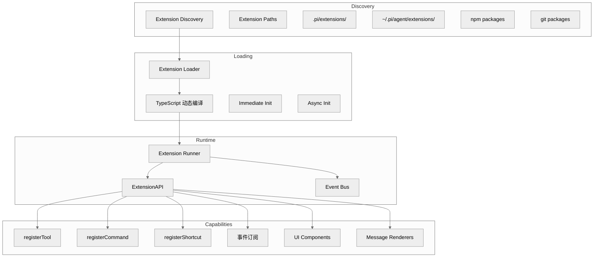

# 第六章：扩展系统

## 一句话概括

Pi 的扩展系统是一个 TypeScript 模块系统，允许开发者通过注册工具、命令、事件订阅和 UI 组件来扩展核心功能，所有扩展默认拥有完整系统权限。

## 架构图



## 扩展发现

### 扩展路径

[resource-loader.ts](file:///workspace/packages/coding-agent/src/core/resource-loader.ts)：

```typescript
const DEFAULT_EXTENSION_PATHS = [
    ".pi/extensions/",           // 项目级
    "extensions/",               // 项目级（兼容）
    "~/.pi/agent/extensions/",  // 用户级
    "~/.pi/extensions/",        // 用户级（兼容）
];
```

### 扩展发现逻辑

```typescript
async discoverExtensions(paths: string[]): Promise<ExtensionCandidate[]> {
    const candidates: ExtensionCandidate[] = [];

    for (const basePath of paths) {
        const extensionsDir = expandTilde(basePath);

        if (isNpmPackage(extensionsDir)) {
            // npm 包
            candidates.push(await loadNpmExtension(extensionsDir));
        } else if (isGitUrl(extensionsDir)) {
            // git 仓库
            candidates.push(await loadGitExtension(extensionsDir));
        } else {
            // 本地目录
            for (const file of readdirSync(extensionsDir)) {
                if (file.endsWith(".ts") || file.endsWith(".js")) {
                    candidates.push(loadFileExtension(join(extensionsDir, file)));
                }
            }
        }
    }

    return candidates;
}
```

## 扩展加载

### ExtensionLoader

[extensions/loader.ts](file:///workspace/packages/coding-agent/src/core/extensions/loader.ts)：

```typescript
export class ExtensionLoader {
    async load(candidates: ExtensionCandidate[]): Promise<LoadExtensionsResult> {
        const extensions: LoadedExtension[] = [];
        const errors: ExtensionError[] = [];

        for (const candidate of candidates) {
            try {
                // 1. 动态编译 TypeScript
                const factory = await this.compileExtension(candidate);

                // 2. 执行工厂函数
                const instance = await factory();

                // 3. 添加到已加载列表
                extensions.push({ path: candidate.path, instance });
            } catch (error) {
                errors.push({ path: candidate.path, error });
            }
        }

        return { extensions, errors };
    }
}
```

### TypeScript 动态编译

```typescript
async compileExtension(candidate: ExtensionCandidate): Promise<ExtensionFactory> {
    if (candidate.path.endsWith(".js")) {
        // 直接 import
        return await import(candidate.path);
    }

    // 使用 jiti 编译 TypeScript
    const jiti = await loadJiti();
    return jiti(candidate.path);
}
```

## ExtensionAPI

### 核心接口

[extensions/types.ts:1100-1300](file:///workspace/packages/coding-agent/src/core/extensions/types.ts#L1100-L1300)：

```typescript
export interface ExtensionAPI {
    // 工具注册
    registerTool(definition: ToolDefinition): void;
    replaceTool(name: string, definition: ToolDefinition): void;

    // 命令注册
    registerCommand(command: CommandDefinition): void;

    // 快捷键注册
    registerShortcut(shortcut: ShortcutDefinition): void;

    // 事件订阅
    on<K extends ExtensionEventType>(
        event: K,
        handler: ExtensionHandler<K>
    ): () => void;

    // 消息渲染
    registerMessageRenderer(renderer: MessageRenderer): void;

    // UI 上下文
    ui: ExtensionUIContext;

    // 会话信息
    getSession(): AgentSession;
    setSessionName(name: string): void;
    getSessionName(): string | undefined;

    // 工具和命令
    getActiveTools(): ToolDefinition[];
    getAllTools(): ToolDefinition[];
    getCommands(): SlashCommandInfo[];

    // Bash 执行
    exec(options: ExecOptions): Promise<ExecResult>;

    // 设置
    getSettings(): SettingsManager;
}
```

### 工具注册

```typescript
registerTool(definition: ToolDefinition): void {
    // 验证定义
    validateToolDefinition(definition);

    // 添加到扩展工具列表
    this.extensionTools.push(definition);

    // 通知会话需要重新构建工具
    this.session?.rebuildTools();
}
```

### 命令注册

```typescript
registerCommand(command: CommandDefinition): void {
    this.commands.push(command);
}
```

## 事件系统

### 可订阅事件

[extensions/types.ts:500-1008](file:///workspace/packages/coding-agent/src/core/extensions/types.ts#L500-L1008)：

```typescript
export type ExtensionEventType =
    // 会话事件
    | "session_start"
    | "session_end"
    | "agent_start"
    | "agent_end"

    // 消息事件
    | "message_start"
    | "message_end"
    | "message_update"
    | "before_tool_call"
    | "after_tool_call"

    // 工具事件
    | "tool_execution_start"
    | "tool_execution_end"
    | "tool_execution_update"

    // 输入事件
    | "input"
    | "input_transform"

    // 模型事件
    | "before_model_request"
    | "after_model_response"

    // UI 事件
    | "ui_render"
    | "overlay_open"
    | "overlay_close"

    // 其他
    | "custom";
```

### 事件订阅示例

```typescript
export default function (pi: ExtensionAPI) {
    // 订阅工具调用前事件
    pi.on("before_tool_call", async (event) => {
        if (event.toolName === "bash") {
            // 检查危险命令
            if (event.args.command.includes("rm -rf")) {
                return { block: true, reason: "Dangerous command blocked" };
            }
        }
    });

    // 订阅工具执行完成事件
    pi.on("after_tool_call", async (event) => {
        console.log(`Tool ${event.toolName} executed with result:`, event.result);
    });
}
```

## ExtensionRunner

### 生命周期

[extensions/runner.ts](file:///workspace/packages/coding-agent/src/core/extensions/runner.ts)：

```typescript
export class ExtensionRunner {
    async initialize(
        extensions: LoadedExtension[],
        session: AgentSession,
    ): Promise<void> {
        // 1. 初始化 UI 上下文
        this.uiContext = this.createUIContext();

        // 2. 注册扩展工具
        for (const ext of extensions) {
            if (ext.instance.registerTool) {
                ext.instance.registerTool(this.toolRegistrar);
            }
        }

        // 3. 注册扩展命令
        for (const ext of extensions) {
            if (ext.instance.registerCommand) {
                ext.instance.registerCommand(this.commandRegistrar);
            }
        }

        // 4. 订阅扩展事件
        for (const ext of extensions) {
            this.subscribeExtensionEvents(ext);
        }
    }

    async shutdown(): Promise<void> {
        // 调用每个扩展的 shutdown 处理器
        for (const ext of this.extensions) {
            await ext.instance.shutdown?.();
        }
    }
}
```

## UI 扩展

### ExtensionUIContext

[extensions/types.ts:124-200](file:///workspace/packages/coding-agent/src/core/extensions/types.ts#L124-L200)：

```typescript
export interface ExtensionUIContext {
    // 对话框
    select(title: string, options: string[]): Promise<string | undefined>;
    confirm(title: string, message: string): Promise<boolean>;
    input(title: string, placeholder?: string): Promise<string | undefined>;
    notify(message: string, type?: "info" | "warning" | "error"): void;

    // 终端输入监听
    onTerminalInput(handler: TerminalInputHandler): () => void;

    // Footer 状态
    setStatus(key: string, text: string | undefined): void;

    // Working 指示器
    setWorkingMessage(message?: string): void;
    setWorkingVisible(visible: boolean): void;
    setWorkingIndicator(options: WorkingIndicatorOptions): void;

    // 编辑器替换
    replaceEditor(factory: EditorFactory): void;
    restoreEditor(): void;

    // 覆盖层
    showOverlay(component: Component, options?: OverlayOptions): OverlayHandle;
    hideOverlay(handle: OverlayHandle): void;

    // Widget
    addWidget(widget: Component, options?: ExtensionWidgetOptions): () => void;
}
```

### 自定义编辑器示例

```typescript
export default function (pi: ExtensionAPI) {
    pi.ui.replaceEditor((tui, theme, keybindings) => {
        return new MyCustomEditor(tui, theme, keybindings);
    });
}
```

## 扩展示例

### 简单命令扩展

[examples/extensions/commands.ts](file:///workspace/packages/coding-agent/examples/extensions/commands.ts)：

```typescript
import type { ExtensionAPI } from "@earendil-works/pi-coding-agent";

export default function commandsExtension(pi: ExtensionAPI) {
    pi.registerCommand({
        name: "hello",
        description: "Say hello",
        handler: async () => {
            pi.ui.notify("Hello from extension!");
        },
    });
}
```

### 自定义工具扩展

[examples/extensions/tools.ts](file:///workspace/packages/coding-agent/examples/extensions/tools.ts)：

```typescript
export default function toolsExtension(pi: ExtensionAPI) {
    pi.registerTool({
        name: "my_tool",
        description: "A custom tool",
        inputSchema: Type.Object({
            input: Type.String(),
        }),
        async execute(id, args) {
            return {
                content: [{ type: "text", text: `Result: ${args.input}` }],
            };
        },
    });
}
```

## 安全性

### 权限模型

Pi **不包含内置权限系统**。扩展默认拥有完整系统权限：

- 文件系统读写
- 命令执行
- 网络访问
- 凭据访问

### 安全建议

1. **容器化**：使用 Docker、Gondolin 等隔离
2. **代码审查**：安装前审查扩展源码
3. **信任设置**：使用 `/trust` 管理项目信任

## 关键文件表

| 文件 | 行数 | 职责 |
|------|------|------|
| [packages/coding-agent/src/core/extensions/types.ts](file:///workspace/packages/coding-agent/src/core/extensions/types.ts) | 1606 | ExtensionAPI 定义 |
| [packages/coding-agent/src/core/extensions/loader.ts](file:///workspace/packages/coding-agent/src/core/extensions/loader.ts) | ~400 | 扩展加载器 |
| [packages/coding-agent/src/core/extensions/runner.ts](file:///workspace/packages/coding-agent/src/core/extensions/runner.ts) | 1135 | 扩展运行器 |
| [packages/coding-agent/src/core/extensions/wrapper.ts](file:///workspace/packages/coding-agent/src/core/extensions/wrapper.ts) | ~100 | 工具包装器 |
| [packages/coding-agent/examples/extensions/](file:///workspace/packages/coding-agent/examples/extensions/) | N/A | 扩展示例 |
