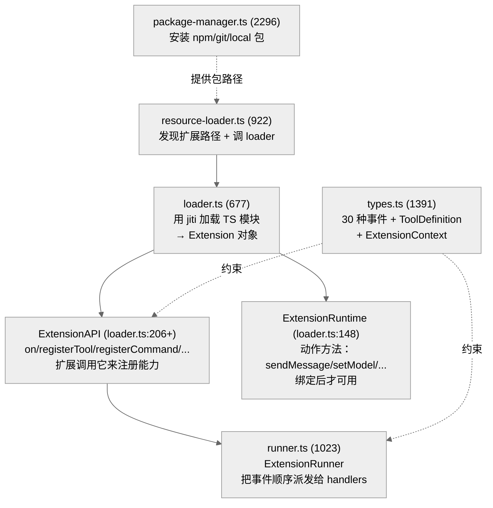
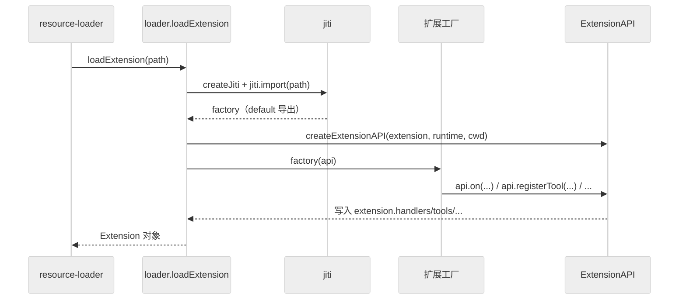
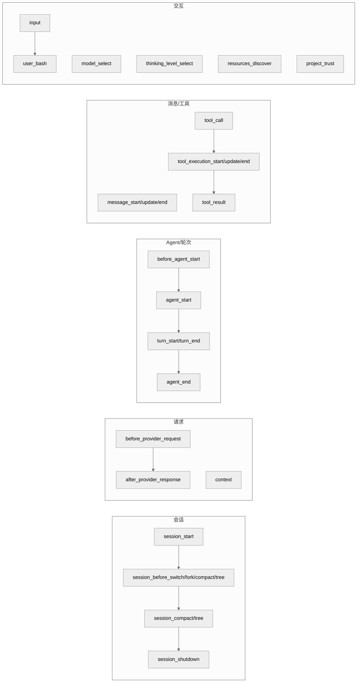
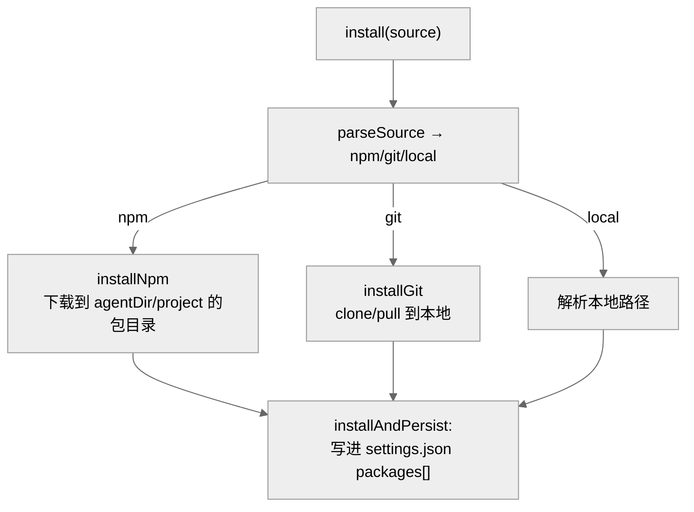

# 07 · 扩展系统：用 TS 注入工具 / Provider / 钩子

> 一句话：pi 的扩展是普通 TS/JS 模块，用 jiti 在**当前进程内**加载（没有真正的沙箱）；扩展通过 `ExtensionAPI`（`on`/`registerTool`/`registerCommand`/`registerProvider`/`registerShortcut`/`registerFlag`/...）注册能力，`ExtensionRunner` 在运行时把 ~30 种事件**顺序**派发给已注册的处理器。

扩展是 pi 的"可编程性"所在——不改源码就能加工具、改请求、拦截工具调用、注册斜杠命令。

---

## 1. 扩展系统的四个零件



| 文件 | 行 | 职责 |
|------|-----|------|
| `extensions/types.ts` | 1391 | 全部事件类型、`ToolDefinition`、`ExtensionContext`、`ExtensionAPI` 接口 |
| `extensions/loader.ts` | 595 | jiti 加载、`createExtensionAPI`、`createExtensionRuntime` |
| `extensions/runner.ts` | 1023 | `ExtensionRunner`：事件派发引擎 |
| `extensions/index.ts` | 177 | 对外门面 re-export |
| `extensions/wrapper.ts` | 27 | 把注册的工具包成 AgentTool |
| `resource-loader.ts` | 922 | 发现扩展/技能/命令并加载 |
| `package-manager.ts` | 2296 | 安装/更新/卸载扩展包 |

---

## 2. 一个扩展长什么样

扩展是一个导出工厂函数的模块。工厂拿到 `ExtensionAPI`，用注册方法声明能力。`createExtensionAPI`（`loader.ts:206`）暴露这些注册方法：

| 方法 | 行 | 注册什么 |
|------|-----|---------|
| `on(event, handler)` | 213 | 事件处理器（核心扩展点） |
| `registerTool(toolDef)` | 221 | 自定义工具（`ToolDefinition`，见第 05 章） |
| `registerCommand(name, opts)` | 229 | 斜杠命令 |
| `registerShortcut(key, opts)` | 237 | 键盘快捷键 |
| `registerFlag(name, opts)` | 252 | CLI 标志（boolean/string） |
| `registerMessageRenderer(type, r)` | 262 | 自定义消息类型的终端渲染 |
| `registerProvider(name, config)` | (runtime) | 自定义 LLM provider |

注册方法都先 `runtime.assertActive()`（防止用已失效的 ctx），再写进 `Extension` 对象的对应 Map（`handlers`/`tools`/`commands`/`shortcuts`/`flags`/`messageRenderers`）。

> **注册 vs 动作**：`ExtensionAPI` 的注册方法在**加载时**调用（声明能力）；`ExtensionRuntime` 的动作方法（`sendMessage`/`setModel`/`setActiveTools`/...）只能在**绑定后**调用——加载期调用会抛 "Extension runtime not initialized"（`loader.ts:149-150`）。这条时序红线防止扩展在系统就绪前乱动状态。

### Provider 注册的延迟绑定

`registerProvider`（`loader.ts:185-187`）在加载期**不能**直接注册（ModelRegistry 还没好），而是把 `{ name, config, extensionPath }` 推进 `runtime.pendingProviderRegistrations`（187），等 `bindCore()` 在 ModelRegistry 就绪后冲刷。这是"加载期声明、绑定期生效"模式的又一例。

---

## 3. jiti 加载：进程内、无沙箱

`loadExtensionModule`（`loader.ts:363-380`）用 `createJiti(import.meta.url, {...})`（371）加载 TS 扩展。关键点：

- **jiti 处理所有 import**（`tryNative` 关掉，374-376 注释），所以扩展可以写 TS、import 第三方包；
- **virtualModules**（43 行附近）把 pi 内置的若干包暴露给扩展（编译成 Bun 单文件二进制时，扩展没法自己 resolve node_modules，靠 virtualModules 注入）；
- 加载结果是工厂函数，`jiti.import(extensionPath, { default: true })`（379）取 default 导出。



> **安全注意**：扩展在**主进程内**运行，**没有真正的沙箱**——它能访问文件系统、网络、环境变量，能力等同于 pi 进程本身。pi 的防护是"项目信任"（`project_trust` 事件，`types.ts:504`）：未信任的项目里，其 `.pi/extensions` 默认不加载，需用户确认。这是 pi 的核心安全边界，扩展机制把"可编程性"和"信任决策"绑在一起。

---

## 4. 扩展发现：从哪里加载

`DefaultResourceLoader`（`resource-loader.ts:161`）在 `reload()`（340）时收集扩展路径。发现根目录（`resource-loader.ts:755-766`）：

**agent 级（全局，`~/.pi/agent/` 下）：**
```
~/.pi/agent/extensions/
```
**项目级（`<cwd>/.pi/` 下，`CONFIG_DIR_NAME` = ".pi"，config.ts:491）：**
```
<cwd>/.pi/extensions/
```

外加：`settings.json` 里 `packages` 字段声明的已安装包、CLI `--extension` 临时指定的路径、package.json 的 `pi.extensions` 字段（`loader.ts:545-557`）。`getEnabledPaths(...)`（376）过滤掉被禁用的。项目级扩展受"信任"门控（341-404 围绕 `projectTrusted`）。

`CONFIG_DIR_NAME`（`config.ts:491`）默认 `.pi`，可由根 package.json 的 `piConfig.configDir` 覆盖。`getDefaultAgentDir()`（`config.ts:520`）= `~/.pi/agent`。

---

## 5. ExtensionRunner：事件派发引擎

`ExtensionRunner`（`runner.ts:262`）是扩展系统的运行时心脏。核心是 `emit(event)`（736-768）：

```ts
for (const ext of this.extensions) {
  const handlers = ext.handlers.get(event.type);
  for (const handler of handlers) {
    try { const r = await handler(event, ctx); /* 可 cancel */ }
    catch (err) { this.emitError(...); }  // 一个扩展抛错不影响其它
  }
}
```

要点：
- **顺序、同步等待**：扩展按加载顺序、handler 逐个 `await`，**不是并发**。一个慢扩展会拖慢整条链。
- **错误隔离**：单个 handler 抛错被 catch 并通过 `emitError` 上报，不中断其它扩展（739-764）。
- **可取消**：`session_before_*` 类事件的 handler 返回 `{ cancel: true }` 可否决该操作（如阻止切换会话）。
- **`hasHandlers(type)`**（536）：快速判断有没有人监听某事件——`sdk.ts` 的 streamFn 钩子就先查这个再决定要不要调（见第 04 章），零监听时零开销。

除通用 `emit` 外，还有一批**专用 emit**，它们带返回值合并语义：

| 方法 | 行 | 语义 |
|------|-----|------|
| `emitMessageEnd` | 770 | 可改写最终消息 |
| `emitToolResult` | 812 | 可改写工具结果 |
| `emitToolCall` | 862 | 可改写/拦截工具调用 |
| `emitUserBash` | 885 | 用户直跑 bash 的拦截 |
| `emitContext` | 914 | 改写发给 LLM 的消息列表 |
| `emitBeforeProviderRequest` | 946 | 改写请求 payload |
| `emitBeforeAgentStart` | 980 | Agent 启动前注入 |
| `emitResourcesDiscover` | 1046 | 贡献额外资源 |
| `emitInput` | 1095 | 改写用户输入 |

---

## 6. ~30 种扩展事件

`types.ts` 定义了 30 种事件类型（实测 `grep -cE 'type: "[a-z_]+";'` = 30，含少量非事件的 `type` 字段如 `boolean`，去重后事件约 29 种），覆盖整个生命周期：



完整列表（按字母序，来自 `grep -oE`）：`after_provider_response`、`agent_end`、`agent_start`、`before_agent_start`、`before_provider_request`、`context`、`input`、`message_end`、`message_start`、`message_update`、`model_select`、`project_trust`、`resources_discover`、`session_before_compact`、`session_before_fork`、`session_before_switch`、`session_before_tree`、`session_compact`、`session_shutdown`、`session_start`、`session_tree`、`thinking_level_select`、`tool_call`、`tool_execution_end`、`tool_execution_start`、`tool_execution_update`、`tool_result`、`turn_end`、`turn_start`、`user_bash`。

这些事件让扩展几乎能介入 Agent 生命周期的每一个关键点——这也是为什么 `sdk.ts` 要把 `onPayload`/`onResponse`/`transformContext` 都接到 runner 上（第 04 章）。

---

## 7. package-manager：安装扩展

`DefaultPackageManager`（`package-manager.ts:775`，2296 行的大文件）负责把扩展包装到本地。支持三种来源（`parseSource`，`type: "npm" | "git" | "local"`，第 90 行附近）：



- 作用域 `SourceScope`：`"user"`（全局，`~/.pi/agent`）或 `"project"`（`local: true`，`<cwd>/.pi`）。
- `install(source, {local})`（974）：解析来源 → `installNpm`/`installGit`；`installAndPersist`（998）再把来源写进 settings 的 `packages[]`，下次启动自动加载。
- `update`（1065 附近）：npm 固定版本不动，git 固定 ref 按配置 checkout，其余拉最新。
- `uninstall`/`removeSourceFromSettings`（824）：卸载并从 settings 移除。
- `getInstalledPath`（843）：按 scope 解析包的实际安装路径。

> 安全：`AGENTS.md` 规定新增带 lifecycle script 的依赖需审查并显式 allowlist。package-manager 安装的扩展同理受"信任"约束——这是把"任意代码执行"风险显式化的设计。

---

## 8. 本章关键文件

| 文件 | 行数 | 职责 |
|------|------|------|
| `packages/coding-agent/src/core/extensions/types.ts` | 1391 | 事件类型 + `ToolDefinition` + `ExtensionContext`/`ExtensionAPI` |
| `packages/coding-agent/src/core/extensions/runner.ts` | 1023 | `ExtensionRunner` 事件派发（`emit`、专用 emit） |
| `packages/coding-agent/src/core/extensions/loader.ts` | 677 | jiti 加载、`createExtensionAPI`(206)、`createExtensionRuntime`(148) |
| `packages/coding-agent/src/core/resource-loader.ts` | 922 | 扩展/技能/命令发现与加载 |
| `packages/coding-agent/src/core/package-manager.ts` | 2296 | npm/git/local 包安装（`DefaultPackageManager` 775） |
| `packages/coding-agent/src/config.ts` | 507 | `CONFIG_DIR_NAME`、`getDefaultAgentDir` |

---

**下一步**：第 08 章转向终端 UI 库 `pi-tui`——差分渲染、编辑器、按键解析如何支撑交互式体验。
