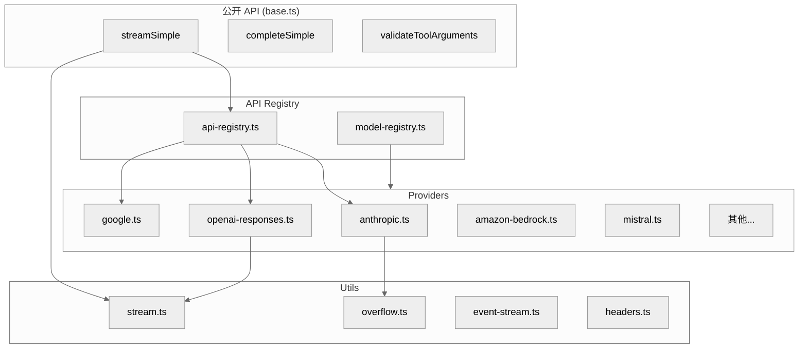

# 第八章：AI 抽象层

## 一句话概括

`@earendil-works/pi-ai` 提供统一的 LLM API 抽象，将 Anthropic、OpenAI、Google 等 Provider 封装为一致的流式接口。

## 架构图



## 核心接口

### streamSimple

[base.ts](file:///workspace/packages/ai/src/base.ts)：

```typescript
export async function streamSimple<P = unknown>(
    model: Model<P>,
    context: Context,
    options?: SimpleStreamOptions,
): Promise<AssistantMessageEventStream> {
    // 1. 获取 provider 实现
    const provider = getProvider(model.provider);

    // 2. 路由到正确的 API
    const api = getApi(provider, model);

    // 3. 调用流式接口
    return api.stream(model, context, options);
}
```

### Context 类型

[types.ts](file:///workspace/packages/ai/src/types.ts)：

```typescript
export interface Context {
    systemPrompt?: string;
    messages: Message[];
    tools?: ToolDefinition[];
}
```

### Message 类型

[types.ts](file:///workspace/packages/ai/src/types.ts)：

```typescript
export type Message =
    | { role: "user"; content: Content[] }
    | { role: "assistant"; content: Content[]; thinking?: string }
    | { role: "tool"; toolCallId: string; toolName: string; content: Content[] };
```

### Content 类型

```typescript
export type Content =
    | { type: "text"; text: string }
    | { type: "image"; source: { type: "base64" | "url"; mediaType: string; data: string } }
    | { type: "toolCall"; id: string; name: string; input: Record<string, unknown> }
    | { type: "toolResult"; toolCallId: string; content: Content[] };
```

## Provider 机制

### Provider 注册

[providers/register-builtins.ts](file:///workspace/packages/ai/src/providers/register-builtins.ts)：

```typescript
export function registerBuiltInProviders(): void {
    // Anthropic
    registerProvider("anthropic", {
        stream: streamAnthropic,
        complete: completeAnthropic,
        getModels: () => anthropicModels,
    });

    // OpenAI
    registerProvider("openai", {
        stream: streamOpenAIResponses,
        complete: completeOpenAIResponses,
        getModels: () => openaiModels,
    });

    // Google
    registerProvider("google", {
        stream: streamGoogle,
        complete: completeGoogle,
        getModels: () => googleModels,
    });

    // ... 更多 providers
}
```

### Provider 接口

```typescript
export interface Provider {
    provider: ProviderId;

    // 流式和完整响应
    stream(model: Model, context: Context, options?: StreamOptions): Promise<AssistantMessageEventStream>;
    complete?(model: Model, context: Context, options?: CompleteOptions): Promise<AssistantMessage>;

    // 模型列表
    getModels(): Model[];

    // 特定 API 支持
    supportsApi?(api: Api): boolean;
}
```

## 模型注册

### Model 类型

[types.ts](file:///workspace/packages/ai/src/types.ts)：

```typescript
export interface Model<P = any> {
    provider: Provider;
    modelId: string;
    displayName?: string;

    // 能力
    maxTokens?: number;
    supportsImages?: boolean;
    supportsCacheControl?: boolean;
    supportsThinking?: boolean;
    supportedProtocols?: Transport[];

    // 思考级别映射
    thinkingLevels?: ThinkingLevelMap;

    // Provider 特定配置
    providerOptions?: P;
}
```

### 模型元数据

[models.generated.ts](file:///workspace/packages/ai/src/models.generated.ts)：

- 17213 行，自动生成
- 包含所有内置模型的元数据
- 由 `scripts/generate-models.ts` 生成

## Anthropic Provider

[providers/anthropic.ts](file:///workspace/packages/ai/src/providers/anthropic.ts)：

### 流式实现

```typescript
export async function streamAnthropic(
    model: Model<AnthropicOptions>,
    context: Context,
    options?: AnthropicStreamOptions,
): Promise<AssistantMessageEventStream> {
    // 1. 构建请求
    const request = {
        model: model.modelId,
        messages: transformMessages(context.messages),
        system: context.systemPrompt,
        tools: transformTools(context.tools),
        thinking: options?.thinking?.type === "enabled" ? {
            type: "enabled",
            budgetTokens: options.thinking.budgetTokens,
        } : undefined,
        stream: true,
    };

    // 2. 发送请求
    const response = await fetch("https://api.anthropic.com/v1/messages", {
        method: "POST",
        headers: buildHeaders(options?.apiKey),
        body: JSON.stringify(request),
    });

    // 3. 解析 SSE 流
    return parseSSEStream(response.body, transformEvent);
}
```

### 思考预算

```typescript
export interface AnthropicThinkingDisplay {
    type: "hidden" | "collapsed" | "expanded";
}

export interface AnthropicThinking {
    type: "enabled" | "disabled";
    budgetTokens?: number;  // 思考 token 预算
}
```

## OpenAI Provider

### Responses API

[providers/openai-responses.ts](file:///workspace/packages/ai/src/providers/openai-responses.ts)：

```typescript
export async function streamOpenAIResponses(
    model: Model<OpenAIResponsesOptions>,
    context: Context,
    options?: OpenAIResponsesStreamOptions,
): Promise<AssistantMessageEventStream> {
    // 使用 OpenAI Responses API
    const response = await fetch("https://api.openai.com/v1/responses", {
        method: "POST",
        headers: buildHeaders(options?.apiKey),
        body: JSON.stringify({
            model: model.modelId,
            input: transformToOpenAIFormat(context.messages),
            tools: context.tools,
            stream: true,
        }),
    });

    return parseSSESstream(response.body, transformOpenAIEvent);
}
```

### Prompt Cache

[providers/openai-prompt-cache.ts](file:///workspace/packages/ai/src/providers/openai-prompt-cache.ts)：

```typescript
export interface CacheControl {
    type: "ephemeral" | "persistent";
    policy?: "auto";
}
```

## Google Provider

[providers/google.ts](file:///workspace/packages/ai/src/providers/google.ts)：

```typescript
export async function streamGoogle(
    model: Model<GoogleOptions>,
    context: Context,
    options?: GoogleStreamOptions,
): Promise<AssistantMessageEventStream> {
    // 使用 Google Generative AI API
    const response = await fetch(
        `https://generativelanguage.googleapis.com/v1beta/models/${model.modelId}:generateContent`,
        {
            method: "POST",
            headers: buildGoogleHeaders(options?.apiKey),
            body: JSON.stringify({
                contents: transformToGoogleFormat(context.messages),
                tools: transformTools(context.tools),
            }),
        }
    );

    return parseGoogleStream(response.body);
}
```

## 流式处理

### EventStream

[utils/event-stream.ts](file:///workspace/packages/ai/src/utils/event-stream.ts)：

```typescript
export class EventStream<TEvent, TResult> {
    private events: TEvent[] = [];
    private ended = false;
    private result?: TResult;
    private listeners: Array<(event: TEvent) => void> = [];

    push(event: TEvent): void {
        this.events.push(event);
        for (const listener of this.listeners) {
            listener(event);
        }
    }

    end(result: TResult): void {
        this.ended = true;
        this.result = result;
    }

    on(handler: (event: TEvent) => void): () => void {
        this.listeners.push(handler);
        // 发送已缓存事件
        for (const event of this.events) {
            handler(event);
        }
        return () => {
            this.listeners = this.listeners.filter(l => l !== handler);
        };
    }
}
```

### 流式事件类型

```typescript
export type AssistantMessageEvent =
    | { type: "start"; partial: AssistantMessage }
    | { type: "text_start"; partial: AssistantMessage }
    | { type: "text_delta"; partial: AssistantMessage }
    | { type: "text_end"; }
    | { type: "thinking_start"; }
    | { type: "thinking_delta"; partial: AssistantMessage }
    | { type: "thinking_end"; }
    | { type: "toolcall_start"; partial: ToolCall }
    | { type: "toolcall_delta"; partial: ToolCall }
    | { type: "toolcall_end"; }
    | { type: "done"; }
    | { type: "error"; error: string };
```

## 上下文溢出处理

### isContextOverflow

[utils/overflow.ts](file:///workspace/packages/ai/src/utils/overflow.ts)：

```typescript
export function isContextOverflow(error: unknown): boolean {
    if (!isAPIError(error)) return false;

    const apiError = error as APIError;
    if (apiError.status === 400) {
        // Anthropic: "Context length exceeded"
        if (apiError.error?.type === "invalid_request_error") {
            return apiError.error.error?.message?.includes("context length");
        }
    }

    if (apiError.status === 429) {
        // Rate limit
        return true;
    }

    return false;
}
```

## OAuth 支持

### Provider

[utils/oauth/index.ts](file:///workspace/packages/ai/src/utils/oauth/index.ts)：

```typescript
export interface OAuthProvider {
    id: OAuthProviderId;
    authorizeUrl: string;
    tokenUrl: string;
    scopes: string[];

    // 流程
    getAuthorizationUrl(state: string): string;
    exchangeCode(code: string): Promise<OAuthTokens>;
    refreshToken(token: string): Promise<OAuthTokens>;
}
```

### 支持的 OAuth Provider

- `anthropic` - Anthropic Claude
- `openai-codex` - OpenAI Codex
- `github-copilot` - GitHub Copilot

## 关键文件表

| 文件 | 行数 | 职责 |
|------|------|------|
| [packages/ai/src/models.generated.ts](file:///workspace/packages/ai/src/models.generated.ts) | 17213 | 模型元数据 |
| [packages/ai/src/base.ts](file:///workspace/packages/ai/src/base.ts) | ~100 | 基础 API |
| [packages/ai/src/stream.ts](file:///workspace/packages/ai/src/stream.ts) | ~200 | 流式处理 |
| [packages/ai/src/types.ts](file:///workspace/packages/ai/src/types.ts) | ~400 | 类型定义 |
| [packages/ai/src/providers/anthropic.ts](file:///workspace/packages/ai/src/providers/anthropic.ts) | 1251 | Anthropic Provider |
| [packages/ai/src/providers/openai-responses.ts](file:///workspace/packages/ai/src/providers/openai-responses.ts) | ~1500 | OpenAI Provider |
| [packages/ai/src/providers/register-builtins.ts](file:///workspace/packages/ai/src/providers/register-builtins.ts) | ~100 | Provider 注册 |
| [packages/ai/src/utils/overflow.ts](file:///workspace/packages/ai/src/utils/overflow.ts) | ~100 | 溢出处理 |
| [packages/ai/src/utils/oauth/index.ts](file:///workspace/packages/ai/src/utils/oauth/index.ts) | ~200 | OAuth 支持 |
