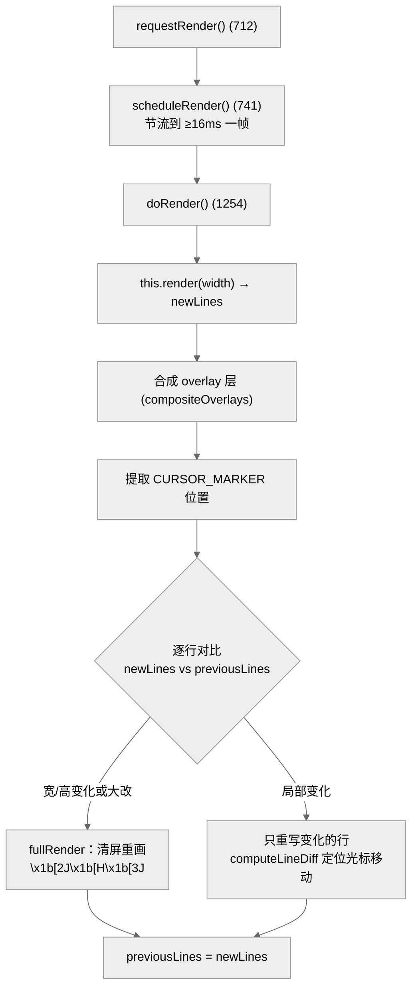
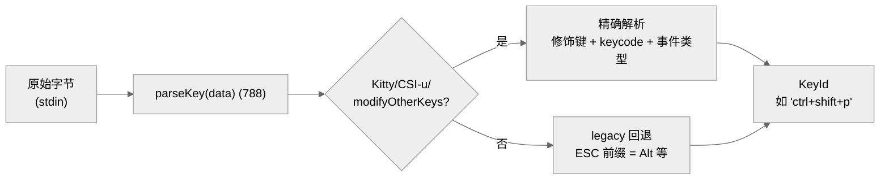
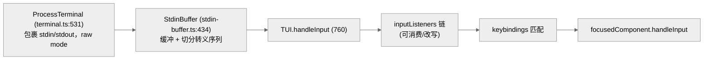

# 08 · pi-tui：差分渲染终端 UI 库

> 一句话：`pi-tui` 是一个自研的、零依赖框架风格的终端 UI 库——核心是 `Component`（`render(width) => string[]`）和 `TUI` 类的**差分渲染**：每帧把组件渲染成行数组，和上一帧逐行对比，只重画变化的行，并用同步输出模式（`\x1b[?2026h/l`）消除闪烁。

这一章讲"像素是怎么上屏的"。它和 Agent 逻辑完全解耦——`pi-tui` 不知道 Agent、provider 的存在，只管把字符高效地画到终端。

---

## 1. 一切皆 Component

`pi-tui` 的抽象极简。`Component` 接口（`tui.ts:64-70`）只要求一个方法：

```ts
interface Component {
  render(width: number): string[];   // 给定宽度，返回若干行
  invalidate?(): void;               // 清缓存、强制重渲染
}
```

组件**纯函数式**地把自己渲染成"带 ANSI 转义的行数组"。`Container`（`tui.ts:256`）是组合容器，`render` 时把子组件的行拼起来（280-289）。`TUI`（`tui.ts:295`）继承 `Container`，是根节点 + 渲染引擎 + 输入分发器。

内置组件（`index.ts` 导出）覆盖常见需求：

| 组件 | 文件 | 行 | 用途 |
|------|------|-----|------|
| `Editor` | `components/editor.ts` | 2307 | 多行输入编辑器（最大、最复杂） |
| `Markdown` | `components/markdown.ts` | 852 | Markdown 渲染 |
| `Input` | `components/input.ts` | 447 | 单行输入 |
| `SettingsList` | `components/settings-list.ts` | 250 | 设置列表 |
| `SelectList` | `components/select-list.ts` | 229 | 选择列表 |
| `Box` / `Text` / `Image` / `Loader` / `Spacer` | 各文件 | — | 基础元件 |

### 焦点与硬件光标

只有一个组件能获得焦点（`Focusable`，`tui.ts:104-108`）。聚焦组件在其渲染输出里、光标该在的位置吐一个特殊标记 `CURSOR_MARKER`：

```
CURSOR_MARKER = "\x1b_pi:c\x07"   // tui.ts:120
```

`TUI` 在合成最终帧后**找到这个标记**（`extractCursorPosition`），据此定位真实硬件光标（`positionHardwareCursor`）。这样组件不必关心自己在屏幕的绝对坐标，只需在相对位置插标记。

---

## 2. 差分渲染：只画变化的行

朴素 TUI 每帧清屏重画，会闪烁且慢。`pi-tui` 用差分渲染。核心状态：`previousLines: string[]`（`tui.ts:297`，上一帧的行）。



### 帧率节流：16ms

`scheduleRender`（`tui.ts:741-758`）保证两帧间隔 ≥ `MIN_RENDER_INTERVAL_MS = 16`（`tui.ts:309`，即 ~60fps 上限）：

```ts
const elapsed = performance.now() - this.lastRenderAt;
const delay = Math.max(0, TUI.MIN_RENDER_INTERVAL_MS - elapsed);
this.renderTimer = setTimeout(() => { ...; this.doRender(); }, delay);
```

多次 `requestRender()` 在一帧内被合并（`renderRequested` 标志），避免流式 token 每来一个字就刷屏。渲染完若期间又有新请求，递归再调度（753-755）。

### 同步输出：消除撕裂

`doRender`（1254）写终端时用 DEC 私有模式 `2026`（同步输出）包裹整批写入：

```
\x1b[?2026h   ← 开始（告诉终端"先别刷新")
...一堆光标移动 + 行内容...
\x1b[?2026l   ← 结束（终端一次性刷新)
```

`fullRender`（1283）在宽/高变化或差异过大时整屏清空重画（`\x1b[2J\x1b[H\x1b[3J` 清屏+home+清回滚），否则走局部更新路径，用 `computeLineDiff(targetRow)`（1264-1268）计算光标需要上下移动几行来定位要重写的行。`PI_DEBUG_REDRAW=1` 可把每次 fullRender 的原因记到 `~/.pi/agent/pi-debug.log`（1592 附近）。

> 设计哲学：把"组件渲染"（纯函数，产出行数组）和"上屏"（差分 + 同步输出）彻底分离。组件作者只写 `render(width): string[]`，完全不碰 ANSI 光标控制；引擎负责把帧高效、无闪烁地搬上终端。这让上百个组件复用同一套高性能渲染。

---

## 3. 键盘输入：解析现代终端协议

终端键盘输入是一团历史包袱——同一个"Ctrl+Shift+P"在不同终端/协议下编码完全不同。`keys.ts`（1400 行）把这团乱码解析成统一的 `KeyId`。

支持的协议（`keys.ts` 头部注释 5-15）：

| 协议 | 说明 |
|------|------|
| **Kitty keyboard protocol** | 现代、最精确（`setKittyProtocolActive`，31） |
| **CSI-u** | `CSI 编码 ; 修饰键 u` |
| **xterm modifyOtherKeys** | `CSI 27 ; modifiers ; keycode ~`（705 注释） |
| **legacy** | 传统 ASCII + Alt 前缀 ESC |



`KeyId`（`keys.ts:152`）= `BaseKey | ModifiedKeyId<BaseKey>`，是个**字符串模板类型**（如 `"ctrl+c"`、`"shift+ctrl+d"`）。`Key` 辅助（165 附近）给出可自动补全的构造器：`Key.ctrl("c")`、`Key.escape`、`Key.ctrlShift("p")`、`Key.super("k")`。

还能区分按键事件类型（`KeyEventType = "press" | "repeat" | "release"`，505），并检测 release/repeat（`isKeyRelease` 527、`isKeyRepeat` 557）——Kitty 协议才有的能力。

---

## 4. 键位绑定：可配置而非硬编码

`keybindings.ts`（244 行）把"哪个键触发哪个动作"做成可配置的，而非散落在各处的 `if (key === "ctrl+x")`。

- `TUI_KEYBINDINGS`（`keybindings.ts:54`）是默认绑定表（`Record<动作名, KeyId | KeyId[]>`）。
- `KeybindingsManager`（155）管理绑定，`matches(data, action)`（197 附近）用 `matchesKey` 判断一段输入是否触发某动作。
- 全局单例 `getKeybindings()`（239）默认用 `TUI_KEYBINDINGS`，可 `setKeybindings()` 覆盖。
- `KeybindingConflict`（136）检测冲突。

> 这正是 `AGENTS.md` 的硬规则："Never hardcode key checks，添加默认值到 `DEFAULT_*_KEYBINDINGS` 以保持可配置。" 任何新快捷键都进绑定表，不写 `matchesKey(data, "ctrl+x")` 式的硬编码。`TUI` 的输入处理（`handleInput`，760）就是先过输入监听器链、再匹配绑定动作。

---

## 5. 编辑器：2307 行的输入核心

`editor.ts`（2307 行，全库最大）是用户敲命令的多行编辑器。它要处理的远不止"插入字符"：

- 多行文本缓冲、换行、自动折行（配合 `utils.ts` 的 `wrapTextWithAnsi`/`visibleWidth`/`sliceByColumn`）；
- 词导航（`word-navigation.ts`，117 行：按词跳/删）；
- 撤销栈（`undo-stack.ts`，28 行）；
- kill-ring（`kill-ring.ts`，46 行，Emacs 风格剪切环）；
- 自动补全（`autocomplete.ts`，786 行：斜杠命令、文件路径、@提及的模糊匹配）；
- IME / 宽字符 / emoji 的列宽计算。

`Editor` 是 `Focusable`，渲染时在光标处插 `CURSOR_MARKER`。它对外是个普通 `Component`，但内部是整个交互体验的重头戏。

### 文本宽度工具

终端里"一个字符占几列"不等于"几个码点"——CJK 占 2 列、emoji 可能占 2 列、零宽字符占 0 列。`utils.ts`（1188 行）的 `visibleWidth`、`truncateToWidth`、`sliceByColumn`、`wrapTextWithAnsi`（`index.ts:114` 导出）解决这个问题，且能在含 ANSI 转义码的字符串上正确计算。所有涉及对齐、截断、折行的组件都依赖它们。

---

## 6. 输入管道与终端抽象



- `ProcessTerminal`（`terminal.ts:531`，实现 `Terminal` 接口）封装 stdin/stdout、raw mode、尺寸查询、ANSI 写入。抽象成接口便于测试（可注入假终端）。
- `StdinBuffer`（`stdin-buffer.ts:434`）缓冲原始字节，正确切分跨多个 chunk 的转义序列（一个按键的字节可能分两次到达）。
- `TUI.handleInput`（760）先消费终端的查询响应（背景色 OSC11、单元格尺寸、颜色方案上报），再过 `inputListeners` 链（监听器可 `consume` 或改写输入），最后匹配全局绑定 / 派发给焦点组件。

---

## 7. 其它能力

| 文件 | 行 | 作用 |
|------|-----|------|
| `terminal-image.ts` | 488 | Kitty 图形协议显示图像（终端内联图片） |
| `markdown.ts` | 852 | Markdown → 带样式的终端文本 |
| `fuzzy.ts` | 137 | 模糊匹配（补全用，`fuzzyFilter`/`fuzzyMatch`） |
| `autocomplete.ts` | 786 | 自动补全引擎 |
| `terminal-colors.ts` | 73 | 颜色工具 |
| `native-modifiers.ts` | 59 | 原生修饰键检测 |

> `pi-tui` 是 `pi` 与 `pi-ai` 并列的"底层基建"——它不依赖 Agent/provider，理论上可独立用于任何终端应用。这种解耦让 UI 层和 AI 层能各自演进。

---

## 8. 本章关键文件

| 文件 | 行数 | 职责 |
|------|------|------|
| `packages/tui/src/tui.ts` | 1714 | `Component`/`Container`/`TUI` + 差分渲染引擎 |
| `packages/tui/src/components/editor.ts` | 2307 | 多行输入编辑器 |
| `packages/tui/src/keys.ts` | 1400 | Kitty/CSI-u/modifyOtherKeys/legacy 按键解析 |
| `packages/tui/src/utils.ts` | 1188 | 列宽/截断/折行（ANSI 感知） |
| `packages/tui/src/markdown.ts` | 852 | Markdown 终端渲染 |
| `packages/tui/src/autocomplete.ts` | 786 | 自动补全引擎 |
| `packages/tui/src/terminal.ts` | 531 | 终端抽象 `ProcessTerminal` |
| `packages/tui/src/stdin-buffer.ts` | 434 | stdin 缓冲与序列切分 |
| `packages/tui/src/keybindings.ts` | 244 | 可配置键位绑定（`TUI_KEYBINDINGS`） |

**关键常量**：`MIN_RENDER_INTERVAL_MS = 16`（tui.ts:309）；`CURSOR_MARKER = "\x1b_pi:c\x07"`（tui.ts:120）。

---

**下一步**：第 09 章看交互模式如何把 `AgentSession` 和这套 TUI 组件接起来，构成完整的交互式界面。
