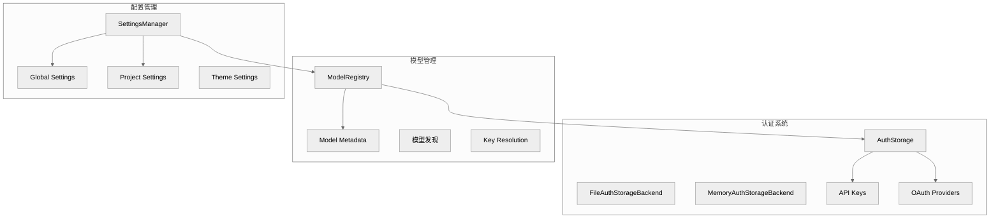

# 第九章：认证与配置

## 一句话概括

Pi 通过 AuthStorage 管理 API 密钥和 OAuth 凭据，通过 ModelRegistry 管理模型列表，通过 SettingsManager 管理用户配置，三者共同支持 Pi 的运行时初始化。

## 架构图



## AuthStorage

### 架构

[auth-storage.ts](file:///workspace/packages/coding-agent/src/core/auth-storage.ts)：

```typescript
export class AuthStorage {
    private backend: AuthStorageBackend;

    static create(backend?: AuthStorageBackend): AuthStorage {
        // 默认使用文件后端
        return new AuthStorage(backend ?? new FileAuthStorageBackend());
    }

    // API Keys
    getApiKey(provider: string): string | undefined;
    setApiKey(provider: string, key: string): void;
    removeApiKey(provider: string): void;

    // OAuth
    getOAuthCredential(provider: OAuthProviderId): OAuthCredential | undefined;
    setOAuthCredential(provider: OAuthProviderId, credential: OAuthCredential): void;
    refreshOAuthCredential(provider: OAuthProviderId): Promise<void>;

    // 批量操作
    getAllCredentials(): AuthStatus;
}
```

### 后端实现

```typescript
export interface AuthStorageBackend {
    getApiKeys(): Record<string, string>;
    setApiKey(provider: string, key: string): void;
    removeApiKey(provider: string): void;

    getOAuthCredentials(): Record<string, OAuthCredential>;
    setOAuthCredential(provider: string, credential: OAuthCredential): void;
}

// 文件后端：~/.pi/agent/auth.json
export class FileAuthStorageBackend implements AuthStorageBackend {
    constructor(path?: string) {
        this.path = path ?? join(getAgentDir(), "auth.json");
    }
}

// 内存后端：用于测试
export class MemoryAuthStorageBackend implements AuthStorageBackend {
    private apiKeys: Record<string, string> = {};
    private oauthCredentials: Record<string, OAuthCredential> = {};
}
```

### API Key 优先级

1. **运行时设置** - `authStorage.setRuntimeApiKey(provider, key)`
2. **环境变量** - `ANTHROPIC_API_KEY` 等
3. **文件存储** - `auth.json` 中的值

### OAuth 流程

```typescript
async login(provider: OAuthProviderId, callbacks: OAuthLoginCallbacks): Promise<void> {
    const oauthProvider = getOAuthProvider(provider);

    // 1. 启动设备码流程
    const deviceCode = await oauthProvider.getDeviceCode();

    // 2. 显示用户验证 URL
    callbacks.onShowURL(deviceCode.verificationUrl);

    // 3. 轮询 token
    const credential = await oauthProvider.pollForToken(deviceCode);

    // 4. 保存凭据
    this.setOAuthCredential(provider, credential);
}
```

## ModelRegistry

### 架构

[model-registry.ts](file:///workspace/packages/coding-agent/src/core/model-registry.ts)：

```typescript
export class ModelRegistry {
    private authStorage: AuthStorage;
    private customModels: Model[] = [];
    private modelsCache?: Model[];

    static create(authStorage: AuthStorage, agentDir?: string): ModelRegistry {
        const registry = new ModelRegistry(authStorage);
        registry.loadCustomModels(agentDir);
        return registry;
    }

    // 查找模型
    find(provider: string, modelId: string): Model | undefined;
    findByPattern(provider: string, pattern: string): Model[];

    // 模型列表
    getModels(options?: { provider?: string; capability?: Capability }): Model[];

    // 自定义模型
    addModel(model: Model): void;
    removeModel(provider: string, modelId: string): void;

    // API Key 解析
    resolveApiKey(model: Model): string | undefined;
}
```

### 模型发现

```typescript
getModels(options?: { provider?: string; capability?: Capability }): Model[] {
    let models = this.getBuiltInModels();

    // 添加自定义模型
    models = [...models, ...this.customModels];

    // 按 provider 过滤
    if (options?.provider) {
        models = models.filter(m => m.provider === options.provider);
    }

    // 按 capability 过滤
    if (options?.capability === "images") {
        models = models.filter(m => m.supportsImages);
    }

    return models;
}
```

### 自定义模型配置

`~/.pi/agent/models.json`:

```json
{
    "customModels": [
        {
            "provider": "openai",
            "modelId": "gpt-4o-custom",
            "displayName": "My GPT-4",
            "maxTokens": 128000
        }
    ]
}
```

### API Key 解析

```typescript
resolveApiKey(model: Model): string | undefined {
    // 1. 先检查 authStorage
    const storedKey = this.authStorage.getApiKey(model.provider);
    if (storedKey) return storedKey;

    // 2. 再检查环境变量
    const envVar = PROVIDER_ENV_VARS[model.provider];
    if (envVar && process.env[envVar]) {
        return process.env[envVar];
    }

    return undefined;
}
```

## SettingsManager

### 架构

[settings-manager.ts](file:///workspace/packages/coding-agent/src/core/settings-manager.ts)：

```typescript
export class SettingsManager {
    private globalSettings: GlobalSettings;
    private projectSettings: ProjectSettings;
    private settingsErrors: SettingsError[] = [];

    static create(cwd: string, agentDir?: string, options?: CreateOptions): SettingsManager {
        const global = SettingsManager.loadGlobalSettings(agentDir);
        const project = SettingsManager.loadProjectSettings(cwd);
        return new SettingsManager(global, project, options);
    }

    // 获取合并后的设置
    getSettings(): MergedSettings;
    getGlobalSettings(): GlobalSettings;
    getProjectSettings(): ProjectSettings;

    // 特定设置
    getTheme(): string;
    getDefaultProvider(): string | undefined;
    getDefaultModel(): string | undefined;
    getEnabledModels(): string[] | undefined;
    getThinkingLevel(): ThinkingLevel;
    getSessionDir(): string;

    // 更新设置
    updateGlobalSettings(settings: Partial<GlobalSettings>): void;
    updateProjectSettings(settings: Partial<ProjectSettings>): void;
}
```

### 设置层级

```
Global Settings (~/.pi/agent/settings.json)
    ↓ 覆盖
Project Settings (.pi/settings.json)
    ↓ 覆盖
CLI Arguments (--model, --provider, etc.)
```

### 设置结构

```typescript
export interface GlobalSettings {
    // 主题
    theme: string;

    // 默认模型
    defaultProvider?: string;
    defaultModel?: string;
    enabledModels?: string[];

    // 思考级别
    thinkingLevel: ThinkingLevel;

    // 会话
    sessionDir?: string;

    // 传输
    transport?: Transport;

    // HTTP 代理
    httpProxy?: string;

    // 其他
    installTelemetry?: boolean;
}

export interface ProjectSettings extends Partial<GlobalSettings> {
    // 项目级覆盖
    extensions?: ExtensionFlag[];
    skills?: SkillConfig[];
    prompts?: string[];
}
```

## 配置路径

### 目录结构

```
~/.pi/agent/
├── settings.json      # 全局设置
├── auth.json          # 认证凭据
├── models.json        # 自定义模型
├── trust.json         # 项目信任决策
├── sessions/          # 会话文件
│   └── *.jsonl
├── extensions/        # 用户扩展
├── skills/           # 用户 Skills
├── prompts/          # 用户 Prompt Templates
└── themes/           # 用户 Themes

project/
├── .pi/
│   ├── settings.json  # 项目设置
│   ├── extensions/    # 项目扩展
│   ├── skills/       # 项目 Skills
│   └── prompts/      # 项目 Prompts
├── .agents/          # 兼容目录
│   └── skills/
└── AGENTS.md        # 上下文文件
```

### 环境变量

| 变量 | 用途 |
|------|------|
| `PI_CODING_AGENT_DIR` | 配置目录（默认 `~/.pi/agent`） |
| `PI_CODING_AGENT_SESSION_DIR` | 会话目录 |
| `PI_PACKAGE_DIR` | 包目录 |
| `PI_OFFLINE` | 离线模式 |
| `PI_SKIP_VERSION_CHECK` | 跳过版本检查 |
| `PI_TELEMETRY` | 遥测设置 |
| `PI_CACHE_RETENTION` | 缓存保留策略 |

### Provider 环境变量

| Provider | 环境变量 |
|----------|---------|
| Anthropic | `ANTHROPIC_API_KEY` |
| OpenAI | `OPENAI_API_KEY` |
| Google | `GOOGLE_API_KEY` |
| Azure OpenAI | `AZURE_OPENAI_API_KEY` |
| AWS Bedrock | (通过 `AWS_*` 环境变量) |
| Groq | `GROQ_API_KEY` |
| Mistral | `MISTRAL_API_KEY` |

## 信任系统

### ProjectTrustStore

[trust-manager.ts](file:///workspace/packages/coding-agent/src/core/trust-manager.ts)：

```typescript
export class ProjectTrustStore {
    private store: Map<string, boolean>;

    constructor(agentDir: string) {
        const trustPath = join(agentDir, "trust.json");
        this.store = this.loadStore(trustPath);
    }

    get(cwd: string): boolean | undefined {
        // 精确匹配
        if (this.store.has(cwd)) {
            return this.store.get(cwd);
        }

        // 检查父目录
        const parent = dirname(cwd);
        if (parent !== cwd) {
            return this.get(parent);
        }

        return undefined;
    }

    set(cwd: string, trusted: boolean): void {
        this.store.set(cwd, trusted);
        this.persist();
    }
}
```

### 信任决策流程

1. 检查 `trust.json` 中的保存决策
2. 检查 `--approve` / `--no-approve` CLI 参数
3. 检查 `defaultProjectTrust` 设置
4. 交互模式显示信任提示
5. 非交互模式使用默认值 (`ask` → `never`)

## 关键文件表

| 文件 | 行数 | 职责 |
|------|------|------|
| [packages/coding-agent/src/core/auth-storage.ts](file:///workspace/packages/coding-agent/src/core/auth-storage.ts) | ~400 | 认证存储 |
| [packages/coding-agent/src/core/model-registry.ts](file:///workspace/packages/coding-agent/src/core/model-registry.ts) | 992 | 模型注册表 |
| [packages/coding-agent/src/core/settings-manager.ts](file:///workspace/packages/coding-agent/src/core/settings-manager.ts) | 1195 | 设置管理器 |
| [packages/coding-agent/src/core/trust-manager.ts](file:///workspace/packages/coding-agent/src/core/trust-manager.ts) | ~300 | 信任管理 |
| [packages/coding-agent/src/core/resolve-config-value.ts](file:///workspace/packages/coding-agent/src/core/resolve-config-value.ts) | ~500 | 配置值解析 |
