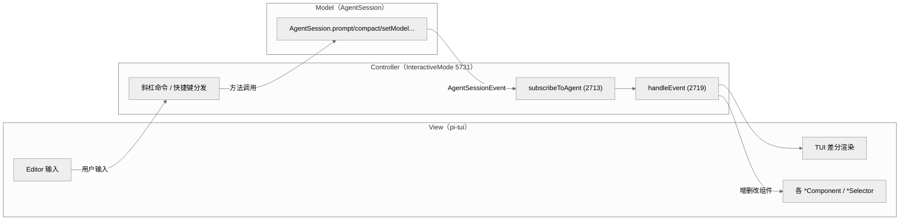
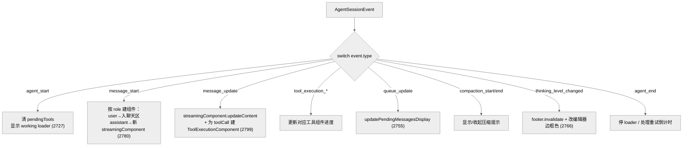
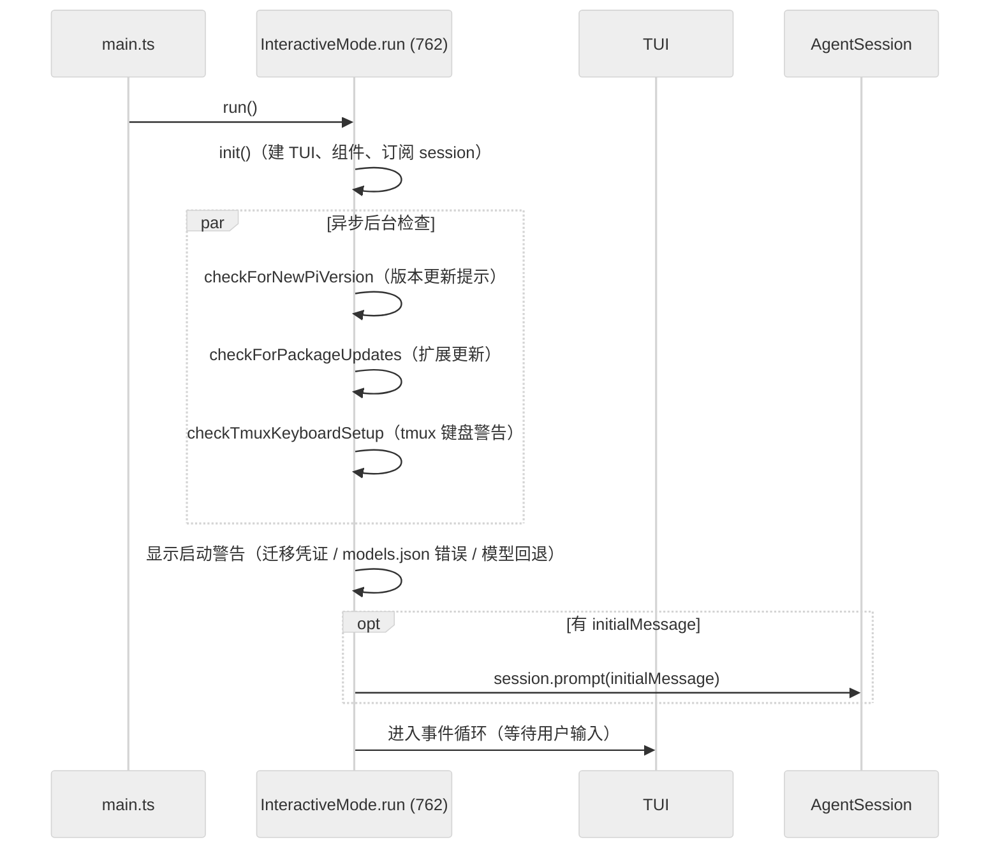
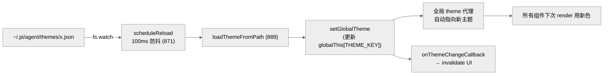

# 09 · 交互模式：把 AgentSession 接到终端

> 一句话：`InteractiveMode`（5731 行，全仓最大文件）是交互式 CLI 的"视图控制器"——它 `new TUI()` 建终端、订阅 `AgentSession` 的事件流，把每个 `AgentSessionEvent` 翻译成 TUI 组件的增删改，并把用户输入（斜杠命令、消息、快捷键）转成 `AgentSession` 的方法调用。

第 04 章的 `AgentSession` 是业务大脑，第 08 章的 `pi-tui` 是渲染肌肉，这一章是把两者缝合的神经。`InteractiveMode` 文件头注释（`interactive-mode.ts:3`）说得直白："Handles TUI rendering and user interaction, delegating business logic to AgentSession."

---

## 1. MVC 式的职责分离



这是经典的单向数据流：**用户输入 → 调 AgentSession 方法 → AgentSession 产生事件 → InteractiveMode 更新 TUI**。`InteractiveMode` 自己不含业务逻辑（不知道怎么压缩、怎么调模型），只负责"把状态变化画出来、把意图传下去"。

---

## 2. 事件订阅：AgentSessionEvent 驱动 UI

`subscribeToAgent`（`interactive-mode.ts:2713-2717`）只有一行实质代码：

```ts
this.unsubscribe = this.session.subscribe(async (event) => {
  await this.handleEvent(event);
});
```

`AgentSessionEvent`（`agent-session.ts:125-149`）= 底层 `AgentEvent`（除 `agent_end` 被改写）∪ 一组会话级事件：

| 事件 | 行 | 含义 |
|------|-----|------|
| `agent_end`（改写版） | 128 | 附带 `willRetry` 标志 |
| `queue_update` | 133 | steering/follow-up 队列变化 |
| `compaction_start` / `compaction_end` | 137/141 | 压缩开始/结束（reason: manual/threshold/overflow） |
| `session_info_changed` | 138 | 会话名变化 |
| `thinking_level_changed` | 139 | 思考等级变化 |
| `auto_retry_start` / `auto_retry_end` | 148/149 | 自动重试 |

`handleEvent`（2719）是一个大 `switch`，把每种事件映射到 UI 操作：



要点：
- **流式 assistant**：`message_start`（role=assistant）时新建 `AssistantMessageComponent`（2780-2790）存为 `streamingComponent`，挂进 `chatContainer`；`message_update` 时反复 `updateContent`（2799），终端靠差分渲染只重画变化的行（第 08 章）——这就是"打字机效果"的来源。
- **工具调用**：流式消息里出现 `toolCall` 内容块时，为每个未见过的 `content.id` 建一个 `ToolExecutionComponent`（2803 附近），后续 `tool_execution_update`/`end` 更新它。
- **每个事件几乎都 `this.ui.requestRender()`**：请求渲染（被 16ms 节流合并）。

---

## 3. 启动流程：run()

`run()`（`interactive-mode.ts:762`）是交互模式的入口：



`init()` 里建 `TUI`（`new TUI(new ProcessTerminal(), showHardwareCursor)`，401）、装配各组件（编辑器、footer、聊天容器、widget 容器）、`subscribeToAgent()`、`renderInitialMessages()`（727，恢复历史会话的消息渲染）。启动后并行发起三个非阻塞检查（版本、包更新、tmux），不阻塞用户开始对话。

---

## 4. 斜杠命令与自动补全

用户在编辑器里输入 `/` 触发命令补全。命令来自三处合并（`interactive-mode.ts:487-544`）：

| 来源 | 行 | 例子 |
|------|-----|------|
| 内置 `BUILTIN_SLASH_COMMANDS` | 487 | `/model`、`/compact`、`/help`、`/clear` |
| 提示模板（`session.promptTemplates`） | 525 | 用户/项目定义的 prompt 模板（第 12 章） |
| 扩展命令（`session.extensionRunner`） | 533 | 扩展注册的 `registerCommand` |
| 技能 | 544 | 可作为命令调用的技能 |

它们都转成统一的 `SlashCommand` 结构喂给 `pi-tui` 的 `autocomplete`（第 08 章），模糊匹配后展示。命令执行则分发到对应 `AgentSession` 方法（`/model` → `cycleModel`/`setModel`，`/compact` → `compact()` 等）。

---

## 5. 丰富的选择器组件

交互模式有一批全屏/覆盖式选择器（`modes/interactive/components/`），都是 `pi-tui` 的 `Component`，以 overlay 形式弹出：

| 组件 | 行 | 作用 |
|------|-----|------|
| `tree-selector.ts` | 1386 | 会话树导航（分支/回溯，对接 `navigateTree`） |
| `session-selector.ts` | 1017 | 历史会话选择/恢复 |
| `settings-selector.ts` | 810 | 设置面板 |
| `config-selector.ts` | 628 | 配置项编辑 |
| `model-selector.ts` | 337 | 模型选择 |
| `scoped-models-selector.ts` | 360 | 多模型作用域设置 |
| `tool-execution.ts` | 377 | 工具调用/结果渲染 |
| `oauth-selector.ts` / `login-dialog.ts` | 208/222 | 登录流程 |
| `trust-selector.ts` | 134 | 项目信任决策（对接 `project_trust`） |
| `theme-selector.ts` | 67 | 主题切换 |

消息类组件（`assistant-message.ts` 147、`bash-execution.ts` 220、`diff.ts` 147、`compaction-summary-message.ts` 59、`branch-summary-message.ts` 58 等）负责把不同消息类型渲染成终端块。

> 注意 `tree-selector.ts`（1386 行）的体量——会话树导航（第 06 章的分支/标签/撤销）的 UI 远比想象复杂，因为要可视化一棵可能很深的树并支持键盘导航。

---

## 6. 主题系统：可热重载

主题在 `modes/interactive/theme/theme.ts`（1261 行）。设计要点：

- **`Theme` 类**（`theme.ts:323`）持有所有颜色/样式。
- **全局 `theme` 代理**（`theme.ts:772`）：用 `Proxy` 包一个空对象，每次属性访问都重定向到 `globalThis[THEME_KEY]` 上的当前主题（773-778）。这样任何组件 `import { theme }` 后用 `theme.xxx`，切换主题时**无需重新获取引用**——代理自动指向新主题。未初始化访问会抛 "Theme not initialized. Call initTheme() first."
- **`initTheme(name, enableWatcher)`**（801）：加载主题并可选启动文件监听。
- **热重载**：自定义主题文件被编辑时，watcher 以 **100ms 防抖**（`theme.ts:866-900`，`setTimeout(..., 100)`）重新 `loadThemeFromPath` → `setGlobalTheme` → 回调 invalidate UI。编辑主题 JSON 即时可见效果。
- **`getThemeByName(name)`**（628）查注册表；内置主题不启动 watcher（813、832 注释）。



---

## 7. 扩展 UI 集成

交互模式还给扩展开了 UI 口子（第 07 章的扩展能注册 widget/shortcut/renderer）：

- **widgets**：扩展可在编辑器上方/下方渲染组件（`extensionWidgetsAbove`/`Below`，354 附近；`renderWidgets`/`renderWidgetContainer`，1885-1892）。
- **terminal input listeners**：扩展可挂输入监听器（`extensionTerminalInputUnsubscribers`，352；通过 `ui.addInputListener`，1995）。
- **message renderers**：扩展用 `registerMessageRenderer` 注册的自定义消息类型，由对应 `custom-message.ts`（99）渲染。
- **overlay 组件**：扩展可弹出自定义带焦点组件（2333 附近 "Show a custom component with keyboard focus"）。

这让扩展不仅能改逻辑，还能改**界面**——这是 pi 可定制性的上限。

---

## 8. 本章关键文件

| 文件 | 行数 | 职责 |
|------|------|------|
| `packages/coding-agent/src/modes/interactive/interactive-mode.ts` | 5731 | 交互模式控制器（订阅事件、渲染、命令分发） |
| `packages/coding-agent/src/modes/interactive/theme/theme.ts` | 1261 | 主题系统（`Theme`、全局代理、热重载） |
| `packages/coding-agent/src/modes/interactive/components/tree-selector.ts` | 1386 | 会话树导航 UI |
| `packages/coding-agent/src/modes/interactive/components/session-selector.ts` | 1017 | 历史会话选择 |
| `packages/coding-agent/src/modes/interactive/components/tool-execution.ts` | 377 | 工具调用渲染 |
| `packages/coding-agent/src/core/agent-session.ts` | 3148 | `AgentSessionEvent`(125-149) + `subscribe`(691) |

**关键常量/事实**：交互模式入口 `run()`（interactive-mode.ts:762）；主题热重载防抖 100ms（theme.ts:866-900）；全局 `theme` 用 Proxy 重定向（theme.ts:772）。

---

**下一步**：第 10 章看另外两种运行模式——打印模式（一次性流式输出）和 RPC 模式（JSONL 协议），以及它们如何复用同一个 `AgentSession`。
