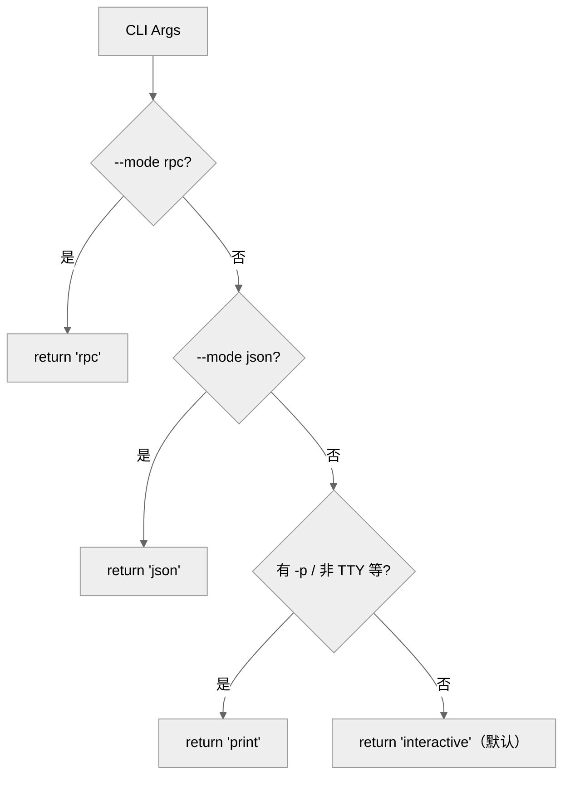
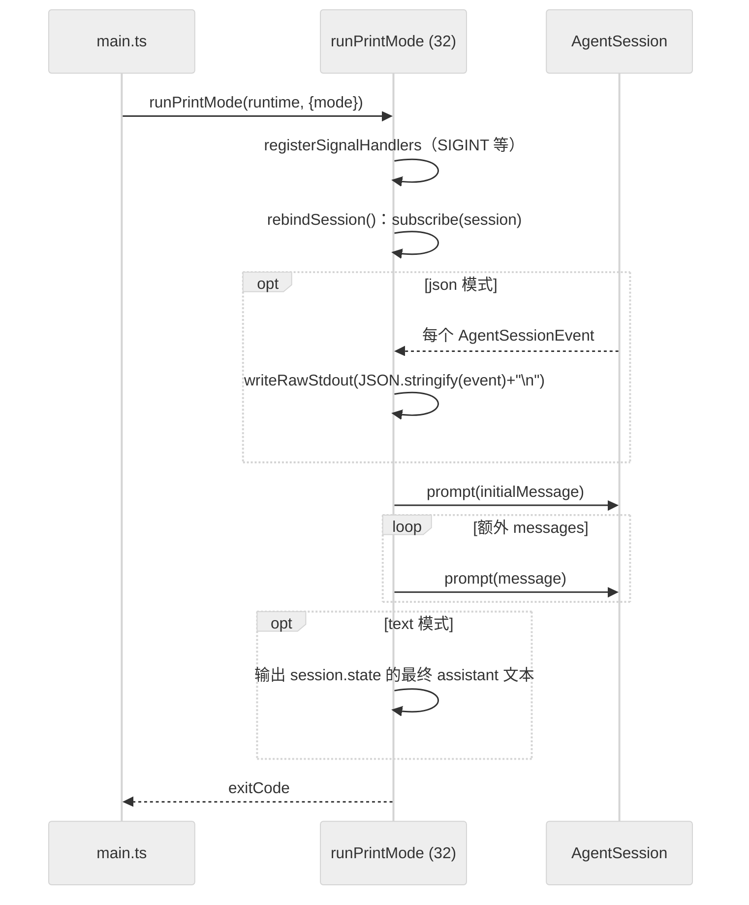
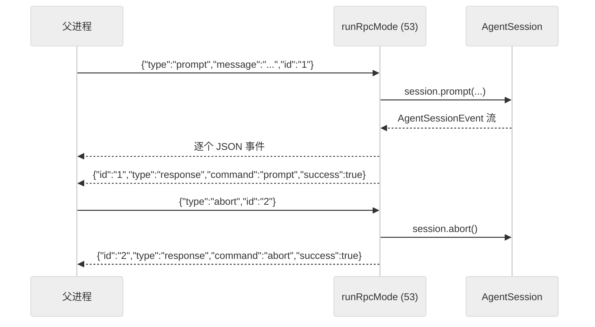
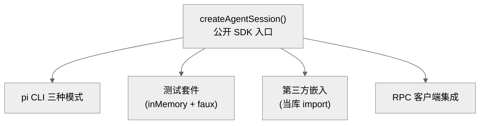

# 10 · 打印模式、RPC 模式与 SDK

> 一句话：同一个 `AgentSession` 可以被三种"前端"驱动——交互式 TUI（第 09 章）、一次性**打印模式**（`pi -p`，流式输出后退出）、和**RPC 模式**（JSONL 协议，~30 个命令，供程序化集成）；`sdk.ts` 还把 `createAgentSession` + 工具工厂作为**公开 SDK** 导出，让 pi 能当库用。

这一章展示 pi 架构解耦的回报：业务逻辑全在 `AgentSession`，换前端只是换一层薄薄的适配。

---

## 1. 模式分发：resolveAppMode

入口 `main.ts` 的 `resolveAppMode(parsed, stdinIsTTY, stdoutIsTTY)`（`main.ts:98-109`）决定走哪种模式：



`AppMode`（来自 `core/project-trust.ts`）有四值：`rpc`/`json`/`print`/`interactive`。分发在 `main()` 末尾（`main.ts:791-836`）：

```ts
if (appMode === "rpc")          await runRpcMode(runtime);
else if (appMode === "interactive")  await new InteractiveMode(runtime, {...}).run();
else /* print/json */           await runPrintMode(runtime, { mode: toPrintOutputMode(appMode), ... });
```

`toPrintOutputMode`（`main.ts:111-113`）把 `json` → `"json"`，其余 → `"text"`。注意：**`json` 其实是打印模式的一个子模式**（事件流以 JSON 输出），共用 `runPrintMode`。

三种模式都拿同一个 `runtime`（`AgentSessionRuntime`，封装 `createAgentSession` 的结果），印证了"一个大脑、多个前端"。

---

## 2. AgentSessionRuntime：会话的可重绑定宿主

`AgentSessionRuntime`（`core/agent-session-runtime.ts:74`）是包在 `AgentSession` 外的一层宿主，处理**会话替换**（新建/fork/切换会话会换掉底层 `AgentSession` 实例）。它持有一个 `createRuntime` 工厂（79）和 `_diagnostics`（80），提供 `newSession`/`fork`/`switchSession`/`setRebindSession` 等方法。

为什么需要它？因为 `/new`、`/fork`、切换会话会**整体替换** `AgentSession`，但前端（InteractiveMode/print/rpc）持有的引用不能失效。`runtime.setRebindSession(callback)` 让前端在会话被替换时重新订阅新 session——`print-mode.ts:67-108` 的 `rebindSession()` 就是干这个：换 `session` 引用、重新 `bindExtensions`、重新 `subscribe`。

---

## 3. 打印模式：一次性流式输出

`runPrintMode(runtimeHost, options)`（`print-mode.ts:32`）是非交互的"发一个 prompt、输出结果、退出"。两种输出（`PrintModeOptions.mode`，`print-mode.ts:17-20`）：

| 模式 | CLI | 输出 |
|------|-----|------|
| `text` | `pi -p "prompt"` | 只输出最终回复文本 |
| `json` | `pi --mode json "prompt"` | 输出**所有事件**的 JSON 流（每行一个 JSON） |



关键实现（`print-mode.ts:103-126`）：

- **json 模式**：`subscribe` 回调里 `writeRawStdout(JSON.stringify(event) + "\n")`（105-106）——把每个会话事件原样序列化成 JSONL，机器可解析。开头先输出 session header（112-115）。
- **text 模式**：不逐事件输出，跑完后读 `session.state` 拿最终 assistant 文本一次性打印（128 附近）。
- `prompt` 是 `await` 的——打印模式天然串行，发完所有消息才退出。

> 打印模式 = "AgentSession + 最薄的 stdout 适配"。它没有 TUI、没有组件，只是订阅事件 + 调 prompt。这正是把业务逻辑全放进 `AgentSession` 的回报：新增一个非交互前端不到 160 行（`print-mode.ts` 共 159 行）。

---

## 4. RPC 模式：JSONL 双向协议

`runRpcMode(runtimeHost)`（`rpc-mode.ts:53`，返回 `Promise<never>`——常驻不退出）是给**程序化集成**的：父进程通过 stdin 发 JSON 命令，pi 通过 stdout 回 JSON 响应 + 事件流。

协议（`rpc-mode.ts:2-9` 注释）：
- **命令**：stdin 每行一个 JSON `RpcCommand`；
- **响应**：`{ id, type: "response", command, success, data?/error? }`；
- **事件**：会话事件以 JSON 推送（异步、与响应交错）。



### ~30 个命令

`RpcCommand`（`rpc-types.ts:19-69`）是一个大 discriminated union。`handleCommand`（`rpc-mode.ts:382`）按 `command.type` switch 分发到 `AgentSession` 方法。命令分组：

| 组 | 命令 | 对应 AgentSession |
|----|------|------------------|
| 对话 | `prompt`/`steer`/`follow_up`/`abort` | `prompt`/`steer`/`followUp`/`abort` |
| 会话 | `new_session`/`switch_session`/`fork`/`clone` | runtime 方法 + `navigateTree` |
| 模型 | `set_model`/`cycle_model`/`get_available_models` | `setModel`/`cycleModel` |
| 思考 | `set_thinking_level`/`cycle_thinking_level` | `setThinkingLevel`/`cycleThinkingLevel` |
| 模式 | `set_steering_mode`/`set_follow_up_mode` | `setSteeringMode`/`setFollowUpMode` |
| 压缩/重试 | `compact`/`set_auto_compaction`/`set_auto_retry`/`abort_retry` | `compact`/`setAutoCompactionEnabled`/... |
| bash | `bash`/`abort_bash` | `executeBash`/`abortBash` |
| 查询 | `get_state`/`get_messages`/`get_session_stats`/`get_commands`/`get_fork_messages`/`get_last_assistant_text` | 各 getter |
| 导出/命名 | `export_html`/`set_session_name` | `exportToHtml`/`setSessionName` |
| 扩展 UI | `extension_ui_request`/`extension_ui_response` | 扩展 UI 桥接 |

`RpcResponse`（`rpc-types.ts:111+`）与命令一一对应，带 `success: true/false`。辅助：`success(id, command, data)`（65）和 `error(id, command, message)`（74）构造响应；`jsonl.ts`（58 行）做 JSONL 编解码；`rpc-client.ts`（575 行）是配套的客户端实现（pi 自己当父进程调子 pi 时用）。

> RPC 模式让 pi 能被嵌入任何语言的程序：编辑器插件、CI、Web 后端只要会读写 JSON 行就能驱动一个完整的编码 Agent。它把 `AgentSession` 的~70 个方法映射成~30 个稳定的线协议命令——这是一道精心设计的公共 API 边界。

### 扩展在 RPC 下的降级

注意 RPC 模式对部分扩展能力降级（无 TUI）：主题切换不支持（`rpc-mode.ts:298-299` 返回 error），扩展只支持字符串数组形式（195 注释 "factory functions are ignored"）。扩展 UI 通过 `extension_ui_request/response` 命令桥接到父进程。

---

## 5. SDK：把 pi 当库用

`sdk.ts` 不只是内部装配点，也是 pi 的**公开编程接口**。它导出（`sdk.ts:111-123`）：

- `createAgentSession(options)`（166）——核心工厂；
- 工具工厂：`createCodingTools`、`createReadOnlyTools`、`createReadTool`/`createBashTool`/`createEditTool`/`createWriteTool`/`createGrepTool`/`createFindTool`/`createLsTool`；
- `withFileMutationQueue`（文件互斥，第 05 章）。

文档注释（`sdk.ts:126-165`）给了清晰的用法示例：

```ts
// 最简
const { session } = await createAgentSession();
// 指定模型
const { session } = await createAgentSession({
  model: getModel('anthropic', 'claude-opus-4-5'),
  thinkingLevel: 'high',
});
// 续接会话
const { session } = await createAgentSession({ continueSession: true });
// 完全控制（自定义 ResourceLoader / SessionManager.inMemory()）
```

`CreateAgentSessionOptions` 允许注入几乎所有依赖（`authStorage`/`modelRegistry`/`settingsManager`/`sessionManager`/`resourceLoader`/`customTools`/`tools`/`noTools`/`excludeTools`/...），这就是为什么测试能用 `SessionManager.inMemory()` + faux provider 做到完全确定性（第 02 章）。



---

## 6. 三种模式对比

| | 交互模式 | 打印模式 | RPC 模式 |
|--|---------|---------|---------|
| 文件 | `interactive-mode.ts` (5165) | `print-mode.ts` (142) | `rpc-mode.ts` (671) |
| 入口 | `InteractiveMode.run()` | `runPrintMode()` | `runRpcMode()` |
| UI | 完整 TUI | 无（stdout） | 无（JSON stdout） |
| 输入 | 键盘/编辑器 | CLI 参数 | stdin JSON 命令 |
| 输出 | 终端渲染 | text 或 JSONL 事件 | JSONL 响应 + 事件 |
| 生命周期 | 常驻（事件循环） | 一次性退出 | 常驻（`Promise<never>`） |
| 典型用途 | 人类交互 | 脚本/管道 | 程序化集成 |
| 共用 | **都驱动同一个 `AgentSession`** | | |

---

## 7. 本章关键文件

| 文件 | 行数 | 职责 |
|------|------|------|
| `packages/coding-agent/src/main.ts` | 837 | `resolveAppMode`(98) + 模式分发(791-836) |
| `packages/coding-agent/src/modes/print-mode.ts` | 159 | 打印/JSON 模式 |
| `packages/coding-agent/src/modes/rpc/rpc-mode.ts` | 774 | RPC 模式（`handleCommand` 382） |
| `packages/coding-agent/src/modes/rpc/rpc-types.ts` | 264 | `RpcCommand`/`RpcResponse` 协议（~30 命令） |
| `packages/coding-agent/src/modes/rpc/rpc-client.ts` | 575 | RPC 客户端 |
| `packages/coding-agent/src/core/sdk.ts` | 399 | 公开 SDK（`createAgentSession` + 工具工厂） |
| `packages/coding-agent/src/core/agent-session-runtime.ts` | — | `AgentSessionRuntime` 可重绑定宿主 |

---

**下一步**：第 11 章深入配置与凭证——SettingsManager、ModelRegistry、AuthStorage 如何管理设置、模型与多 provider 鉴权。
