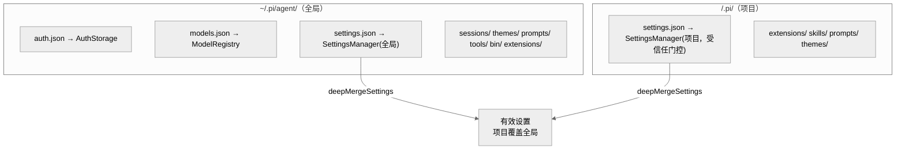
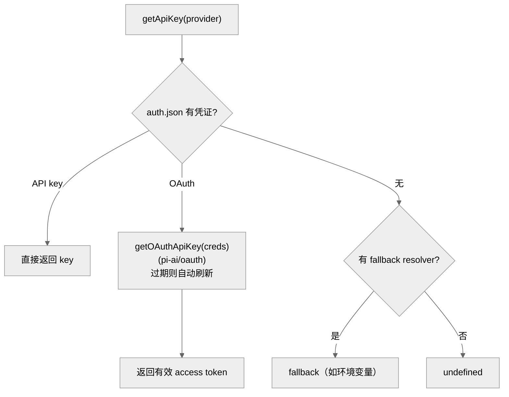
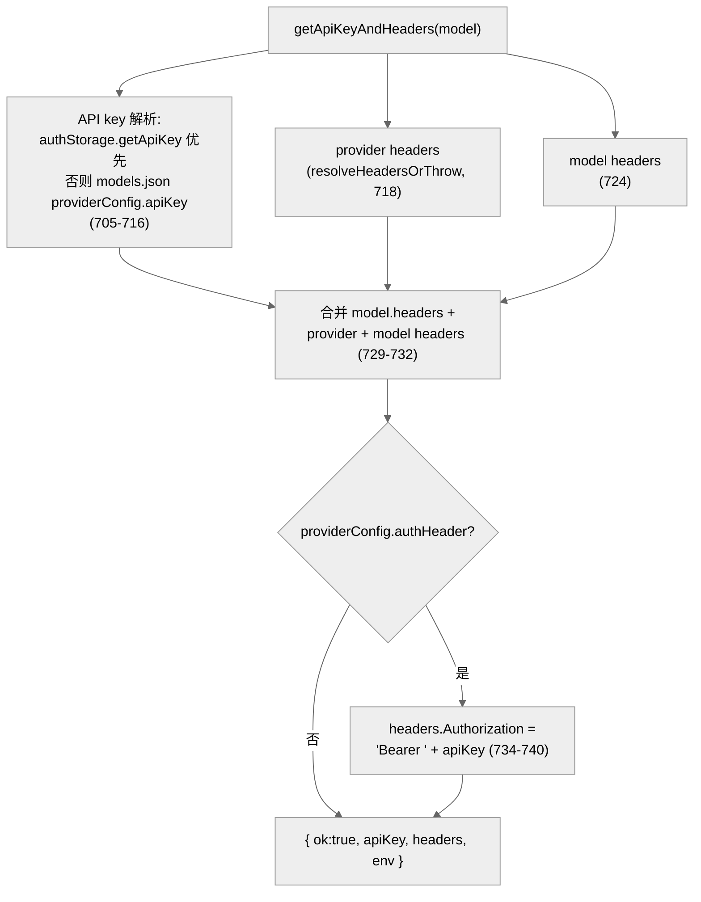

# 11 · 配置、模型与凭证

> 一句话：pi 用三个管理器分管三类持久状态——`SettingsManager`（`settings.json`，全局+项目两层深合并）、`ModelRegistry`（内置 + `models.json` 自定义模型，叠加鉴权状态）、`AuthStorage`（`auth.json`，API key + OAuth 凭证，自动刷新）；它们的产物在 `getApiKeyAndHeaders` 处汇合，决定每次请求带什么 key 和 header。

第 04 章的 `createAgentSession` 把这三者造出来；这一章拆开它们各自怎么工作。

---

## 1. 配置目录布局

所有持久状态落在两个地方：**agent 级**（全局，`~/.pi/agent/`）和**项目级**（`<cwd>/.pi/`）。

`getAgentDir()`（`config.ts:515-521`）的解析：

```ts
const envDir = process.env[ENV_AGENT_DIR];  // PI_CODING_AGENT_DIR
if (envDir) return expandTildePath(envDir);
return join(homedir(), CONFIG_DIR_NAME, "agent");  // ~/.pi/agent
```

`ENV_AGENT_DIR`（`config.ts:495`）= `${APP_NAME.toUpperCase()}_CODING_AGENT_DIR`，即默认 `PI_CODING_AGENT_DIR`（改名构建时变 `TAU_CODING_AGENT_DIR` 等）。

agent 目录下的标准文件/子目录（`config.ts:515-567`）：

| 路径 | 函数 | 内容 |
|------|------|------|
| `auth.json` | `getAuthPath` (534) | API key / OAuth 凭证 |
| `models.json` | `getModelsPath` (529) | 自定义模型 + provider 配置 |
| `settings.json` | `getSettingsPath` (539) | 用户设置 |
| `themes/` | `getCustomThemesDir` (524) | 自定义主题 |
| `prompts/` | `getPromptsDir` (554) | 提示模板 |
| `tools/` | `getToolsDir` (544) | 自定义工具 |
| `bin/` | `getBinDir` (549) | 托管的 fd/rg 二进制 |
| `sessions/` | `getSessionsDir` (559) | 会话 JSONL（非项目会话） |
| `extensions/` | (第 07 章) | 全局扩展 |

项目级 `<cwd>/.pi/` 下有同名的 `settings.json`/`extensions/`/`skills/`/`prompts/`/`themes/`。`CONFIG_DIR_NAME`（`config.ts:491`）默认 `.pi`，可由 package.json 的 `piConfig.configDir` 改。



---

## 2. SettingsManager：两层深合并

`SettingsManager`（`settings-manager.ts:268`，静态 `create()` 303）管理 `Settings`（80）这个大接口，路径在 188-190：全局 `~/.pi/agent/settings.json` + 项目 `<cwd>/.pi/settings.json`。

**合并规则**：`deepMergeSettings(base, overrides)`（`settings-manager.ts:126-152`）——项目设置**深度覆盖**全局：

- 嵌套对象**递归合并**（`{ ...baseValue, ...overrideValue }`，146）；
- 基本类型和数组**整体覆盖**（149）；
- `undefined` 的覆盖值被忽略（133）。

所以"全局设默认、项目按需覆盖个别项"成立，不会因项目设了一个字段而丢掉全局其余设置。

`Settings`（80）有大量分组（10-79 一系列 interface）：`CompactionSettings`、`BranchSummarySettings`、`ProviderRetrySettings`、`RetrySettings`、`TerminalSettings`、`ImageSettings`、`ThinkingBudgetsSettings`、`MarkdownSettings`、`WarningSettings` 等。对外是一堆 getter：

| getter | 行 | 读什么 |
|--------|-----|--------|
| `getDefaultProvider` | 669 | 默认 provider |
| `getDefaultModel` | 673 | 默认模型 |
| `getDefaultThinkingLevel` | 734 | 默认思考等级 |
| `getSteeringMode` | 697 | steering 模式 |
| `getBlockImages` | 1107 | 是否屏蔽图像（第 04 章） |
| `getProviderRetrySettings` / `getHttpIdleTimeoutMs` / ... | — | streamFn 包装用（第 04 章） |

**项目信任门控**：`projectTrusted`（273）。未信任项目的 `settings.json` 和扩展不生效——`reload()`（473）按当前信任状态加载。这是 pi 防"恶意仓库注入配置/扩展"的第一道闸。

---

## 3. AuthStorage：凭证与 OAuth 刷新

`AuthStorage`（`auth-storage.ts:199`，静态 `create()` 212）管理 `auth.json`（`getAgentDir()/auth.json`）。凭证有两种（`AuthCredential`，34）：

```ts
type AuthCredential = ApiKeyCredential | OAuthCredential;
type OAuthCredential = { type: "oauth" } & OAuthCredentials;  // (30-32)
```

核心方法 `getApiKey(provider, { includeFallback })`：



- OAuth 凭证通过 `getOAuthApiKey`（`pi-ai/oauth`，第 02 章）刷新——令牌过期自动续，调用方拿到的总是有效 token。这就是为什么长时间运行的 Agent 不会中途掉 token。
- `getAuthStatus(provider)`（360）：返回是否已配置 + 来源（不刷新，纯查询）。
- `login(providerId, callbacks)`（397）：走 OAuth 登录流程（Anthropic/Copilot/Codex，第 02 章）。
- `setFallback(...)`（242 附近）：注册 API key 兜底解析器（如环境变量 `ANTHROPIC_API_KEY`）。
- `getProviderEnv(provider)`（310）：provider 专属环境变量。

---

## 4. ModelRegistry：内置 + 自定义 + 鉴权

`ModelRegistry`（`model-registry.ts:352`，静态 `create(authStorage, modelsJsonPath)` 367）是 pi 对模型的统一视图。它做三件事的叠加：

1. **内置模型**：来自 pi-ai 的 `getModels(provider)`（第 02 章的 `models.generated.ts`，435/589 行调用）；
2. **自定义模型 / provider 配置**：来自 `models.json`（用户可加新 provider、改 baseUrl、配 key 来源、自定义 header）；
3. **鉴权状态**：和 `AuthStorage` 联动，标记每个模型"能不能用"。

关键方法：

| 方法 | 行 | 作用 |
|------|-----|------|
| `find(provider, modelId)` | 653 | 按 provider+id 查模型 |
| `hasConfiguredAuth(model)` | 660 | 该模型是否有可用凭证 |
| `getApiKeyAndHeaders(model)` | 703 | **请求时的鉴权解析**（核心） |
| `getProviderAuthStatus(provider)` | 768 | provider 鉴权状态（含 models.json 配置的 key） |
| `getError()` | 397 | models.json 解析错误 |

### getApiKeyAndHeaders：鉴权汇合点

`getApiKeyAndHeaders(model)`（703-752）是 streamFn 包装（第 04 章）每次请求都调的地方。它把多源信息合并成 `ResolvedRequestAuth`：



- **key 优先级**（705-716）：`auth.json` 里的 key 优先，没有再用 `models.json` 里 provider 配置的 `apiKey`（可能是命令/环境变量引用，`resolveConfigValueOrThrow` 解析）。
- **header 三层合并**（729-732）：`model.headers`（内置）+ provider headers + model headers，后者覆盖前者。
- **authHeader 模式**（734-740）：某些 provider 用 `Authorization: Bearer <key>` 而非自定义 header，这里统一处理；无 key 直接返回 `{ ok: false, error }`。
- 出错时返回 `{ ok: false, error }` 而非抛——让 streamFn 包装决定是否 throw（第 04 章）。

> 这一个方法把"凭证从哪来、header 怎么拼、env 怎么注入"的全部复杂度收口在 ModelRegistry 内部。Agent 循环和 provider 都不需要懂多 provider 鉴权的细节——它们只拿到一个解析好的 `{ apiKey, headers, env }`。

---

## 5. 模型解析：从字符串到 Model

用户在 CLI 或设置里写的是 `"anthropic/claude-opus-4-5"` 这种字符串，`model-resolver.ts`（681 行）负责把它解析成 `Model` 对象。

| 函数 | 行 | 作用 |
|------|-----|------|
| `parseModelPattern(pattern)` | 192 | 解析 `provider/modelId` 模式（支持通配） |
| `findExactModelReferenceMatch(...)` | 76 | 精确匹配 |
| `resolveModelScope(patterns, registry)` | 258 | 解析"作用域模型"列表（多模型轮换） |
| `resolveCliModel(options)` | 340 | 解析 CLI `--model` 参数 |
| `findInitialModel(options)` | 527 | 启动时选初始模型（第 04 章用） |

`findInitialModel`（527）的回退链（被 `createAgentSession` 调用）：settings 默认 provider/model → 各 provider 默认 → 报告无可用模型。`ScopedModel`（52）支持给会话配一组模型（如 `/model` 在它们间轮换，`cycleModel`）。

---

## 6. 安装方式检测与自更新

`config.ts` 还管"pi 是怎么装的"，以便自更新时用对命令。`detectInstallMethod()`（`config.ts:73`）返回 `InstallMethod`（29）：`bun-binary | npm | pnpm | yarn | bun | unknown`。

- `bun-binary`（编译的单文件二进制，75）：自更新走专门的二进制替换；
- 其余（npm/pnpm/yarn/bun 全局包）：`getUpdateInstruction(pkg)`（348）给出 `npm i -g ...` 之类命令；
- `getSelfUpdateCommand`（315）/ `getSelfUpdateUnavailableInstruction`（328）据此分支。

应用元信息（`config.ts:487-491`）来自根 package.json 的 `piConfig`：`APP_NAME`（默认 `pi`）、`APP_TITLE`（默认 `π`）、`CONFIG_DIR_NAME`（默认 `.pi`）。这套设计让 pi 可被"换皮"成另一个品牌（改 piConfig 即可），所有路径/环境变量名/显示名随之变化。

---

## 7. 本章关键文件

| 文件 | 行数 | 职责 |
|------|------|------|
| `packages/coding-agent/src/core/settings-manager.ts` | 1195 | `Settings` + 全局/项目深合并 + 信任门控 |
| `packages/coding-agent/src/core/model-registry.ts` | 992 | 模型统一视图 + `getApiKeyAndHeaders`(703) |
| `packages/coding-agent/src/core/model-resolver.ts` | 681 | 模型字符串解析（`findInitialModel` 527） |
| `packages/coding-agent/src/core/auth-storage.ts` | 542 | `auth.json` 凭证 + OAuth 刷新 |
| `packages/coding-agent/src/config.ts` | 566 | 路径解析、安装检测、APP 常量 |

**关键事实**：agent 目录默认 `~/.pi/agent`，可由 `PI_CODING_AGENT_DIR` 覆盖（config.ts:495,515）；设置项目覆盖全局用 `deepMergeSettings`（settings-manager.ts:126）；请求鉴权统一在 `getApiKeyAndHeaders`（model-registry.ts:703）解析。

---

**下一步**：第 12 章看系统提示、技能与斜杠命令——pi 如何动态构造发给模型的指令，以及如何用技能/命令扩展能力。
