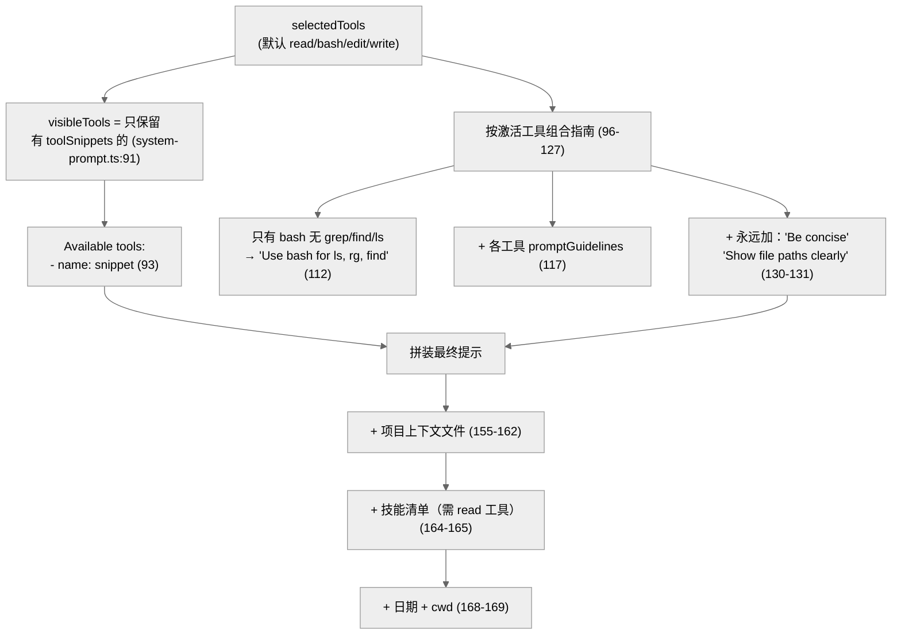
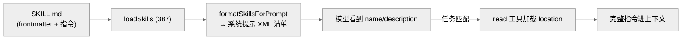
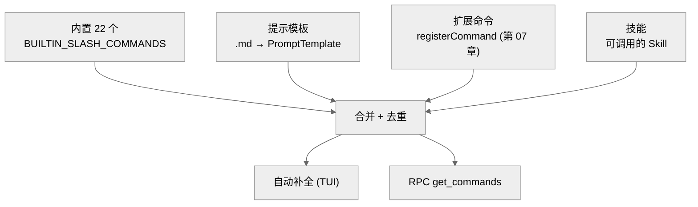

# 12 · 系统提示、技能与斜杠命令

> 一句话：pi 的系统提示是**动态拼装**的——根据当前激活的工具列表选择性地列出工具说明（`promptSnippet`）和指南（`promptGuidelines`），再叠加项目上下文文件、技能清单、日期/cwd；技能是 `SKILL.md` 描述的"按需加载的专项指令"，斜杠命令分内置（22 个）、提示模板、扩展、技能四类。

这一章讲"发给模型的指令是怎么来的"以及"用户怎么扩展可调用的命令"。

---

## 1. 系统提示：随工具集动态生成

`buildSystemPrompt(options)`（`system-prompt.ts:28`，整个文件仅 173 行）是构造系统提示的唯一函数。它有两条路径：**自定义提示**（`customPrompt`，52-82）和**默认提示**（84-172）。

`BuildSystemPromptOptions`（`system-prompt.ts:8-25`）的输入：

| 字段 | 作用 |
|------|------|
| `customPrompt` | 替换整个默认提示 |
| `selectedTools` | 当前激活工具（默认 `[read,bash,edit,write]`） |
| `toolSnippets` | 工具名→一行说明（来自各工具的 `promptSnippet`） |
| `promptGuidelines` | 激活工具贡献的指南要点 |
| `appendSystemPrompt` | 追加文本 |
| `contextFiles` | 项目上下文文件（如 AGENTS.md） |
| `skills` | 预加载的技能 |
| `cwd` | 工作目录 |

### 关键设计：工具说明随激活状态出现



要点（`system-prompt.ts:89-94`）：**一个工具只有在调用方提供了 `toolSnippets[name]` 时才出现在 "Available tools" 段**。这呼应第 05 章——`promptSnippet` 决定工具是否"自我介绍"给模型。`visibleTools = tools.filter(name => !!toolSnippets?.[name])`（91）。

指南也是动态的（96-127）：
- 若只有 `bash`、没有 `grep`/`find`/`ls`，加一条 "Use bash for file operations like ls, rg, find"（111-114）——告诉模型用 bash 内的命令替代缺失的独立工具；
- 各激活工具的 `promptGuidelines` 去重后追加（117-122，用 `guidelinesSet` 去重）；
- 永远追加 "Be concise in your responses" 和 "Show file paths clearly"（130-131）。

> 这套机制让系统提示**精确匹配当前能力**：开了 grep 工具就不告诉模型"用 bash 搜索"，关了就告诉。模型永远不会被告知去用一个没激活的工具，也不会缺少对激活工具的说明。`AgentSession` 在工具集变化时（`setActiveToolsByName`）重建系统提示，所以它始终同步。

### 默认提示骨架

默认提示（`system-prompt.ts:132-153`）的固定骨架：

```
You are an expert coding assistant operating inside pi, a coding agent harness...

Available tools:
{动态工具列表}

Guidelines:
{动态指南}

Pi documentation (read only when the user asks about pi itself...):
- Main documentation: {readmePath}
...
```

末尾按序追加：`appendSystemPrompt` → `<project_context>` 包裹的项目指令文件 → 技能清单 → `Current date` + `Current working directory`。

### 项目上下文文件

`contextFiles`（如 `AGENTS.md`/`CLAUDE.md`）被包进 `<project_context>` + `<project_instructions path="...">` 标签（155-162）。这就是仓库根的 `AGENTS.md` 如何进入模型视野的——`DefaultResourceLoader.loadProjectContextFiles`（第 07 章 `resource-loader.ts:84`）加载它们，`buildSystemPrompt` 注入。

---

## 2. 技能：按需加载的专项指令

技能（Skill）是"模型在任务匹配时用 read 工具自行加载的指令文件"。`Skill` 接口（`skills.ts:74-81`）：

```ts
interface Skill {
  name: string;
  description: string;
  filePath: string;     // SKILL.md 路径
  baseDir: string;      // 相对路径解析基准
  sourceInfo: SourceInfo;
  disableModelInvocation: boolean;
}
```

### 技能怎么进系统提示

`formatSkillsForPrompt(skills)`（`skills.ts:335-360`）把技能渲染成 XML 块加到系统提示尾部（仅当 read 工具激活，因为要靠 read 加载）：

```
The following skills provide specialized instructions for specific tasks.
Use the read tool to load a skill's file when the task matches its description.

<available_skills>
  <skill>
    <name>...</name>
    <description>...</description>
    <location>/abs/path/SKILL.md</location>
  </skill>
</available_skills>
```

模型看到 name/description/location，当任务匹配 description 时，**用 read 工具读 location** 把完整指令载入上下文。`disableModelInvocation: true` 的技能不出现在此清单（337）——它们只能被显式调用。

### 技能发现

`loadSkills(options)`（`skills.ts:387`）从多处加载（`LoadSkillsOptions`，367-385）：项目 `cwd` 下、`agentDir` 下、显式 `skillPaths`、默认目录（`includeDefaults`）。`loadSkillsFromDir`（168）的递归规则（164-166 注释）：

- 目录含 `SKILL.md` → 视为技能根，**不再递归**；
- 否则递归子目录找 `SKILL.md`。

每个 `SKILL.md` 用 `parseFrontmatter`（285）解析 YAML frontmatter 拿 `name`/`description`，name 缺失则用父目录名（296）。`validateName`（92）/`validateDescription`（117）按 Agent Skills 规范校验。

### 技能调用

技能可作为斜杠命令显式触发。`parseSkillBlock(text)`（`agent-session.ts:113`）用正则解析 `<skill name="..." location="...">...</skill>` 块（114），把"调用某技能"编码进用户消息。交互模式把技能列进斜杠命令（第 09 章 `interactive-mode.ts:544`）。



> 技能 vs 系统提示：系统提示是"永远在场"的指令，技能是"按需召唤"的指令。把专项知识（如"如何用某框架""如何做某类重构"）做成技能，避免它们常驻上下文吃 token——只在相关时由模型自己加载。这是上下文经济学的又一体现。

---

## 3. 斜杠命令：四类来源

斜杠命令（`/xxx`）的类型定义在 `slash-commands.ts`（仅 41 行）。`SlashCommandSource`（4）= `"extension" | "prompt" | "skill"`，加上内置共四类。

### 22 个内置命令

`BUILTIN_SLASH_COMMANDS`（`slash-commands.ts:18-41`，实测 22 条）：

| 命令 | 作用 | 命令 | 作用 |
|------|------|------|------|
| `/settings` | 设置菜单 | `/tree` | 会话树导航 |
| `/model` | 选模型 | `/trust` | 项目信任决策 |
| `/scoped-models` | Ctrl+P 轮换模型集 | `/login` `/logout` | 鉴权配置 |
| `/export` `/import` | 导出/导入会话 | `/new` | 新会话 |
| `/share` | 分享为 gist | `/compact` | 手动压缩 |
| `/copy` | 复制末条消息 | `/resume` | 恢复其它会话 |
| `/name` `/session` | 命名/会话信息 | `/reload` | 重载扩展/技能/主题/键位 |
| `/changelog` `/hotkeys` | 更新日志/快捷键 | `/fork` `/clone` | 分支/克隆 |
| `/quit` | 退出 | | |

这些命令大多直接映射到 `AgentSession` 方法或 runtime 操作（第 09/10 章）。

### 提示模板（自定义命令）

提示模板（`prompt-templates.ts`，284 行）让用户用 `.md` 文件定义**自己的斜杠命令**。`PromptTemplate`（11-15）含 `name`/`description`/`argumentHint`/`content`。

- `loadTemplatesFromDir(dir)`（137）非递归扫 `.md`；文件名（去 `.md`）即命令名（108）。
- frontmatter 的 `description`/`argument-hint` 被读取（111/124），无 description 则取首个非空行。
- **参数替换**：`parseCommandArgs(argsString)`（24，bash 风格引号解析）+ `substituteArgs(content, args)`（69）把 `/mycommand foo bar` 的参数填进模板占位符。

例如建 `~/.pi/agent/prompts/review.md`，内容是审查指令，就能用 `/review` 触发。

### 合并与展示

交互模式（第 09 章）把四类命令合并喂给自动补全（`interactive-mode.ts:487-544`）：内置 → 提示模板（`session.promptTemplates`）→ 扩展命令（`session.extensionRunner`，去重内置名）→ 技能。RPC 模式用 `get_commands` 命令返回同样的合集（第 10 章）。



---

## 4. 资源加载的统一入口

系统提示的三种动态输入（工具片段、项目上下文、技能）和命令（提示模板）都由 `DefaultResourceLoader`（第 07 章 `resource-loader.ts`）在 `reload()` 时统一加载：扩展、技能、提示模板、上下文文件、系统提示文件一并发现。`AgentSession` 从 `resourceLoader` 取这些资源，传给 `buildSystemPrompt` 和命令列表。`/reload` 命令触发重新加载，让编辑技能/模板/扩展后无需重启即时生效。

---

## 5. 本章关键文件

| 文件 | 行数 | 职责 |
|------|------|------|
| `packages/coding-agent/src/core/system-prompt.ts` | 173 | `buildSystemPrompt` 动态拼装系统提示 |
| `packages/coding-agent/src/core/skills.ts` | 487 | 技能加载/校验/`formatSkillsForPrompt` |
| `packages/coding-agent/src/core/slash-commands.ts` | 41 | `BUILTIN_SLASH_COMMANDS`（22 个）+ 类型 |
| `packages/coding-agent/src/core/prompt-templates.ts` | 284 | 用户自定义命令（.md 模板 + 参数替换） |
| `packages/coding-agent/src/core/resource-loader.ts` | 922 | 统一加载这些资源 |

**关键事实**：系统提示中工具仅在有 `promptSnippet` 时出现（system-prompt.ts:91）；永久指南 "Be concise" + "Show file paths clearly"（system-prompt.ts:130-131）；内置斜杠命令 22 个（slash-commands.ts:18-41）；技能含 `SKILL.md` 的目录不再递归（skills.ts:164-166）。

---

**下一步**：第 13 章看基础设施——构建、发布、打包（bun/node）、二进制分发，以及把整个系统跑起来的工程化机制。
