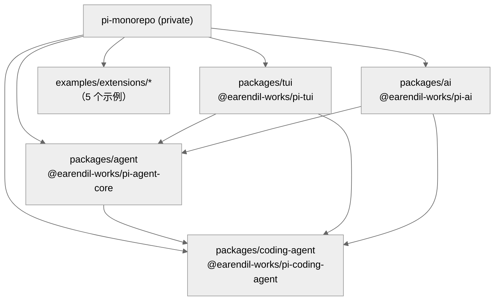
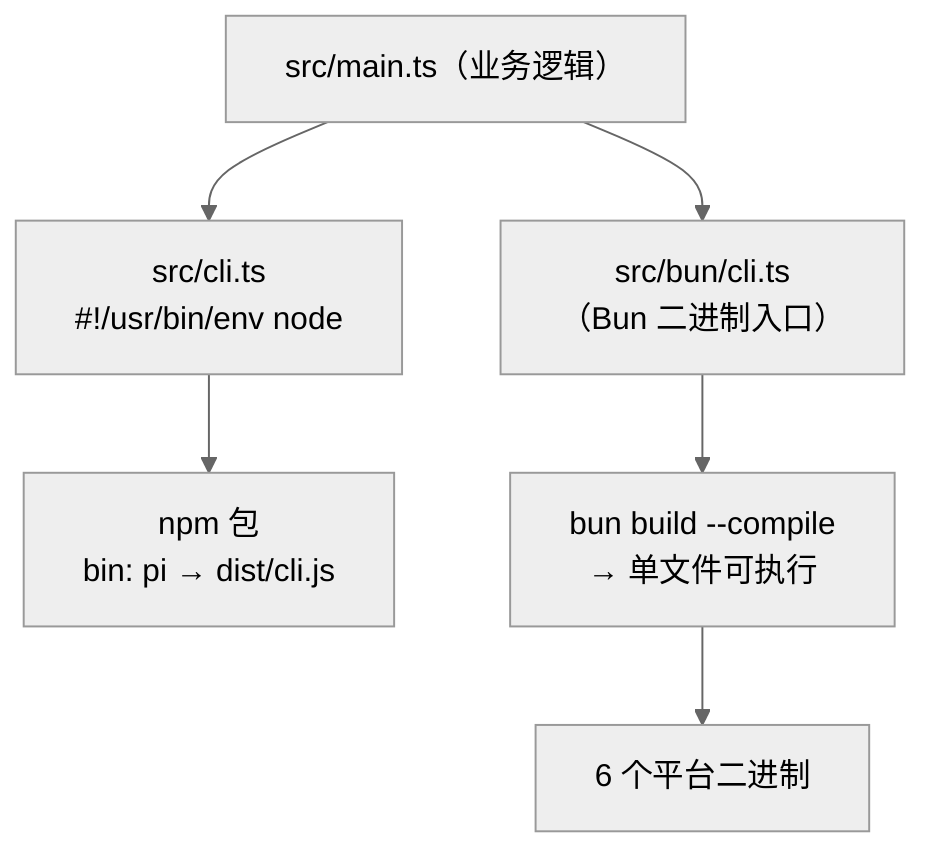
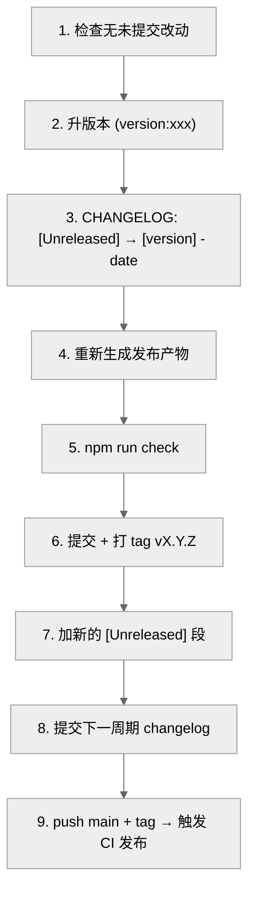

# 13 · 基础设施：构建、打包与发布

> 一句话：pi 是 npm workspaces 单仓，4 个包按 `tui → ai → agent → coding-agent` 顺序用 `tsgo` 编译；同一份 TS 源码出两种产物——Node 包（`dist/cli.js`，`#!/usr/bin/env node`）和 Bun 编译的单文件二进制（6 个平台）；版本锁步（所有包共用一个版本号），发布由打 tag 触发 CI 的 npm 可信发布。

这一章讲"代码怎么从源码变成用户能跑的东西"。

---

## 1. 单仓结构：npm workspaces

根 `package.json`（`name: "pi-monorepo"`, `private: true`, `type: "module"`）声明 workspaces（`package.json:5-12`）：

```
packages/*                                    # 4 个核心包
packages/coding-agent/examples/extensions/*   # 5 个示例扩展（也是 workspace）
```

四个核心包（第 01 章）+ 示例扩展（with-deps、custom-provider-anthropic、custom-provider-gitlab-duo、sandbox、gondolin）。把示例扩展也纳入 workspace，是为了让它们能解析 pi 的本地包、被 lint/typecheck 覆盖。



---

## 2. 构建：tsgo + 严格的导入约定

根 `build`（`package.json:15`）按依赖顺序串行编译：

```
cd packages/tui && build && cd ../ai && build && cd ../agent && build && cd ../coding-agent && build
```

每个包的 `build`（如 coding-agent，`package.json:30`）用 **`tsgo`**（TypeScript 原生预览编译器 `@typescript/native-preview`，根 devDeps）：

```
tsgo -p tsconfig.build.json && chmod +x dist/cli.js && copy-assets
```

### TypeScript 配置的关键选择

`tsconfig.base.json` 几个不寻常的开关：

| 选项 | 值 | 含义 |
|------|-----|------|
| `module` / `moduleResolution` | `Node16` | 现代 ESM 解析 |
| `erasableSyntaxOnly` | `true` | **只允许可擦除语法**（Node strip-only 模式） |
| `allowImportingTsExtensions` | `true` | 源码里直接 `import "./x.ts"` |
| `rewriteRelativeImportExtensions` | `true` | 编译时把 `.ts` 重写成 `.js` |
| `useDefineForClassFields` | `false` | 类字段语义 |

`erasableSyntaxOnly` 是 `AGENTS.md` 那条规则的根源："只用可擦除 TS 语法——不要 `enum`、`namespace`、参数属性、`import =`"。因为源码要能被 Node 的 strip-only 模式直接跑（开发时 `tsx`/jiti 不做完整编译，只擦类型），任何需要代码生成的 TS 特性都禁用。

`allowImportingTsExtensions` + `rewriteRelativeImportExtensions` 让源码统一写 `.ts` 后缀的相对导入（`check:ts-imports` 脚本 `check-ts-relative-imports.mjs` 强制这一约定），编译后自动变 `.js`。这让同一份源码既能被 tsx/jiti 直接执行，又能被 tsgo 编出正确的 `.js`。

### 资源拷贝

`copy-assets`（`coding-agent/package.json:32`）把非 TS 资源拷进 `dist`：主题 JSON、PNG、export-html 模板、vendor JS。`copy-binary-assets`（33）给二进制版多拷 package.json/README/docs/examples + photon wasm（图像缩放）。

---

## 3. 两种运行时：Node 与 Bun

pi 有**两个入口**，对应两种分发：



### Node 路径

`src/cli.ts`（20 行）是 npm 包入口：设 `process.title`、`PI_CODING_AGENT=true`、静音 warnings、`configureHttpDispatcher()`（配 undici 全局调度器），然后 `main(process.argv.slice(2))`。`package.json` 的 `bin: { "pi": "dist/cli.js" }` 让 `npm i -g` 后有 `pi` 命令。

### Bun 路径

`src/bun/cli.ts` 是 Bun 二进制入口：先 `restoreSandboxEnv()`、`import "./register-bedrock.ts"`（Bedrock provider 在二进制里需显式注册），再 `import "../cli.ts"`。`build:binary`（`coding-agent/package.json:31`）：

```
（构建四个包）&& bun build --compile ./dist/bun/cli.js ./src/utils/image-resize-worker.ts --outfile dist/pi && copy-binary-assets
```

`bun build --compile` 把整个 app + 依赖打成一个自包含可执行文件（无需用户装 Node/npm）。这就是第 07 章"jiti virtualModules"的由来——二进制里没有 node_modules，扩展靠 virtualModules 拿到内置包。

`scripts/build-binaries.sh` 为 **6 个平台**产出（脚本头注释 17-22）：

```
pi-darwin-arm64 / pi-darwin-x64 / pi-linux-x64 / pi-linux-arm64
pi-windows-x64 / pi-windows-arm64
```

---

## 4. 质量门：npm run check

`check`（`package.json:16`）是提交前必跑的关卡（`AGENTS.md` 规定代码改动后跑、修完所有 error/warning/info 再提交）：

```
biome check --write --error-on-warnings .   # 格式 + lint
&& check:pinned-deps                          # 直接依赖必须精确版本
&& check:ts-imports                           # .ts 相对导入约定
&& check:shrinkwrap                           # shrinkwrap 与 lock 一致
&& tsgo --noEmit                              # 类型检查
&& check:browser-smoke                        # 浏览器烟测
```

| 子检查 | 脚本 | 把关什么 |
|--------|------|---------|
| biome | `@biomejs/biome` | 格式化 + lint，warning 即失败 |
| `check:pinned-deps` | `check-pinned-deps.mjs` | 外部直接依赖必须 pin 精确版本（供应链安全） |
| `check:ts-imports` | `check-ts-relative-imports.mjs` | 相对导入必须带 `.ts` 后缀 |
| `check:shrinkwrap` | `generate-coding-agent-shrinkwrap.mjs --check` | npm-shrinkwrap 同步 |
| 类型 | `tsgo --noEmit` | 全仓类型检查 |
| browser-smoke | `check-browser-smoke.mjs` | 确认核心能在浏览器环境跑 |

> 依赖安全是硬约束（`AGENTS.md`）：直接外部依赖 pin 精确版本（看 coding-agent 的 deps：`chalk: "5.6.2"`、`diff: "8.0.4"`，无 `^`）；新增带 lifecycle script 的依赖要审查并加 allowlist；lockfile 改动默认被 pre-commit 拦（需 `PI_ALLOW_LOCKFILE_CHANGE=1`）。`coding-agent` 还维护 `npm-shrinkwrap.json` 锁定整棵发布依赖树。

---

## 5. 版本锁步与发布

**锁步版本**：所有包共用一个版本号（当前 `0.79.9`，见各 `package.json`），每次发布一起升。`version:patch/minor/major`（`package.json:24-26`）用 `npm version -ws` 升所有 workspace + `sync-versions.js` 同步内部依赖引用（如 coding-agent 的 `"@earendil-works/pi-ai": "^0.79.9"`）+ 刷新 lockfile。

`patch` = 修复 + 新增，`minor` = 破坏性变更（`AGENTS.md`：无 major 发布）。

`release.mjs <patch|minor|major>` 的九步（`scripts/release.mjs:8-19` 注释）：



### CI 可信发布

push `vX.Y.Z` tag 触发 `.github/workflows/build-binaries.yml`：构建 6 平台二进制 + `publish-npm` job 用 **npm trusted publishing**（GitHub Actions OIDC，环境 `npm-publish`）发布——**本地无需 `npm publish`/OTP/whoami**。发布助手幂等（已存在的版本跳过），CI 失败可重跑 tag workflow，**不要重跑 `release:patch`**（`AGENTS.md`）。

`release:local`（`local-release.mjs`）则在本地构建一个未发布的发布包做冒烟测试（Node + Bun 两种产物都测 `--help`/`--version`/`--list-models`/真实 prompt/交互启动）。

---

## 6. CHANGELOG 与文档

每个包一份 `packages/*/CHANGELOG.md`，统一在 `## [Unreleased]` 下分 `Breaking Changes`/`Added`/`Changed`/`Fixed`/`Removed`。已发布版本段不可变。内部改动引用 issue（`([#123](...issues/123))`），外部 PR 引用 PR + 作者。

coding-agent 把 `docs/`、`examples/`、`README.md`、`CHANGELOG.md` 都打进发布包（`package.json:20-26` 的 `files`），二进制版还 `cp -r docs dist/`——这就是第 12 章系统提示里 "Pi documentation" 段能引用 `getReadmePath()`/`getDocsPath()`/`getExamplesPath()` 的原因：文档随产物分发，模型可在运行时 read 它们。

---

## 7. 开发工作流工具

| 脚本 | 用途 |
|------|------|
| `profile:tui` / `profile:rpc` | 性能剖析（`profile-coding-agent-node.mjs`） |
| `scripts/stats.ts` / `cost.ts` / `tool-stats.ts` | 会话统计、成本、工具使用分析 |
| `scripts/session-transcripts.ts` | 会话转写 |
| husky (`prepare: husky`) | git hooks（pre-commit 跑检查、拦 lockfile） |
| `test.sh`（根） | 跑非 e2e 测试（`AGENTS.md`：不要直接跑全 vitest，含 e2e） |

测试用 faux provider + harness（第 02 章），`test/suite/` 完全确定性、零真实 token。回归测试放 `test/suite/regressions/<issue>-<slug>.test.ts`。

---

## 8. 本章关键文件

| 文件 | 职责 |
|------|------|
| `package.json` | workspaces + 构建/检查/版本/发布脚本 |
| `tsconfig.base.json` | `erasableSyntaxOnly` + `.ts` 导入重写等编译约定 |
| `packages/coding-agent/package.json` | `bin: pi`、`build`/`build:binary`、shrinkwrap |
| `packages/coding-agent/src/cli.ts` | Node 入口（20 行） |
| `packages/coding-agent/src/bun/cli.ts` | Bun 二进制入口 |
| `scripts/build-binaries.sh` | 6 平台二进制构建 |
| `scripts/release.mjs` | 锁步发布九步流程 |
| `.github/workflows/build-binaries.yml` | CI 二进制 + npm 可信发布 |

**关键事实**：构建顺序 tui→ai→agent→coding-agent（package.json:15）；`erasableSyntaxOnly: true`（tsconfig.base.json）；锁步版本 0.79.9；6 平台二进制（build-binaries.sh）；npm 可信发布由 tag 触发。

---

**下一步**：第 99 章（附录）汇总文件索引、术语表、环境变量速查。
