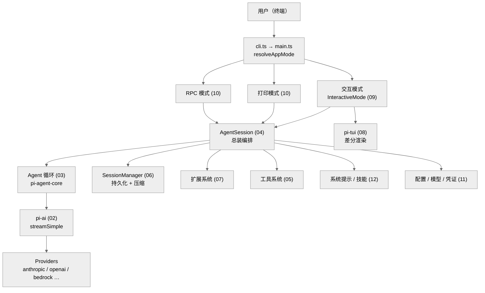

# pi 代码深读（Deep Dive）

> 对 `ljie-PI/pi` 单仓的逐层源码精读文档。按"读者心智模型"组织（全局概览 → 核心流程 → 子系统详解 → 扩展机制 → 基础设施 → 附录），而非代码目录结构。

**pi** 是一个交互式编码 Agent CLI，单仓含 4 个 npm 包：

| 包 | 名称 | 职责 | 文件数 |
|----|------|------|--------|
| `packages/ai` | `@earendil-works/pi-ai` | 统一多厂商 LLM API（provider/流式/类型） | 55 |
| `packages/agent` | `@earendil-works/pi-agent-core` | Agent 运行时（循环 + harness） | 26 |
| `packages/coding-agent` | `@earendil-works/pi-coding-agent` | 交互式编码 Agent CLI（总装） | 158 |
| `packages/tui` | `@earendil-works/pi-tui` | 终端 UI 库（差分渲染） | 28 |

依赖序：`tui + ai → agent → coding-agent`。全仓 `src` 共 267 个 `.ts` 文件。

---

## 章节目录

### 一、全局概览（系统是什么）
- **[01 · 全局概览：pi 是什么](./01-overview.md)** — 单仓结构、4 包关系、整体架构、数据流、核心循环

### 二、核心流程（怎么工作）
- **[02 · pi-ai：统一多厂商 LLM API](./02-ai-layer.md)** — Provider 适配、streamSimple、消息类型、模型注册、OAuth、faux provider
- **[03 · pi-agent-core：Agent 循环与两层 API](./03-agent-core.md)** — agentLoop/runLoop、低层 Agent vs 高层 AgentHarness、AgentEvent、工具执行
- **[04 · AgentSession：编码 Agent 的总装与编排](./04-agent-session.md)** — `createAgentSession`、streamFn 注入、事件持久化、prompt 流程

### 三、子系统详解（每部分怎么实现）
- **[05 · 工具系统：7 个内置工具与 ToolDefinition 抽象](./05-tool-system.md)** — 三层工具抽象、read/bash/edit/write/grep/find/ls、输出截断、文件变更队列
- **[06 · 上下文压缩与会话持久化](./06-context-compaction.md)** — 会话树、9 种 SessionEntry、JSONL、迁移 v1→v3、压缩阈值、estimateTokens
- **[07 · 扩展系统：用 TS 注入工具 / Provider / 钩子](./07-extensions.md)** — jiti 加载、ExtensionAPI、ExtensionRunner、~30 事件、project-trust 安全、包管理
- **[08 · pi-tui：差分渲染终端 UI 库](./08-tui-library.md)** — Component 接口、差分渲染、scheduleRender、键盘协议、editor
- **[09 · 交互模式：把 AgentSession 接到终端](./09-interactive-mode.md)** — InteractiveMode 控制器、事件处理、选择器、主题热重载

### 四、扩展与外围模式
- **[10 · 打印模式、RPC 模式与 SDK](./10-modes-print-rpc.md)** — `resolveAppMode`、print 模式、RPC JSONL 协议、SDK 导出
- **[11 · 配置、模型与凭证](./11-config-models-auth.md)** — 配置目录、SettingsManager 合并、AuthStorage/OAuth 刷新、ModelRegistry、安装检测
- **[12 · 系统提示、技能与斜杠命令](./12-prompt-skills-commands.md)** — `buildSystemPrompt` 动态拼装、SKILL.md 技能、22 个内置 slash 命令、提示模板

### 五、基础设施与附录
- **[13 · 基础设施：构建、打包与发布](./13-infrastructure.md)** — tsgo 构建、Node/Bun 双产物、质量门、锁步版本、CI 可信发布
- **[99 · 附录：文件索引、术语表、环境变量](./99-appendix.md)** — Top 20 文件、术语表、`PI_*` 环境变量、配置布局、关键常量速查

---

## 阅读路径

### 初学者（先建立心智模型）
```
01 概览 → 03 Agent 循环 → 04 AgentSession 总装 → 05 工具系统
```
理解"一条用户消息从输入到产出经过了哪些步骤、工具怎么被调度"。读完能讲清核心循环。

### 快速查阅（带着具体问题）
直接跳 **[99 附录](./99-appendix.md)**：
- 找某个常量的值 → 附录 E
- 找某个环境变量 → 附录 C
- 找最大/最关键的文件 → 附录 A
- 不认识某个术语 → 附录 B

### 开发者（要改代码 / 写扩展）
```
全序通读 01 → 13，重点：
  改 provider / 模型     → 02, 11
  改 Agent 行为 / 循环   → 03, 04, 06
  加工具 / 写扩展        → 05, 07, 12
  改 UI / 交互           → 08, 09
  改运行模式 / 集成 SDK  → 10
  改构建 / 发布          → 13
```

---

## 文档约定

- **语言**：中文正文，代码符号保留英文原名。
- **图**：Mermaid，统一 `%%{init: {'theme': 'neutral'}}%%`；节点名与代码中真实符号一致。
- **引用**：关键实现标注 `文件:行号`（基于撰写时的代码快照，行号可能随提交漂移）。
- **事实**：所有数字（行数、文件数、字段数、常量值）均以 `wc`/`grep`/`find` 实测，未从命名推断。
- **结构**：每章 = 一句话概括 → 架构图 → 核心概念/数据结构 → 流程图 → 关键实现（带行号）→ 关键文件表 → 下一步指引。

---

## 系统全景图



---

构建/发布见 **[13 基础设施](./13-infrastructure.md)**；环境变量与常量速查见 **[99 附录](./99-appendix.md)**。
